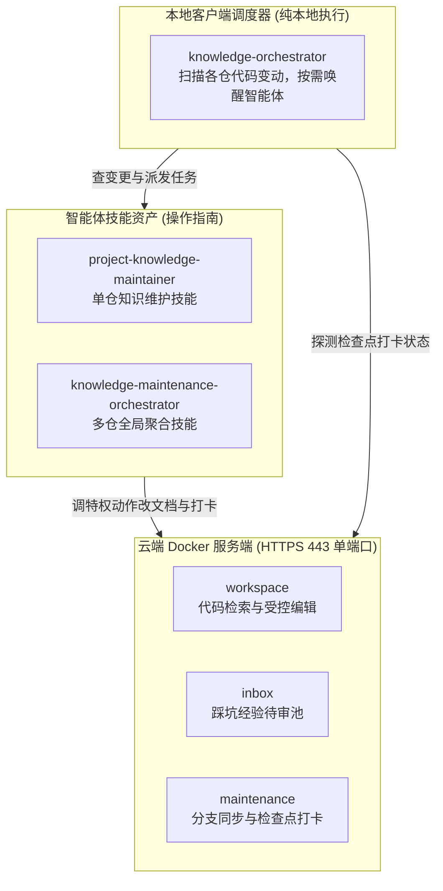

# knowledge-dock

为 AI 智能体与研发团队打造的自维护工程知识中枢。

核心就干三件事：
- 代码变了自动改文档：业务代码更新后，智能体自动比对差异并同步维护文档，不用人工苦哈哈补文档；
- 踩坑经验统一投递：平时排障踩坑经验直接丢进收件箱，由智能体统一整理归纳，不把正式文档改乱；
- 云端统一查最新事实：服务端统一提供代码与文档检索，所有人查到的都是最新事实，解决本地代码未拉取导致的认知偏差。

---

## 协作架构

系统由云端服务、本地调度与智能体技能三层组成：



- 云端服务端（`server/`）：运行在 Docker 容器中，443 单端口对外服务。普通令牌只能查代码和投递经验，特权令牌才能改文档和打卡。
- 本地调度器（`client/`）：纯本地轻量批处理命令，定时看哪些代码仓有变动，有变动就叫智能体去干活。
- 智能体技能（`skills/`）：维护指南与提示词资产，教智能体如何核查代码差异、编辑文档、检查死链与推进检查点。

---

## 三分钟快速上手

### 准备环境与令牌

复制环境配置并生成两个互不相同的高强度随机令牌：

```bash
cp .env.example .env
openssl rand -hex 32
openssl rand -hex 32
```

编辑 `.env` 文件，分别填入生成的两个令牌：

```dotenv
ACTIONDOCK_TOKEN=<生成的第一个随机查询令牌>
ACTIONDOCK_AGENT_TOKEN=<生成的第二个随机维护令牌>
PORT=443
KNOWLEDGE_DATA_DIR=/data/knowledge
SSH_DIR=/root/.ssh
```

### 启动服务容器

在项目根目录下通过 Docker Compose 启动容器：

```bash
docker compose up -d --build
```

服务统一监听 443 端口，默认使用内置证书保障通信链路安全。

### 客户端配置与验证

在客户端添加查询配置与特权维护配置：

```bash
# 添加面向日常查询与经验投递的普通配置
ad profile add sk -s https://<cloud-host-ip>:443 -t <ACTIONDOCK_TOKEN> -k -d "知识库查询服务"

# 添加面向维护智能体的受控维护配置
ad profile add skm -s https://<cloud-host-ip>:443 -t <ACTIONDOCK_AGENT_TOKEN> -k -d "知识库维护服务"
```

验证检索与踩坑经验投递：

```bash
# 验证代码与文档全文正则检索
ad run workspace/search.rg --profile sk -- pattern=createPayment

# 验证排障经验投递至待审池
ad run knowledge/knowledge.collect --profile sk -- title="支付超时排障" content="网关网络抖动时需开启指数退避重试..."
```

---

## 深入探索

关于系统的架构设计、部署配置、批量调度与知识维护细节，请参阅各专题指南：

- 架构指南：三层分工、双钥匙单端口、双分支隔离与打卡机制，参见 [docs/architecture.md](docs/architecture.md)。
- 部署指南：目录规划、配置约束与常见故障速查，参见 [docs/deployment.md](docs/deployment.md)。
- 调度指南：本地批量调度、参数速查与后台长跑姿势，参见 [docs/orchestration.md](docs/orchestration.md)。
- 运维规程：收件箱整理、打卡打标与防污染红线，参见 [docs/operations.md](docs/operations.md)。

---

## 开源许可证

本项目遵循 MIT 开源许可证。
