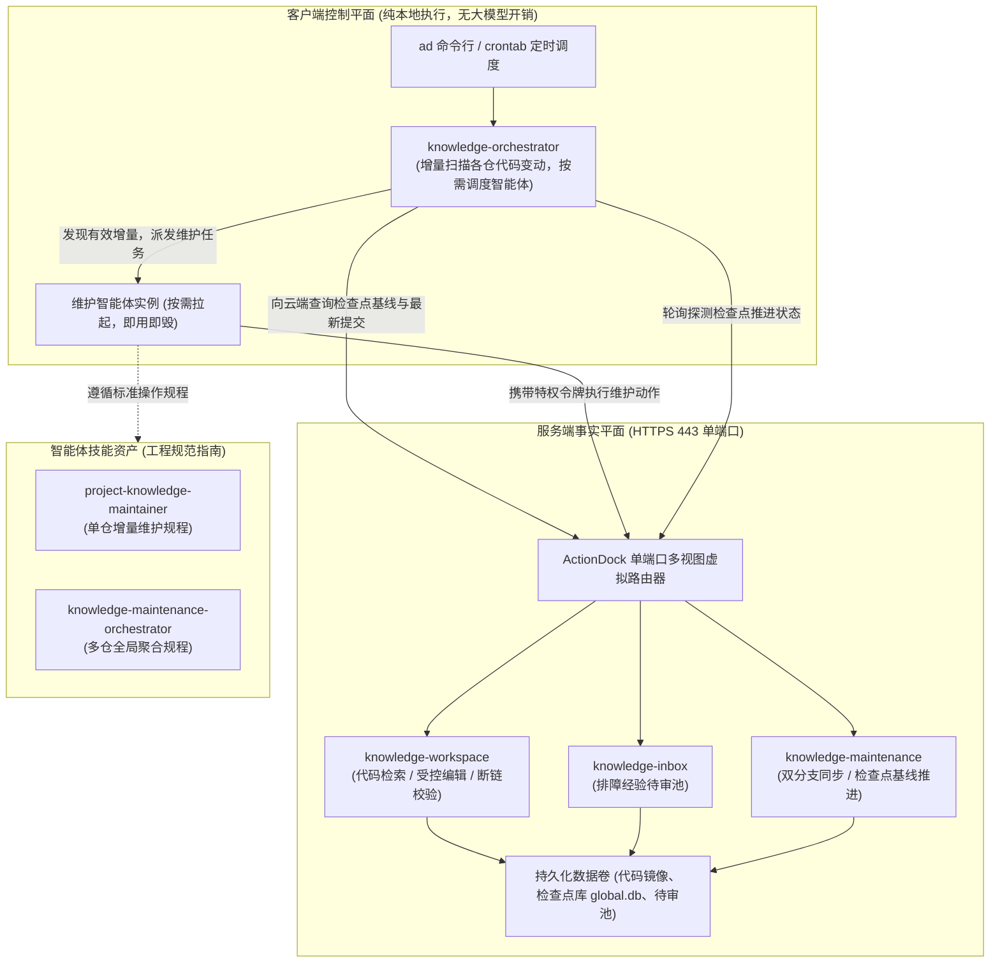

# knowledge-dock

为 AI 智能体与研发团队构建的自维护工程知识中枢与智能体编排工作空间。

---

## 前言与痛点

在传统的研发排障与多智能体维护实践中，团队通常依赖中心化的企业维基、外部知识库或独立的分析平台。然而随着业务微服务的快速裂变，这一模式逐渐暴露出几大根本性痛点：

- 代码与文档严重脱节：业务代码每日高速迭代，而外部文档依赖人工二次补录。随着人员交接与版本推进，文档迅速过时，排障人员经常遭遇代码实现已变更但文档依然记录旧逻辑的尴尬局面；
- 本地未拉取最新代码导致排障误诊：当生产环境出现突发告警时，研发人员或排障助手若未及时拉取最新发布分支代码，排障过程便会建立在陈旧的代码切片之上，从而做出错误的推断与修复决策；
- 排障经验碎片化散落：一线研发在排查完线上故障后，宝贵的排障经验往往散落在个人即时通讯软件或临时备忘录中，无法转化为受控的工程知识资产；若放开权限允许随意修改正式文档，又会导致主观臆测与未经求证的描述污染权威知识。

为了彻底扭转这一局面，knowledge-dock 确立了「**知识随代码仓库同步自维护**」的核心路线，将工程知识资产与业务源码紧密绑定，并基于 ActionDock 规范构建了统一的工程知识服务与编排体系。

---

## 核心定位

knowledge-dock 的核心定位是自维护工程知识中枢与智能体编排工作空间，在系统层面核心解决三件事：

- 代码变更自动驱动知识自维护：代码提交后，通过检查点机制定向比对增量，智能体按需核验业务契约是否失效，实现工程文档的自动维护与零断链自愈，彻底终结文档滞后；
- 排障经验受控进入待审池缓冲流转：一线排障记录通过只读视图结构化追加至待审池，经特权智能体与业务源码交叉核验、去重提炼后合入规范目录并归档留痕，保护正式知识库不受随意篡改；
- 云端单端口统一最新事实源：服务端统一收敛至标准 HTTPS 443 端口，对外提供最新代码与知识文档的全局事实源，消除多环境代码版本不一致造成的认知偏差。

---

## 物理分层架构演进：调度在本地，事实在云端

在方案初期的探索中，我曾尝试将整套系统打包为一个全托管的服务端容器。彼时的构想是将多仓巡检、命令渲染、外部智能体派发与状态轮询调度器全部整合进服务端的维护包中，由云端承担所有调度工作。

然而在初次联调时，这一设计带来了严重的系统崩溃。

当时在客户端执行调度时，习惯性地附加了控制选项：

```bash
# 最初导致调度失控的错误调用
ad run orchestrator.pipeline --profile skm -- dispatchCmd='...'
```

由于 `--profile skm` 属于 ActionDock 的底层控制选项，该命令触发了框架的远程打包上传机制，直接将本地调度器打包发送至云端容器执行。结果导致：
- 云端容器仅包含只读与维护的轻量环境，缺乏调度器的完整执行依赖；
- 调度器的本质是派发本地配置的外部智能体工具，置身于云端容器后，根本无法反向调用客户端本机的智能体；
- 调度器在云端试图再次向云端发起维护调用，引发死循环嵌套，迅速耗尽连接池并导致服务完全崩溃。

这次教训让我们深刻认识到：**调度器属于客户端控制平面，必须与服务端事实平面彻底物理解耦**。

基于此，我们确立了「**调度在本地，事实在云端**」的物理边界，将系统严格划分为三层资产：



- 服务端事实平面（`server/`）：一体化运行于 Docker 容器中，基于 ActionDock 单端口多视图规范，统一收敛至 443 端口对外提供服务。作为工程代码与文档的最新事实源，仅暴露受控的 Action 动作，不承担任何调度逻辑；
- 本地客户端控制平面（`client/packages/knowledge-orchestrator`）：纯本地轻量批处理调度器，在客户端或宿主执行机执行，**命令行严禁附加控制选项** `--profile`。负责增量探测、命令渲染、异步派发智能体任务与审计报告结算；
- 智能体技能资产（`skills/`）：标准操作规程资产，指导维护智能体执行代码分支同步、差异核验、受控文档编辑、断链校验与检查点推进。

---

## 关键工程机制速览

### 单端口虚拟视图权限隔离

服务端无需部署任何反向代理网关或暴露多端口，统一监听标准 HTTPS 443 端口，依据鉴权令牌在协议层实现细粒度的虚拟视图隔离：

- 只读查询视图（对应配置名称 `sk`）：面向日常研发人员与只读排障助手，由只读查询令牌 `ACTIONDOCK_TOKEN` 鉴权。仅暴露代码与文档全文正则检索（`workspace/search.rg`）、受控分段直读（`workspace/files.read`）、目录浏览（`workspace/files.list`）以及排障经验结构化追加（`knowledge/knowledge.collect`）。所有写操作与系统命令在该视图下被严格阻断；
- 特权维护视图（对应配置名称 `skm`）：面向本地调度器与维护智能体，由特权维护令牌 `ACTIONDOCK_AGENT_TOKEN` 鉴权。提供完整的工作区文件读写、受控精准编辑、终端命令调度、断链自愈核验与检查点基线推进能力。

### 双分支隔离治理模型

为杜绝自动化维护对业务主干开发造成干扰，纳管的业务代码仓统一遵循双分支隔离治理模型：

- 主干业务分支（如 `release`、`main` 或 `master`）：由人类研发团队日常维护与发布，仅存放纯粹的业务源码；
- 专属知识分支（如 `docs`）：由维护智能体自主同步与维护，工程知识文档严格收敛在 `docs/knowledge/` 目录下；
- 冲突安全中止机制：执行分支同步时，若检测到代码级冲突，系统严禁自动化强制合并，立即执行 `git merge --abort` 终止合并并保护现场，将冲突文件清单交由智能体进行语义消解。

### 检查点基线推进机制

增量控制严格奉行「**以知识失效而非改动量驱动更新**」的工程哲学：

- 增量扫描基准原理：检查点在持久化数据库中记录各代码仓当前已核验的提交哈希，调度器仅需扫描上次检查点至最新提交之间的增量区间；
- 无文档变更时推进检查点的技术必要性：当新增提交仅涉及内部重构、变量更名或单测扩充而未改变任何业务契约时，智能体判定无需修改文档。此时系统**必须坚决推进检查点**（携带参数 `actionTaken="no_change_needed"`）。推进基线是标记该批次提交已完成审计的法定凭据；若不推进，后续巡检仍会将已审计代码判定为未审增量，陷入冗余重复比对的死循环。

### 排障经验待审池缓冲闭环

遵循「**缓冲入池，去重转正**」的沉淀策略：

- 物理存储隔离：待审池目录独立挂载，与正式代码工作区物理隔离；
- 只追加不直读：外部在只读查询视图（`sk`）下仅可执行结构化追加（`knowledge.collect`），待审信息不对外开放检索，杜绝主观推测污染正式知识库；
- 源码核验与归档：维护智能体定期扫描待审池，结合代码仓源码进行交叉核验属实后，提炼归入标准目录，并调用 `knowledge.archive` 动作完成决议归档。

---

## 快速上手

### 准备环境与令牌

在服务端宿主机准备环境配置并生成高强度随机令牌：

```bash
cp .env.example .env
openssl rand -hex 32
openssl rand -hex 32
```

编辑 `.env` 文件，分别填入生成的只读查询令牌与特权维护令牌（两者长度必须达到 32 字符以上且互不相同）：

```dotenv
ACTIONDOCK_TOKEN=<生成的只读查询令牌>
ACTIONDOCK_AGENT_TOKEN=<生成的特权维护令牌>
PORT=443
KNOWLEDGE_DATA_DIR=/data/knowledge
SSH_DIR=/root/.ssh
```

### 启动服务容器

在项目根目录下构建并启动容器：

```bash
docker compose up -d --build
```

服务启动后自动完成自举检查，统一监听 443 端口对外提供单端口虚拟视图服务。

### 客户端配置与验证

在客户端执行机注册只读查询配置与特权维护配置：

```bash
# 注册面向日常查询与排障助手的只读查询配置
ad profile add sk -s https://<云端服务地址>:443 -t <ACTIONDOCK_TOKEN> -k -d "知识中枢只读查询服务"

# 注册面向维护智能体与本地调度器的特权维护配置
ad profile add skm -s https://<云端服务地址>:443 -t <ACTIONDOCK_AGENT_TOKEN> -k -d "知识中枢特权维护服务"
```

验证代码全局正则检索与排障经验结构化追加：

```bash
# 验证代码与文档全文正则检索
ad run workspace/search.rg --profile sk -- pattern="MK40001"

# 验证排障经验结构化追加至待审池
ad run knowledge/knowledge.collect --profile sk -- \
  title="网关超时排障记录" \
  content="遇到网络抖动时回调需校验幂等号并开启指数退避重试..."
```

---

## 专题指南索引

关于系统的全景设计、部署交付、本地编排调度与知识运维规程，请参阅各专题指南：

- 全景架构设计与权衡手记：系统分层演进、单端口虚拟视图选型、双分支治理、免大文件浅克隆与检查点基线哲学，参见 [docs/architecture.md](docs/architecture.md)；
- 部署与交付实战指南：宿主机持久化目录规划、安全环境变量约束、多仓清单配置与生产故障排查，参见 [docs/deployment.md](docs/deployment.md)；
- 本地流水线编排实战指南：调度器物理边界与控制选项铁律、模版引擎安全渲染、四种标准运维范式与审计报告结算，参见 [docs/orchestration.md](docs/orchestration.md)；
- 知识全生命周期运维规程：待审池全生命周期治理实战、检查点基线推进深度推导、失效四问判定法、零断链门禁与防污染红线，参见 [docs/operations.md](docs/operations.md)。

---

## 开源许可证

本项目遵循 MIT 开源许可证。
