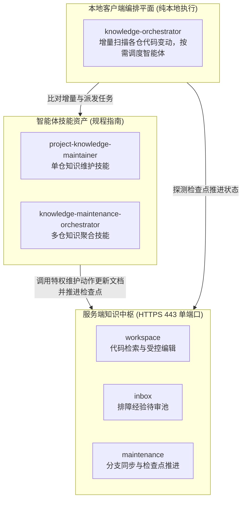

# knowledge-dock

为 AI 智能体与研发团队构建的自维护工程知识中枢与编排工作空间。

核心能力：
- 代码变更驱动文档自维护：业务代码提交变更后，智能体自动分析差异并同步维护工程文档，消除人工维护知识库的滞后与疏漏；
- 排障经验结构化收集与待审池治理：运维排障与日常研发中产生的经验记录结构化收集入待审池，经特权智能体审核提炼后合入规范目录，避免非受控直接修改正式知识库；
- 云端单端口提供最新代码与文档统一事实源：服务端统一收敛至标准 443 端口对外提供最新代码与知识文档检索，杜绝本地分支未同步导致的认知偏差。

---

## 协作架构

系统由服务端知识中枢、本地客户端编排平面与智能体技能资产三层组成：



- 服务端知识中枢（`server/`）：一体化运行于 Docker 容器中，基于 ActionDock 单端口多视图规范，统一收敛至 443 端口对外提供服务。查询视图仅开放检索与经验追加，维护视图提供完整读写与检查点推进能力。
- 本地客户端编排平面（`client/`）：纯本地轻量批处理调度器，基于检查点增量探测代码仓变动，按需异步调度智能体执行维护流水线。
- 智能体技能资产（`skills/`）：工程标准指导语与工作流规范资产，指导智能体执行代码差异分析、受控文档编辑、断链校验与检查点推进。

---

## 快速上手

### 准备环境与令牌

复制环境配置模板并生成高强度随机令牌：

```bash
cp .env.example .env
openssl rand -hex 32
openssl rand -hex 32
```

编辑 `.env` 文件，分别配置查询令牌与特权维护令牌：

```dotenv
ACTIONDOCK_TOKEN=<生成的只读查询令牌>
ACTIONDOCK_AGENT_TOKEN=<生成的特权维护令牌>
PORT=443
KNOWLEDGE_DATA_DIR=/data/knowledge
SSH_DIR=/root/.ssh
```

### 启动服务容器

在项目根目录下通过 Docker Compose 构建并启动容器：

```bash
docker compose up -d --build
```

服务统一监听 443 端口，默认使用内置证书保障传输链路安全。

### 客户端配置与验证

在客户端执行机注册只读查询配置与特权维护配置：

```bash
# 注册面向日常查询与经验追加的查询视图配置
ad profile add sk -s https://<cloud-host-ip>:443 -t <ACTIONDOCK_TOKEN> -k -d "知识中枢只读查询服务"

# 注册面向维护智能体的受控维护视图配置
ad profile add skm -s https://<cloud-host-ip>:443 -t <ACTIONDOCK_AGENT_TOKEN> -k -d "知识中枢特权维护服务"
```

验证代码检索与排障经验追加：

```bash
# 验证代码与文档全文正则检索
ad run workspace/search.rg --profile sk -- pattern=createPayment

# 验证排障经验结构化追加至待审池
ad run knowledge/knowledge.collect --profile sk -- title="支付超时排障" content="网关网络抖动时需开启指数退避重试..."
```

---

## 专题指南索引

关于系统的全景架构、部署交付、本地编排与知识运维规程，请参阅各专题指南：

- 全景架构：系统分层职责、单端口虚拟视图、双分支隔离与检查点推进机制，参见 [docs/architecture.md](docs/architecture.md)。
- 部署交付：持久化目录规划、配置约束与常见故障速查，参见 [docs/deployment.md](docs/deployment.md)。
- 本地调度：本地流水线编排、多运维范式、参数规范与结算报告，参见 [docs/orchestration.md](docs/orchestration.md)。
- 运维规程：待审池全生命周期治理、检查点推进机制、零断链门禁与防污染红线，参见 [docs/operations.md](docs/operations.md)。

---

## 开源许可证

本项目遵循 MIT 开源许可证。
