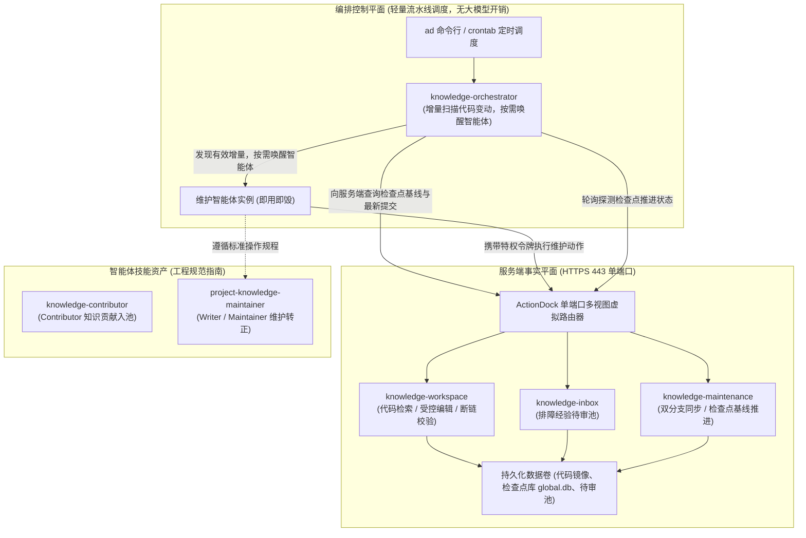

# knowledge-dock

为 AI 智能体与研发团队构建的自维护工程知识中枢与智能体编排工作空间。

---

## 核心痛点与解决思路

在基于大模型与智能体协同的高频研发体系中，工程知识库的沉淀与维护普遍面临三大致命痛点：

- 知识维护依赖人工：业务代码频繁发版，开发人员很少主动维护，靠手工补录难以长期持续；
- 本地知识容易过期：本地仓库未及时拉取最新代码，排障或代码分析时容易读到旧知识导致误诊；
- 知识贡献缺少统一入口：生产排障与日常人工补充缺乏稳定通道进入正式知识库，直接修改正式库极易导致格式混乱与推测污染。

knowledge-dock 的终极目标十分明确：

> **Git 管正式知识，云主机提供最新只读视图，代码变更自动维护知识，人工贡献统一进入 Knowledge Inbox。**

系统在云端提供权威只读视界，通过代码变更驱动增量核验，将人工经验收敛至待审池缓冲流转，实现工程知识的全自动维护与自生长闭环。

---

## 系统架构与协作拓扑

knowledge-dock 建立了清晰的分层控制与协作模型：



系统由三大核心平面构成：

- 服务端事实平面（`server/`）：一体化运行于 Docker 容器中，基于 ActionDock 单端口多视图规范统一收敛至标准 443 端口。作为全局代码镜像与正式知识库的权威事实源，专注于提供纯粹、轻量、无状态的原子能力（双分支同步、增量扫描、检查点推进、代码检索、受控编辑与待审池收集），对外仅暴露受控的 Action 动作，不承担任何上层编排调度逻辑；
- 编排控制平面（`client/packages/knowledge-orchestrator`）：轻量批处理流水线调度器，在当前执行机环境中运行，命令行无需附加控制选项 `--profile`。专注于多代码仓按清单巡检、比对增量差异、待审池串行消费、组装安全命令模板、派发智能体任务、探测状态并结算审计报告，可灵活适配本地开发机、独立运维调度机或 CI/CD 自动化流水线等多种执行拓扑；
- 智能体技能资产（`skills/`）：提供标准操作规程资产，包含面向一线开发与运营人员的知识贡献助手（`skills/knowledge-contributor`）、面向代码变更与维护转正的知识中枢（`skills/project-knowledge-maintainer`）以及负责批量多仓巡检的总控编排技能（`skills/knowledge-maintenance-orchestrator`）。

---

## 核心特性

- 单端口虚拟视图权限隔离：无需前置反向代理网关，在标准 HTTPS 443 端口依据鉴权令牌实现细粒度隔离。只读查询视图（`sk`）面向外部只读检索与受控候选投递，特权维护视图（`skm`）面向内部维护智能体开放完整受控读写能力；
- 双分支隔离治理模型：主干业务分支由研发团队日常提交与发版，专属知识分支（`docs`）承载工程知识，文档严格收敛在 `docs/knowledge/` 目录下。分支同步遇代码级冲突立即安全中止合并，交由智能体进行语义消解；
- 检查点基线推进机制：坚决贯彻「代码变更只触发检查，知识失效才触发更新」的核心准则。以已记录的知识是否失效为判定基准，无论是否改动文档均推进检查点水位，确保全系统增量闭环收敛；
- 排障经验待审池缓冲闭环：遵循「缓冲入池，去重转正」策略。一线排障人员在只读视图下即可结构化提交候选经验，待审池不对外开放通用检索；由维护智能体结合代码源码交叉核验、去重提炼后合入正式库并归档留痕；
- 零断链门禁与业务代码防污染红线：正式发布前强制执行 `links.verify` 校验，实现链接就地自愈；严格隔离业务源码，严禁在业务目录创建文档或污染主干分支。

---

## 三分钟快速上手

### 准备环境与令牌

在服务端宿主机配置环境并生成高强度随机令牌：

```bash
cp .env.example .env
openssl rand -hex 32
openssl rand -hex 32
```

编辑 `.env` 配置文件，分别填入生成的只读查询令牌与特权维护令牌（两者长度必须达到 32 字符以上且互不相同）：

```dotenv
ACTIONDOCK_TOKEN=<生成的只读查询令牌>
ACTIONDOCK_AGENT_TOKEN=<生成的特权维护令牌>
PORT=443
KNOWLEDGE_DATA_DIR=/data/knowledge
SSH_DIR=/root/.ssh
```

### 启动服务容器

在项目根目录下构建并启动一体化容器：

```bash
docker compose up -d --build
```

服务启动后自动完成自举检查，统一在 443 端口对外提供单端口多视图服务。

### 客户端配置与极速检索

在执行机注册只读查询配置与特权维护配置：

```bash
# 注册面向日常查询与排障助手的只读查询配置
ad profile add sk -s https://<云端服务地址>:443 -t <ACTIONDOCK_TOKEN> -k -d "知识中枢只读查询服务"

# 注册面向维护智能体与流水线调度器的特权维护配置
ad profile add skm -s https://<云端服务地址>:443 -t <ACTIONDOCK_AGENT_TOKEN> -k -d "知识中枢特权维护服务"
```

一行命令完成全仓代码与知识文档的毫秒级检索：

```bash
ad run workspace/search.rg --profile sk -- pattern="MK40001"
```

---

## 深入探索

关于架构设计演进、系统部署交付、流水线编排调度与日常知识运维的深度规程，请参阅：

- 全景架构设计指南：自动维护与反馈闭环实践、物理分层设计手记与检查点基线哲学，参见 [docs/architecture.md](docs/architecture.md)；
- 部署与交付实战指南：容器部署、环境变量、纳管仓库清单配置与安全基线，参见 [docs/deployment.md](docs/deployment.md)；
- 流水线编排实战指南：三阶段流水线调度（单仓增量巡检、系统知识跨仓聚合、待审池串行消费）、命令模板安全渲染与审计报告结算，参见 [docs/orchestration.md](docs/orchestration.md)；
- 知识全生命周期运维规程：待审池 Candidate Markdown 语义规范、失效判定准则与质量门禁，参见 [docs/operations.md](docs/operations.md)；
- 知识贡献技能规程：面向开发与运营的知识捕获、语义模板与待审池安全投递，参见 [skills/knowledge-contributor/SKILL.md](skills/knowledge-contributor/SKILL.md)。

---

## 开源许可证

本项目遵循 MIT 开源许可证。
