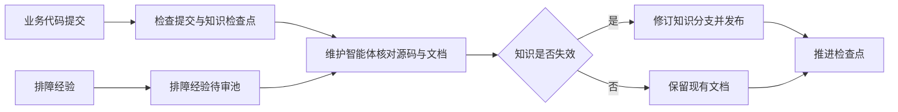

# knowledge-dock

代码已经发布，排障文档却仍描述旧流程。knowledge-dock 让代码提交触发知识核验：确实影响业务契约时更新文档；不影响时记录审查结论并推进检查点。人工排障经验先进入待审池，经源码核对后再写入正式知识。

正式知识保存在 Git 仓库中。云端工作区集中维护代码镜像，向研发人员和智能体提供检索；本地调度器按需派发知识维护任务。系统提供受控动作和调度能力，实际的语义判断与文档修改由接入的维护智能体完成。



## 适用场景

- 多仓库代码持续演进，需要定期检查工程知识是否仍与实现一致。
- 研发和排障智能体需要查询同一份云端代码与正式知识。
- 生产排障中出现可复用经验，需要先收集证据，再审查、去重和沉淀。

knowledge-dock 负责维护流程与访问边界，不替代代码评审，也不保证每次智能体判断都正确。正式发布前仍需核对文档范围、链接和审查结果。

## 系统组成

| 组成 | 所在位置 | 职责 |
|---|---|---|
| 工作区 | `server/packages/knowledge-workspace` | 检索、读取、编辑及链接检查 |
| 排障经验待审池 | `server/packages/knowledge-inbox` | 接收候选、查询状态、记录归档决议 |
| 仓库维护 | `server/packages/knowledge-maintenance` | 分支同步、增量扫描、发布、检查点推进 |
| 客户端控制平面 | `client/packages/knowledge-orchestrator` | 巡检多仓、派发任务、等待结果、生成报告 |
| 智能体技能资产 | `skills/` | 贡献预审、单仓维护和批量调度规程 |

服务端通过 ActionDock 的单端口虚拟视图权限隔离，在 HTTPS 443 端口依据令牌暴露不同动作。查询视图 `sk` 可检索、读取和提交待审候选；维护视图 `skm` 可调用编辑和仓库维护动作。`sk` 不是完全无写入能力的视图，它只允许向待审池受控追加。

## 首次运行

需要 Node.js 24.12.0 及以上、Docker Compose、Git、ripgrep 和 ActionDock 命令行工具 `ad`。下列步骤以仓库根目录为当前目录。

- 准备配置，并将仓库清单中的示例地址、分支改为实际值：

  ```bash
  cp .env.example .env
  cp server/config/repos.json.example server/config/repos.json
  openssl rand -hex 32
  openssl rand -hex 32
  ```

- 将两次生成的不同令牌分别填入 `.env` 的 `ACTIONDOCK_TOKEN` 和 `ACTIONDOCK_AGENT_TOKEN`，然后启动服务：

  ```bash
  docker compose up -d --build
  docker compose ps
  ```

- 在安装了 `ad` 的执行机上注册连接。以下 `-k` 仅用于自签名证书环境；使用受信任证书时去掉它：

  ```bash
  ad profile add sk -s https://<服务地址>:443 -t <查询令牌> -k
  ad profile add skm -s https://<服务地址>:443 -t <维护令牌> -k
  ```

- 同步已配置的仓库，再查询工作区：

  ```bash
  ad run maintenance/maintenance.sync --profile skm
  ad run workspace/files.list --profile sk -- path="." depth:=1
  ad run workspace/search.rg --profile sk -- pattern="PaymentStatus"
  ```

检索词需换成目标仓库中的真实符号。仓库清单路径、私有 Git 认证、证书及生产部署细节见[部署指南](docs/deployment.md)。仅启动服务不会自动执行维护智能体；接入和调度方式见[编排指南](docs/orchestration.md)。

## 继续阅读

- [文档导航](docs/README.md)：按部署、使用和维护任务找资料。
- [架构与边界](docs/architecture.md)：理解事实源、双分支、虚拟视图和当前门禁边界。
- [知识维护流程](docs/workflow.md)：了解代码变更与候选经验如何形成闭环。
- [示例场景](docs/examples/payment-flow.md)：查看一次业务状态变化如何影响多篇知识文档。

各子包 README 提供对应动作的参数、配置和本地开发命令。

## 许可证

项目清单 [package.json](package.json) 声明使用 MIT 许可证。
