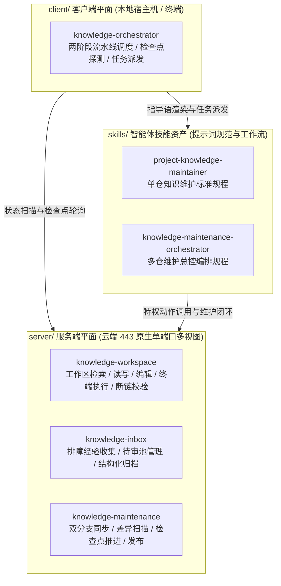
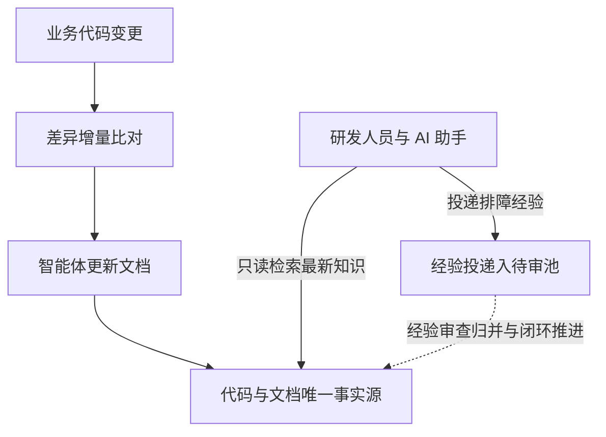

# knowledge-dock

为 AI 智能体与研发团队打造的自维护工程知识中枢与编排工作空间。

knowledge-dock 是基于 ActionDock 规范构建的一体化云知识服务容器与智能体编排工作空间。通过代码变更自动驱动文档更新，将线上排障经验收集入待审池，统一由云端对外提供已同步的最新代码与知识检索，并在本地提供轻量高效的多仓流水线调度编排。

---

## 物理分层架构

本项目采用清晰的物理分层 Monorepo 架构，将服务端知识中枢、本地客户端编排与智能体技能资产彻底解耦：



- **服务端平面**（`server/`）：包含 `knowledge-workspace`（工作区检索与读写）、`knowledge-inbox`（反馈待审池收集）与 `knowledge-maintenance`（特权同步与检查点推进），通过单端口多视图统一在 443 端口对外提供服务。
- **客户端平面**（`client/`）：包含 `knowledge-orchestrator`（本地流水线调度器），负责两阶段扫描、命令渲染、异步派发与检查点探测。
- **智能体技能资产**（`skills/`）：包含 `project-knowledge-maintainer` 与 `knowledge-maintenance-orchestrator`，提供经过工程验证的自闭环维护指导语与编排模板。

---

## 解决的问题

在多智能体协作与高频迭代的研发场景中，传统工程知识库普遍面临三个现实问题：

- **文档与代码脱节**：业务代码高频重构，人工补文档成本高，文档很快就会落后于代码真实实现。
- **本地环境不一致**：本地代码仓未及时拉取主干时，智能体基于陈旧代码分析排障，容易得出错误结论。
- **排障经验难以沉淀**：线上排障踩坑经验散落在群聊中；若直接随意编写正式文档，又容易引发内容冲突与碎片化。

---

## 核心特性

- **代码驱动文档自维护**：代码变更自动驱动智能体核验差异并更新文档，告别人工补文档。
- **云端统一最新视界**：统一由云端服务提供实时同步的代码与文档基准，消灭本地滞后。
- **排障经验规范入池**：线上排障经验投递至独立待审池，经自动化核验提炼后归档，不污染正式知识库。
- **单端口多视图安全隔离**：在 443 端口基于 Token 自动隔离，外部只读与追加，内部特权维护。

---

## 业务流转流程



---

## 三分钟快速上手

### 配置环境与高强度鉴权令牌

复制环境配置模板并生成高强度随机令牌：

```bash
cp .env.example .env
openssl rand -hex 32
openssl rand -hex 32
```

编辑 `.env` 文件，分别填入生成的专属鉴权令牌与宿主机持久化目录：

```dotenv
ACTIONDOCK_TOKEN=<生成的首个高强度随机查询令牌>
ACTIONDOCK_AGENT_TOKEN=<生成的第二个高强度随机维护令牌>
PORT=443
KNOWLEDGE_DATA_DIR=/data/knowledge
SSH_DIR=/root/.ssh
```

### 容器编排一键启动

通过 Docker Compose 启动容器化服务：

```bash
docker compose up -d --build
```

服务统一监听 443 端口，内置自签名证书保障通信链路安全。

### 客户端验证检索与经验投递

在客户端添加查询与特权维护连接配置：

```bash
# 添加面向外部用户的检索与投递配置
ad profile add sk -s https://<cloud-host-ip>:443 -t <ACTIONDOCK_TOKEN> -k -d "知识库查询服务"

# 添加面向维护智能体的受控维护配置
ad profile add skm -s https://<cloud-host-ip>:443 -t <ACTIONDOCK_AGENT_TOKEN> -k -d "知识库维护服务"
```

验证工程代码全文检索与候选排障经验投递：

```bash
# 验证工程代码全文检索
ad run workspace/search.rg --profile sk -- pattern=createPayment

# 验证排障经验结构化投递至待审池
ad run knowledge/knowledge.collect --profile sk --input-file candidate.json
```

---

## 深入探索

关于系统的架构设计、部署实操、流水线调度与知识运维细节，请阅读「一核四册」官方技术文档：

- **全景架构设计白皮书**：物理分层架构、单端口多视图、两阶段调度引擎与智能体协同演进，请阅读 [docs/architecture.md](docs/architecture.md)。
- **服务端部署与运维指南**：宿主机目录持久化规范、环境变量约束、私有 Git 免密与排障速查，请阅读 [docs/deployment.md](docs/deployment.md)。
- **客户端多仓流水线调度指南**：两阶段调度机制、执行机物理边界、模板引擎占位符与后台守护进程运维，请阅读 [docs/orchestration.md](docs/orchestration.md)。
- **端到端知识运维与闭环规程**：全生命周期流转、线上排障经验收集、检查点推进与零断链门禁，请阅读 [docs/operations.md](docs/operations.md)。
- **智能体编排技能规范**：总控编排智能体技能规范与任务流转规则，请阅读 [skills/knowledge-maintenance-orchestrator/SKILL.md](skills/knowledge-maintenance-orchestrator/SKILL.md)。

---

## 开源许可证

本项目遵循 MIT 开源许可证。
