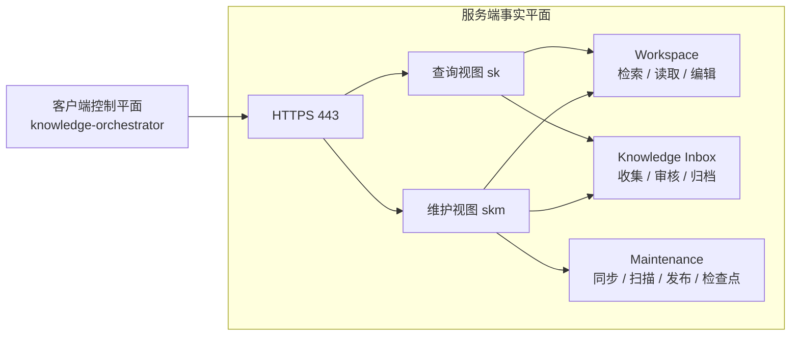
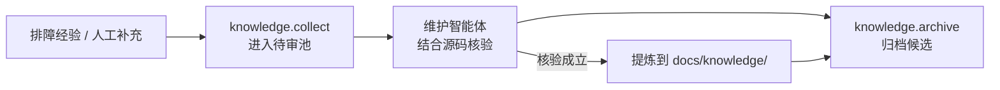
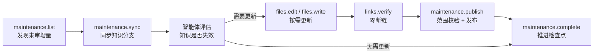

# Action 体系设计

> Knowledge Dock 的 Action 层不是“把 Shell 包一层 API”，而是为 AI 智能体提供一组**可约束、可审计、可截断、可组合**的确定性操作接口。

本文解释 Action 体系为什么这样设计，以及这些设计如何共同保证：智能体可以完成知识维护，但不能绕过权限边界、质量门禁和仓库治理规则。

---

## 1. 设计目标

面向人类设计的终端工具，默认操作者能够理解上下文、识别异常输出，并主动避免高风险操作。AI 智能体并不天然具备这些可靠性，因此 Action 层需要把关键约束落实到执行系统，而不是依赖提示词。

Knowledge Dock 的 Action 体系围绕四个目标设计：

| 目标 | 需要解决的问题 | 设计响应 |
|---|---|---|
| **确定性边界** | 智能体可能生成错误参数或调用高风险能力 | 使用结构化 Action、参数校验和能力白名单 |
| **上下文可控** | 大量命令输出会快速消耗模型上下文 | 对检索、进程输出和读取范围设置配额与截断 |
| **事实可追踪** | 外置状态容易与代码版本漂移 | 以 Git 为唯一事实源，并使用提交哈希推进检查点 |
| **故障可隔离** | 调度、维护与查询混在一起会扩大故障半径 | 服务端提供原子能力，客户端负责批处理编排 |

核心原则可以概括为：

> **让模型负责判断，让系统负责约束。**

---

## 2. 为什么不直接使用传统工具

在确定 Action 体系前，几种常见方案都存在明显缺陷。

### 2.1 本地维护脚本

本地脚本适合单仓和人工使用，但不适合作为统一的智能体运行环境：

- 多仓镜像、扫描和索引会持续消耗本地磁盘、网络与算力；
- 每台机器维护独立副本，容易产生事实源漂移；
- 线上排障助手、流水线和维护智能体无法共享同一套权威工作区；
- 本地开发环境通常同时包含源码、凭据和其他敏感资源，权限边界难以收敛。

因此，Knowledge Dock 将事实工作区集中在服务端维护。

### 2.2 直接开放 SSH / Shell

Shell 的问题不是能力不足，而是能力过于宽泛。

终端接口通常包含：

- 非结构化文本输出；
- ANSI 转义符、不稳定换行和工具特有退出码；
- 难以统一限制的命令能力；
- 难以强制执行的质量门禁；
- 过大的系统权限暴露面。

对于智能体而言，这意味着它既要理解业务任务，又要解析终端状态，还可能获得远超任务所需的权限。

Knowledge Dock 因此只暴露必要的原子 Action，并在服务端限制执行范围。

### 2.3 自建通用 HTTP 服务

手写 HTTP API 可以解决部分问题，但会引入另一组工程成本：

- CLI、HTTP、智能体工具调用需要分别适配；
- 只读和维护权限需要自行实现鉴权与接口过滤；
- 进程流式输出、超时、截断、参数校验需要重复建设；
- 工具协议与服务协议容易逐渐分叉。

ActionDock 提供统一的 Action 运行模型，使同一组能力可以同时服务 CLI、远端调用和智能体。

### 2.4 外置知识数据库

Knowledge Dock 不把正式工程知识迁移到独立文档库或向量数据库中。

原因很直接：

- 正式知识需要与代码版本绑定；
- 分支、提交、回滚和审计已经由 Git 提供；
- 如果知识拥有另一套独立状态，代码与知识之间就会产生新的同步问题。

因此，**Git 是正式知识的唯一事实源**。其他索引可以作为加速层，但不能成为权威状态。

---

## 3. 为什么选择 ActionDock

ActionDock 在 Knowledge Dock 中承担的是“受控执行底座”，关键能力与需求一一对应。

| Knowledge Dock 需求 | ActionDock 提供的能力 |
|---|---|
| 同一服务入口下区分查询与维护能力 | 单端口 Virtual Views |
| 防止大输出占满模型上下文 | 受控流式进程、超时与输出截断 |
| 降低模型构造复杂参数的失败率 | 扁平、可校验的 Action 参数协议 |
| 同一能力同时支持 CLI 与远端调用 | 统一 Action 运行模型 |
| 保持部署链路轻量 | 基于 Node.js / TypeScript 的轻量运行时 |

这使 Knowledge Dock 不需要再单独维护一套工具协议、网络协议和 CLI 适配层。

---

## 4. 系统边界

Action 体系分为两个平面：

- **服务端事实平面**：保存代码镜像、知识分支、检查点与待审池，并提供受控原子 Action；
- **客户端控制平面**：负责多仓巡检、任务派发、轮询和批处理调度。



这一划分的目的不是拆分代码目录，而是明确职责：

> 服务端负责“事实与能力”，客户端负责“何时调用、调用哪个仓库、如何串联”。

---

## 5. 必须由系统保证的五条不变量

这些规则不能只写在 Agent Prompt 中，而必须由 Action 契约直接保证。

### 5.1 权限不变量：查询与维护能力隔离

Knowledge Dock 在 HTTPS 443 单一入口下使用两套逻辑视图：

| 视图 | 凭据 | 面向对象 | 能力范围 |
|---|---|---|---|
| `sk` | `ACTIONDOCK_TOKEN` | 查询用户、只读排障助手 | 检索、读取、目录浏览、候选经验投递 |
| `skm` | `ACTIONDOCK_AGENT_TOKEN` | 维护智能体、调度器 | 读写、编辑、受限命令执行、同步、发布、检查点维护 |

查询视图不暴露文件覆写和 Git 维护动作，因此外部调用者即使出现错误推理，也无法越过能力边界。

相关实现：

- [`search-rg.ts`](../server/packages/knowledge-workspace/actions/search-rg.ts)
- [`files-read.ts`](../server/packages/knowledge-workspace/actions/files-read.ts)
- [`files-list.ts`](../server/packages/knowledge-workspace/actions/files-list.ts)
- [`files-write.ts`](../server/packages/knowledge-workspace/actions/files-write.ts)
- [`files-edit.ts`](../server/packages/knowledge-workspace/actions/files-edit.ts)

### 5.2 仓库不变量：业务分支与知识分支隔离

纳管代码仓采用双分支模型：

- `main` / `release`：业务主干，由业务研发维护；
- `docs`：知识分支，用于承载工程知识；
- 正式知识改动严格限制在 `docs/knowledge/`。

同步过程中如果发生冲突，[`maintenance-sync.ts`](../server/packages/knowledge-maintenance/actions/maintenance-sync.ts) 必须安全中止合并，而不是自动选择一侧结果。

```text
merge success   -> 继续知识维护
merge conflict  -> git merge --abort -> 交给智能体做语义判断
```

自动化系统负责识别冲突，智能体负责理解冲突；两者职责不能倒置。

### 5.3 增量不变量：每次完成审查都推进检查点

每个仓库维护一个基于提交哈希的检查点，例如：

```text
last_knowledge_checked_commit = <commit sha>
```

[`maintenance-list.ts`](../server/packages/knowledge-maintenance/actions/maintenance-list.ts) 只返回检查点之后的未审增量。

完成本轮知识审查后，无论文档是否实际发生变化，都必须通过 [`maintenance-complete.ts`](../server/packages/knowledge-maintenance/actions/maintenance-complete.ts) 推进检查点。

原因是：

> “没有文档变更”也是一次有效的审查结论。

如果不推进检查点，同一批代码会在下一轮再次被识别为未审增量，导致重复扫描和无法收敛的维护循环。

### 5.4 知识入口不变量：人工经验先进入待审池

外部经验不能直接写入正式知识目录。

标准流程是：



候选文档是**贡献单元**，不是正式知识单元。它可以被合并、拆分、改写，也可以在核验后被拒绝。

相关 Action：

- [`knowledge-collect.ts`](../server/packages/knowledge-inbox/actions/knowledge-collect.ts)
- [`knowledge-list.ts`](../server/packages/knowledge-inbox/actions/knowledge-list.ts)
- [`knowledge-archive.ts`](../server/packages/knowledge-inbox/actions/knowledge-archive.ts)

### 5.5 发布不变量：零断链且不得污染业务代码

发布前必须同时满足两项条件。

**零断链门禁**

[`links-verify.ts`](../server/packages/knowledge-workspace/actions/links-verify.ts) 校验 Markdown 内部链接、相对路径和锚点。存在断链时必须先修复，再允许发布。

**业务代码防污染红线**

[`maintenance-publish.ts`](../server/packages/knowledge-maintenance/actions/maintenance-publish.ts) 在提交前检查改动范围。任何超出 `docs/knowledge/` 的修改都应阻断发布并回滚。

因此，“Agent 被要求不要修改业务代码”不是安全机制；**发布 Action 本身拒绝这类修改**才是安全机制。

---

## 6. 为什么调度器运行在本地

`knowledge-orchestrator` 属于客户端控制平面，而不是服务端常驻任务。

这样设计有三个原因：

1. **服务端保持无状态**  
   多仓轮询、长时间等待和任务派发不会占用服务端的长期会话资源。

2. **保留本地执行上下文**  
   调度器可以使用本机的 `dispatchCmd`、日志路径和 Agent 运行环境。

3. **缩小故障半径**  
   单次流水线失败只影响当前客户端任务，不影响服务端继续提供查询和维护 Action。

入口实现：

[`pipeline.ts`](../client/packages/knowledge-orchestrator/actions/pipeline.ts)

### `--profile` 与 `profile=` 的区别

这两个参数名称相似，但语义不同。

```bash
# 框架控制参数：
# --profile skm 表示“把当前 Action 发到远端 skm 视图执行”

ad run some.remote.action --profile skm -- key="value"
```

而本地 orchestrator 自身不应该通过 `--profile` 远端执行：

```bash
ad run orchestrator.pipeline -- \
  profile="skm" \
  logFile="/var/log/knowledge-pipeline.log" \
  dispatchCmd='ad run my-agent.dispatch --profile skm -- repo="{{repo}}" prompt="{{prompt}}"' \
  timeout:=15 \
  interval:=10
```

这里的 `profile="skm"` 是普通 Action 入参，表示下游任务应连接哪个远端视图。

---

## 7. Action 能力矩阵

### Workspace

| Action | 视图 | 职责 |
|---|---|---|
| `workspace/search.rg` | `sk`, `skm` | 基于 ripgrep 的受控全文检索，支持输出配额与截断 |
| `workspace/files.read` | `sk`, `skm` | 分段读取文件，限制路径与读取范围 |
| `workspace/files.list` | `sk`, `skm` | 受控遍历目录与文件清单 |
| `workspace/files.write` | `skm` | 受控全量写入文件 |
| `workspace/files.edit` | `skm` | 基于精确匹配的局部编辑 |
| `workspace/bash.exec` | `skm` | 在受限工作区执行命令并捕获状态 |
| `workspace/links.verify` | `skm` | 校验 Markdown 相对链接与锚点 |

### Knowledge Inbox

| Action | 视图 | 职责 |
|---|---|---|
| `knowledge/knowledge.collect` | `sk`, `skm` | 将排障经验和人工补充写入待审池 |
| `knowledge/knowledge.list` | `skm` | 查询待审候选及其状态 |
| `knowledge/knowledge.archive` | `skm` | 归档已处理候选并记录决议 |

### Maintenance

| Action | 视图 | 职责 |
|---|---|---|
| `maintenance/maintenance.sync` | `skm` | 同步业务分支与知识分支，冲突时安全中止 |
| `maintenance/maintenance.list` | `skm` | 获取检查点之后的未审提交与影响摘要 |
| `maintenance/maintenance.publish` | `skm` | 发布知识变更，并执行防污染校验 |
| `maintenance/maintenance.complete` | `skm` | 推进检查点并持久化审计结果 |

### Orchestrator

| Action | 平面 | 职责 |
|---|---|---|
| `orchestrator/orchestrator.pipeline` | 客户端控制平面 | 多仓巡检、任务派发、轮询、待审池消费和审计汇总 |

---

## 8. 一次维护任务的标准闭环

从 Action 的角度看，一次代码变更维护可以简化为：



这个流程有一个重要特征：

> **“是否需要修改知识”由智能体判断；“允许修改什么、何时可以发布、何时算完成”由 Action 系统决定。**

这就是 Knowledge Dock Action 体系的核心边界。

---

## 9. 设计总结

Action 层的价值不在于提供更多工具，而在于缩小智能体的自由度，使关键工程规则具备确定性。

整个设计可以归纳为四句话：

1. **只暴露完成任务所需的最小能力。**
2. **把权限、输出、路径和发布范围限制在 Action 内。**
3. **把 Git 作为知识状态、版本和审计的统一事实源。**
4. **让服务端保持原子和稳定，把批处理编排留在客户端。**

在这套边界下，智能体仍然可以完成搜索、判断、编辑和维护，但系统不需要假设它每一次推理都正确。

---

## 延伸阅读

- [全景架构设计](architecture.md)
- [核心概念与设计原则](concepts.md)
- [核心流程与生命周期](workflow.md)
- [智能体设计](agent-design.md)
- [部署与交付](deployment.md)
- [知识运维与质量门禁](operations.md)
