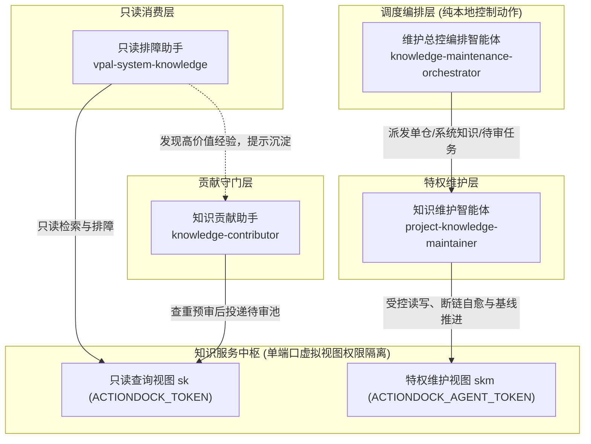
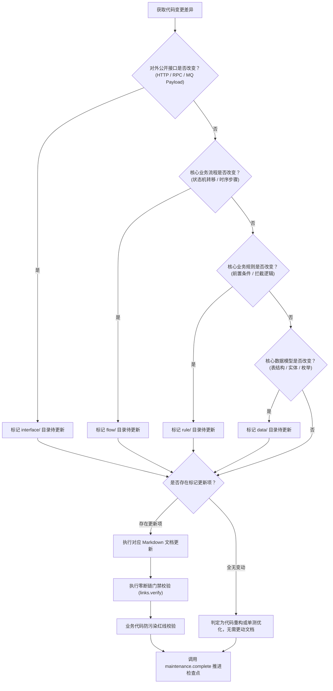

# 智能体设计与角色矩阵

> 智能体体系设计的核心不在于堆叠大而全的模型能力，而在于建立基于最小特权与单端口虚拟视图的确定性角色矩阵与协同闭环。通过将概率性大模型语义推断限制在刚性工程契约之内，让多智能体在严格的权限隔离与确定性质量门禁下各司其职。

本文系统阐述系统的多智能体协同拓扑、最小特权角色矩阵、输入输出契约、契约失效四问决策机制以及人机协同模型。

---

## 核心工程不变量

智能体体系的构建与运转严格遵循三条核心工程不变量：

- 智能体最小特权分工不变量：所有智能体按其运行平面与职责边界被授予最小可用权限。只读排障助手与知识贡献助手在网络协议层面绝对受限于只读查询视图，特权维护操作严格收敛于受信任网络，严禁任何形式的越权读写；
- 事实平面与控制平面解耦不变量：服务端事实平面专注于提供轻量、无状态的受控原子能力，客户端控制平面（纯本地控制动作，命令行严禁附加 `--profile` 控制选项）负责流水线调度编排，严禁将批处理调度与状态探测逻辑反向侵入服务端；
- 概率性推理向确定性门禁收敛不变量：智能体的大模型语义推断必须通过零断链门禁、业务代码防污染红线与双分支隔离治理模型的硬性确定性门禁检验，任何违反门禁的操作一律回滚阻断。

---

## 智能体协同全景拓扑

整个体系构建了职责清晰、边界明确的多智能体协同拓扑，覆盖知识只读消费、贡献守门、特权维护与批量编排全流程：

---

## 智能体角色分工矩阵

单端口虚拟视图权限隔离（Virtual Views）基于只读查询令牌 `ACTIONDOCK_TOKEN` 与特权维护令牌 `ACTIONDOCK_AGENT_TOKEN` 在 443 端口实现细粒度动作暴露隔离。各智能体据此严格切分运行平面与能力边界：

| 角色技能名称 | 运行平面 | 依赖视图与令牌 | 核心定位与场景 | 关键职责与行为约束 |
|---|---|---|---|---|
| 知识贡献助手 [knowledge-contributor](file:///root/code/knowledge-dock/skills/knowledge-contributor) | 交互终端或命令行 | 只读查询视图（`sk`，基于 `ACTIONDOCK_TOKEN`） | 一线研发与运营人员的工程知识贡献守门人 | 负责日常排障与人工经验的交互式捕获。充当知识库防污染第一道门禁，负责输入合理性拦截、排障经验待审池查重预审、标准候选格式组装并显式要求用户确认后投递 |
| 知识维护智能体 [project-knowledge-maintainer](file:///root/code/knowledge-dock/skills/project-knowledge-maintainer) | 受信任受控容器环境 | 特权维护视图（`skm`，基于 `ACTIONDOCK_AGENT_TOKEN`） | 单仓代码变更核验与待审池消费转正中枢 | 负责单仓知识库初始化与增量更新。执行双分支同步、契约失效四问评估、源码交叉比对、精准更新规范文档、触发零断链门禁就地自愈并坚决推进检查点基线 |
| 维护总控编排智能体 [knowledge-maintenance-orchestrator](file:///root/code/knowledge-dock/skills/knowledge-maintenance-orchestrator) | 客户端控制平面（纯本地运行） | 客户端控制平面与特权维护视图（`skm`） | 多仓库批量自动化巡检调度中枢 | 负责客户端控制平面三阶段流水线执行。按仓库清单批量扫描增量、安全渲染命令模板、串行派发维护智能体任务、轮询探测检查点状态并输出审计总结报告 |
| 只读排障助手 `vpal-system-knowledge` | 研发日常工作流与排障终端 | 只读查询视图（`sk`，基于 `ACTIONDOCK_TOKEN`） | 研发日常查询与线上生产排障交互终端 | 面向研发人员提供毫秒级全文检索与文档调阅能力。排障期间仅调阅云端权威事实，绝不读取单机滞后旧代码；排障结束后敏锐提示沉淀排障证据 |

---

## 核心输入输出与协议契约对比

| 角色名称 | 核心输入契约 | 核心输出产物 | 协作上下游关系 |
|---|---|---|---|
| 知识贡献助手 | 开发者非结构化排障现象描述、日志堆栈与关键参数 | 规范 YAML 元数据 + 固定语义标记节的 Markdown 候选文档 | 上游对接人类开发者或只读排障助手，下游通过 `knowledge.collect` 投递至排障经验待审池 |
| 知识维护智能体 | 仓库代码增量差异文件集、排障经验待审池待审候选条目 | 更新后的六类规范知识文档、断链自愈修复集、更新后的检查点水位 | 上游接收总控编排智能体派发任务，下游受控提交至代码仓专属知识分支 `docs` |
| 维护总控编排智能体 | 多代码仓配置清单 `repos.json`、流水线调度触发信号 | 多仓增量巡检清单、智能体执行模板、全流程巡检审计汇总报告 | 上游对接定时任务或本地触发，下游串行拉起并调度知识维护智能体执行维护 |
| 只读排障助手 | 研发人员技术疑问、错误码、日志堆栈或接口名称 | 权威知识引用、架构拓扑解答、排障指引与候选经验沉淀引导提示 | 上游对接一线技术人员，下游引导转交至知识贡献助手沉淀有效经验 |

---

## 人机协同协作模型

系统的核心人机协作模型建立在明确的因果分工之上：

> 人类提供事实证据，智能体负责工程对齐。
> 代码变化只是审查的信号，业务契约失效才是文档更新的理由。

### 人类工程师的核心价值

在复杂多变的生产环境中，人类工程师具备不可替代的场景洞察与现场决策能力：

- 捕捉高价值异动：敏锐洞察业务流程异常与现场故障表征；
- 提供客观证据：直接提供真实日志堆栈片段、调用链标识与具体入参数据；
- 做出业务裁决：在面临架构分歧或重大变更时进行最终决策授权。

人类工程师无需花费宝贵精力排版文档格式、手动绘制时序图或手动梳理复杂的相对链接与锚点。

### 智能体的工程整理价值

智能体承接所有繁琐、机械且容易出错的工程化维护开销：

- 将碎片化表述转化为严格符合 [knowledge-model.md](file:///root/code/knowledge-dock/docs/knowledge-model.md) 的标准语义标记节；
- 深入源码排查候选结论是否具有全局普适性，剔除偶发孤证；
- 在六类既有骨架中定位最合理的归属文件并执行就地补丁编辑；
- 自动检测并修复失效链接，达成零断链门禁；
- 严格遵循业务代码防污染红线与双分支隔离治理模型，安全合入知识分支。

---

## 维护智能体决策流与契约失效四问

知识维护智能体在执行代码变更审查时，严格遵循标准化决策树，杜绝无意义的文档重写：

### 契约失效四问评估决策矩阵

| 评估维度 | 源码变动特征 | 映射受波及骨架 | 裁定准则 |
|---|---|---|---|
| 对外公开接口契约 | 路由路径、控制器入参出参结构变动、错误码枚举增删、异步消息主题或载荷调整 | `interface/` 目录 | 接口实现私有改动不更新；对外结构或错误码协议变动必须更新 |
| 核心业务流程时序 | 状态机新增状态或流转分支、外部依赖调用时序变迁、关键异步解耦通知变动 | `flow/` 目录 | 内部辅助方法重构不更新；跨组件生命周期与状态跃迁变动必须更新 |
| 核心业务规则逻辑 | 前置校验拦截条件、阈值范围、风控策略、退款或分账计算规则变动 | `rule/` 目录 | 算法性能优化不更新；业务判定准入与准出分支逻辑变动必须更新 |
| 核心数据模型定义 | 持久化数据表字段增删改、领域实体属性变更、状态机枚举字典定义扩充 | `data/` 目录 | 临时本地变量改动不更新；核心存储模型与枚举定义变动必须更新 |

### 检查点基线推进机制保障

在契约评估结束后，无论是否发生文档变更，系统均强制执行检查点基线推进：

- 无文档变更时推进检查点的技术必要性在于：无论代码变更是否触发文档改动，推进基线均为标记该批次提交已通过完整审计与评估的唯一凭据；若不推进检查点，后续维护将持续对已审计代码重复发起冗余比对与全量扫描，破坏增量闭环收敛性并带来不必要的计算开销。
- 有文档变更时推进检查点：在零断链门禁与防污染红线校验通过后，特权动作将本次代码提交哈希记入检查点，确保增量闭环顺利收敛。

---

## 智能体设计总结

智能体体系的架构设计可以凝练为四句话：

- 角色职责依循最小特权原则精准切分，单端口双重视界阻断越权隐患。
- 控制平面与事实平面严格解耦，调度逻辑收敛于本地，原子能力托付于服务端。
- 契约失效四问裁定文档更新必要性，确定性门禁遏制概率性幻觉。
- 检查点基线推进确保增量审计闭环，驱动人机协同长效自愈。

---

## 延伸阅读导航

- 知识模型与内容组织规范：了解六类知识骨架切片与排障经验待审池候选规范，参见 [docs/knowledge-model.md](file:///root/code/knowledge-dock/docs/knowledge-model.md)；
- 业务演进实战案例：查阅支付超时状态驱动的多文档联动自维护实操，参见 [docs/examples/payment-flow.md](file:///root/code/knowledge-dock/docs/examples/payment-flow.md)；
- 全景架构设计指南：了解单端口虚拟视图与支撑系统运转的不变量，参见 [docs/architecture.md](file:///root/code/knowledge-dock/docs/architecture.md)；
- 核心概念与设计原则：查阅四大核心设计原则与双分支隔离治理模型权威定义，参见 [docs/concepts.md](file:///root/code/knowledge-dock/docs/concepts.md)。
