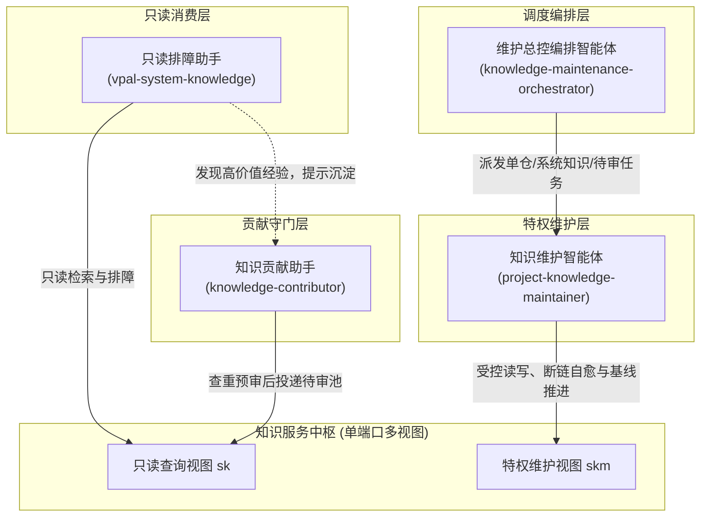
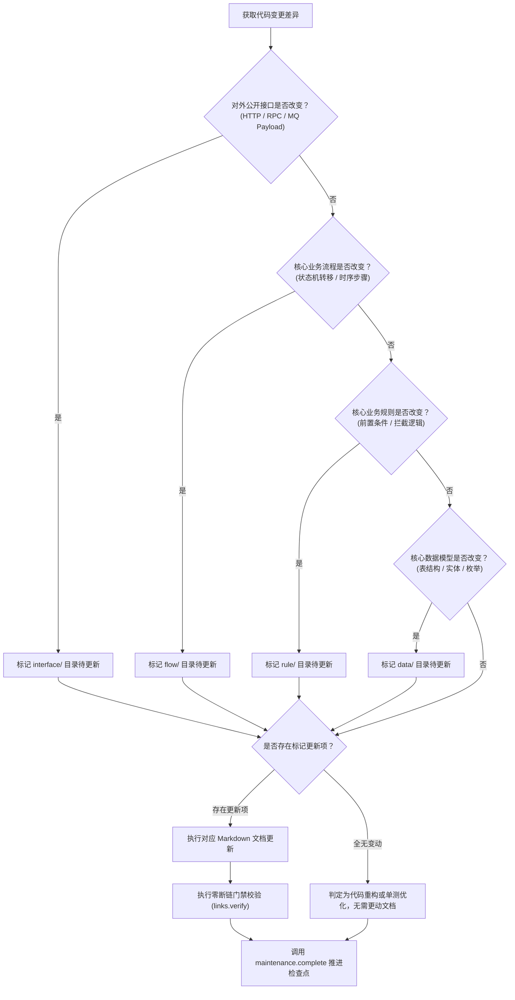

# 智能体体系设计与角色分工

---

## 智能体协作架构

knowledge-dock 构建了一套职责清晰、分工明确的多智能体协同体系。各个智能体遵循最小权限原则，分别服务于知识消费、知识贡献、自动化维护与批量编排场景：

---

## 智能体角色分工矩阵

| 角色技能名称 | 核心定位与场景 | 依赖视图与权限 | 关键职责与行为约束 |
|---|---|---|---|
| **知识贡献助手** `knowledge-contributor` | 一线研发与运营人员的工程知识贡献守门人 | 只读查询视图（`sk`） | 负责日常排障与人工经验的交互式捕获。充当知识库防污染第一道门禁，负责输入合理性拦截、待审池查重预审、标准候选格式组装并显式要求用户确认后投递 |
| **知识维护智能体** `project-knowledge-maintainer` | 单仓代码变更核验与待审池消费转正中枢 | 特权维护视图（`skm`） | 负责单仓知识库初始化与增量更新。执行双分支同步、契约失效四问评估、源码交叉比对、精准更新规范文档、触发零断链门禁就地自愈并坚决推进检查点基线 |
| **总控编排智能体** `knowledge-maintenance-orchestrator` | 多仓库批量自动化巡检调度 | 本地控制平面与特权维护视图（`skm`） | 负责调度流水线三阶段执行。按仓库清单批量扫描增量、安全渲染命令模板、串行派发维护智能体任务、轮询探测检查点状态并输出审计总结报告 |
| **只读排障助手** `vpal-system-knowledge` | 研发日常查询与线上生产排障交互终端 | 只读查询视图（`sk`） | 面向研发人员提供毫秒级全文检索与文档调阅能力。排障期间仅调阅云端权威事实，绝不读取单机滞后旧代码；排障结束后敏锐提示沉淀排障证据 |

---

## 人机协同协作模型

knowledge-dock 的核心交互理念是**人提供事实，智能体负责整理**：

- **人类工程师的核心价值**：在复杂线上环境中，人类工程师具备不可替代的现场直觉与根因定位能力。工程师提供客观的关键事实证据（如特定请求入参、异常堆栈日志与业务上下文），无需花费精力调整格式、绘制时序图或理清文档引用关系；
- **智能体的核心价值**：智能体具备对全局架构与代码实现的高效比对能力。智能体承接所有繁重且容易出错的机械性开销，包括：
  - 将非结构化的自然语言描述转化为标准语义分节；
  - 深入源码排查候选结论是否具有普遍适用性；
  - 在既有的知识骨架中定位最合理的归属文件；
  - 自动修复因文件变更产生的失效相对链接与锚点；
  - 严格确保不误伤业务源码并推进检查点基线。

---

## 维护智能体决策机制

维护智能体在执行代码变更审查时，严格遵循标准化决策树：

决策评估要点：

- **契约优先**：代码实现的变化若未溢出为对外契约的变化，坚决不修改文档；
- **增量收敛**：无论是否发生文档变更，必须执行检查点基线推进，确保系统状态平稳收敛。
