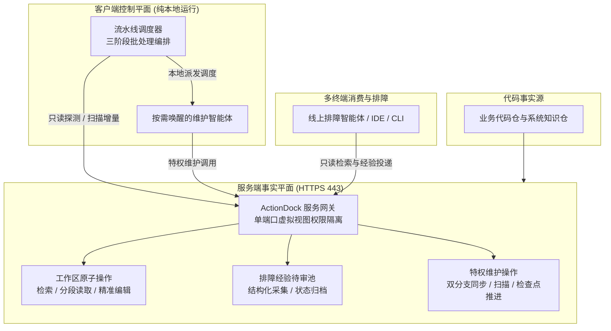

# 全景架构设计指南

> Knowledge Dock 的架构目标不是建一个静态文档库，而是建立一套让工程知识随代码提交自动演进的确定性闭环系统。

本文阐述系统的逻辑架构、运行时安全边界，以及支撑这一体系平稳运转的核心不变量。

---

## 核心反差：从断裂误判到自动演进

传统研发流程与 Knowledge Dock 驱动的自维护体系之间，存在本质的工程反差：

| 维度 | 传统文档模式 | Knowledge Dock 模式 |
|---|---|---|
| **更新时机** | 改动代码后依赖人工自觉维护，通常被遗忘 | 代码提交自动触发增量核验与契约失效分析 |
| **可信程度** | 文档严重滞后失修，智能体检索易引发误判 | 知识与代码提交哈希严格对齐，永远反映最新工程事实 |
| **维护成本** | 人工编写与排查断链成本高，导致文档荒废 | 智能体自动补齐差异并就地自愈断链，人类仅提供事实凭据 |
| **存储边界** | 外置独立文档库，易与真实代码版本脱节 | Git 作为唯一事实源，代码变更与知识演进原子绑定 |

核心差异可以概括为：

> **代码变化只是审查的信号，业务契约失效才是文档更新的理由。**

---

## 逻辑架构与双平面职责

系统在物理与逻辑上清晰划分为两个平面：

- **服务端事实平面**：汇聚代码镜像、双分支治理、检查点水位与待审池，对外仅提供纯粹、轻量、无状态的受控原子 Action；
- **客户端控制平面**：流水线调度器（`knowledge-orchestrator`）在当前执行机纯本地运行，负责巡检多仓、组装任务模板、派发智能体并汇总审计报告。统一规范表述为「客户端控制平面」（纯本地控制动作，命令行严禁附加 `--profile` 控制选项）。

这一划分的确立原则：

> **服务端负责事实与能力，客户端负责何时调用、调用哪个仓库与如何串联。**

---

## 运行时架构：单端口虚拟视图隔离

统一规范表述为「单端口虚拟视图权限隔离」（Virtual Views），基于只读查询令牌 `ACTIONDOCK_TOKEN` 与特权维护令牌 `ACTIONDOCK_AGENT_TOKEN` 在 443 端口实现细粒度动作暴露隔离。

服务端基于 ActionDock 原生虚拟视图特性，统一收敛至标准 HTTPS 443 端口，仅通过请求头中的令牌划分安全信任边界，彻底免除前置反向代理网关：

| 视图 | 鉴权凭据 | 面向对象 | 暴露能力集 |
|---|---|---|---|
| 查询视界（`sk`） | `ACTIONDOCK_TOKEN` | 外部开发人员、线上排障助手 | 代码全文检索、文件安全分段读取、目录浏览、排障经验待审池受控追加 |
| 维护视界（`skm`） | `ACTIONDOCK_AGENT_TOKEN` | 受信任网络内的维护智能体、本地调度器 | 文件受控写入、精准编辑、受限终端执行、零断链门禁校验、双分支同步、发布提交、检查点推进 |

查询视界在网络协议层物理剥离了所有文件覆写与 Git 分支操作权限，杜绝外部越权调用。

---

## 支撑架构运转的五条工程不变量

系统拒绝将安全与一致性押注在智能体的提示词上，而是由服务端 Action 强制兑现五条不变量：

- **单一事实源不变量**：
  - 正式工程知识必须以纯文本 Markdown 结构保存在 Git 仓库的专属知识分支中，拒绝引入任何外置独立知识数据库，确保知识演进与代码提交哈希强绑定；
- **双分支隔离不变量**：
  - 统一规范表述为「双分支隔离治理模型」，主干业务分支与知识分支解耦，遇冲突安全中止并由智能体进行语义消解；
  - 业务主干分支保持纯粹的生产代码，专属知识分支（`docs`）承载文档；分支同步发生冲突时立即执行 `git merge --abort` 退出，严禁自动化程序私自裁决；
- **检查点推进不变量**：
  - 统一规范表述为「检查点基线推进机制」（基于提交哈希的增量扫描基准）。无文档变更时推进检查点的技术必要性在于：无论代码变更是否触发文档改动，推进基线均为标记该批次提交已通过完整审计与评估的唯一凭据；若不推进检查点，后续维护将持续对已审计代码重复发起冗余比对与全量扫描，破坏增量闭环收敛性并带来不必要的计算开销；
- **经验流转缓冲不变量**：
  - 统一规范表述为「排障经验待审池」，规范候选经验结构化采集、特权审查提炼与决议归档留痕闭环；
  - 候选文档是贡献单元而非正式知识存储单元，必须先缓冲入待审池，经维护智能体结合源码交叉求证属实后方可提炼合入正式知识骨架；
- **发布质量门禁不变量**：
  - 统一规范表述为「零断链门禁」（`links.verify` 就地自愈）与「业务代码防污染红线」（严格收敛在 `docs/knowledge/` 目录）；
  - 零断链门禁强制要求 Markdown 相对引用与锚点校验通过；防污染红线强制核验暂存区改动，一旦超出知识文档目录立即全量回滚并阻断发布。

---

## 架构设计总结

整个系统全景架构可以凝练为四句话：

- **以 Git 为单一事实源，让工程知识随代码提交自收敛演进。**
- **单端口 443 原生划分双重视界，最小特权保障安全防线。**
- **服务端保持无状态原子能力，批处理流水线收敛于本地控制平面。**
- **通过五条硬性不变量约束状态变迁，以确定性工程系统驾驭概率性智能体。**

---

## 延伸阅读导航

- **动作体系与底座工程解析**：深入了解面向智能体工作空间的设计约束、传统选型反向推导、ActionDock 框架精准赋能与双平面协同契约，参见 [docs/action-design.md](action-design.md)；
- **核心概念与设计原则**：查阅四大核心设计原则、单端口虚拟视图与双分支隔离模型权威定义，参见 [docs/concepts.md](concepts.md)；
- **核心流程与生命周期**：掌握代码变更自维护、待审池流转闭环与三阶段流水线调度机制，参见 [docs/workflow.md](workflow.md)；
- **部署与交付实战指南**：获取多仓库配置、双令牌安全基线与 Docker 容器部署指引，参见 [docs/deployment.md](deployment.md)；
- **知识运维与质量门禁**：获取检查点基线运维、待审池流转操作与零断链门禁自愈手册，参见 [docs/operations.md](operations.md)。
