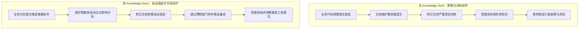
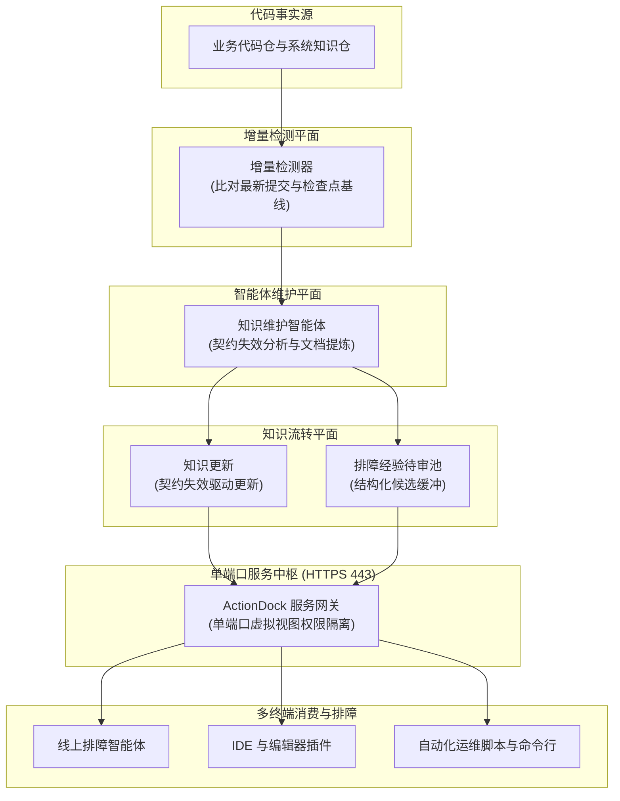
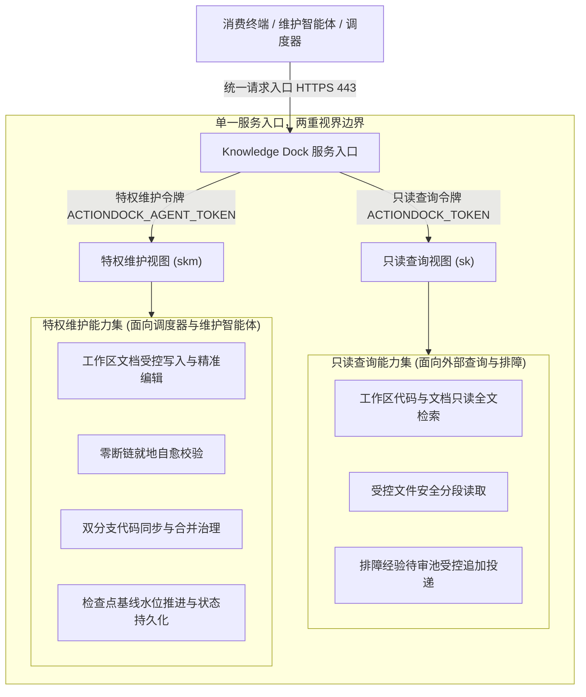

# 全景架构设计指南

> Knowledge Dock 是一个让 AI 智能体永远基于最新工程事实工作的知识基础设施。代码变化，知识自动演进。

---

## 核心演进反差

在传统的研发模式与 Knowledge Dock 驱动的自维护工程体系之间，存在本质性的工程反差：

工作模式对比：
- **无 Knowledge Dock 场景**：改动代码后文档被遗忘，智能体检索失效知识导致诊断错误，研发团队陷入「越用智能体越不敢信」的信任恶性循环；
- **有 Knowledge Dock 场景**：代码提交触发自动化增量核验，维护智能体按需更新知识骨架，智能体与工程师永远获取经过代码交叉验证的权威事实。

关于系统解决的工程痛点与方案横向对比，参见 [docs/vision.md](vision.md)。

---

## 逻辑架构总览

系统端到端逻辑架构拓扑如下：

系统核心组件协同关系：
- **代码事实源**：企业内部托管的代码仓库与系统架构仓库，作为系统唯一的权威事实源；
- **增量检测器**：负责比对仓库生产分支最新提交与检查点基线水位，筛选出存在有效未审提交的目标仓库；
- **知识维护智能体**：负责分析代码变更影响、执行契约失效判定、更新知识骨架、修复断链并推进基线；
- **排障经验待审池**：外部经验与人工补充的受控待审池，阻断未经求证的信息直接写入正式知识库；
- **知识服务中枢**：基于单端口虚拟视图技术，在 HTTPS 443 端口分别提供面向外部的只读查询能力与面向内部的受控维护能力；
- **消费与交互终端**：包含开发者的日常开发工具、自动化运维脚本以及线上只读排障助手。

关于端到端生命周期时序与详细流转，参见 [docs/workflow.md](workflow.md)。

---

## 核心设计原则在架构中的映射

架构的各项技术选型严格源于系统的四大核心设计原则：

- **Git 是唯一事实源**：架构拒绝引入外置文档数据库，所有正式工程知识均以纯文本 Markdown 结构收敛于 Git 仓库中；
- **代码变化不等于知识更新**：增量代码提交仅作为触发核验的必要信号，内部重构与单测调整不触发文档修改；
- **人工贡献统一进入待审池**：架构物理隔离正式知识与人工输入，外部经验必须经由待审池缓冲与源码交叉求证后方可转正；
- **智能体负责整理维护**：人类工程师提供关键事实证据，智能体承接文档对齐、断链校验与分支发布的全部工程开销。

关于四大原则的深入定义与推导，参见 [docs/concepts.md](concepts.md)。

---

## 运行时架构与安全边界

Knowledge Dock 倡导极简与轻量至上的工程哲学，弱化底层物理包细节，采用「单一服务入口，两重视界边界」的设计范式。

### 单端口多视图权限隔离

服务端基于 ActionDock 原生虚拟视图特性，在标准 HTTPS 443 统一端口下运行，仅通过请求头中的鉴权令牌划定严格的信任边界，无需部署与维护复杂的前置反向代理网关：

视图安全特性说明：
- **只读查询视图**：由只读查询令牌 `ACTIONDOCK_TOKEN` 鉴权，面向外部日常研发人员与只读排障助手。仅开放代码检索、文档读取与经验入池追加，严格剥离任何文件覆写与分支操作能力；
- **特权维护视图**：由特权维护令牌 `ACTIONDOCK_AGENT_TOKEN` 鉴权，面向受信任网络内的维护智能体与流水线调度器。开放工作区受控编辑、断链自愈、双分支同步与检查点基线推进能力；
- **单端口收敛优势**：消除多端口微服务网络配置复杂度与跨域问题，天然适配企业私有云与容器化环境。

### 控制平面与事实平面职责解耦

- **服务端事实平面**（`server/`）：专注于提供纯粹、轻量、无状态的原子能力。承载代码镜像、双分支同步、差异扫描、检查点推进与待审池收集，对外暴露受控动作，不承担上层批处理编排逻辑；
- **客户端控制平面**（`client/packages/knowledge-orchestrator`）：专注于轻量批处理流水线调度。在当前执行机环境中运行，负责按清单巡检多仓、组装模板、派发智能体任务并结算审计报告。

---

## 核心工程机制与可靠性保障

### 双分支隔离治理模型

- **主干业务分支**：如 `release` 或 `main` 分支，由人类业务开发团队日常提交与发版，保持纯粹的工程业务代码；
- **专属知识分支**：统一命名为 `docs` 分支，承载该代码仓的工程知识文档。文档改动严格收敛在 `docs/knowledge/` 目录下，严禁污染业务代码；
- **冲突安全中止机制**：分支同步过程中若检测到代码级冲突，自动化程序严禁私自裁决，立即安全中止并由智能体进行语义消解。

### 检查点基线推进机制

- **增量扫描基准**：每次巡检时，系统比对业务分支最新提交哈希与已记录的检查点哈希，仅将存在有效新提交的仓库标记为待处理任务；
- **推进基线的技术必要性**：无论代码变更是否触发文档改动，推进基线均为标记该批次提交已通过完整审计与评估的唯一凭据；若不推进检查点，后续维护将持续对已审计代码重复发起冗余比对与全量扫描，破坏增量闭环收敛性并带来不必要的计算开销。

### 质量门禁与业务代码防污染红线

- **零断链门禁**：正式发布前强制调用断链扫描，自动核验 Markdown 相对文件引用路径与锚点，智能体就地自愈修复至断链数为零；
- **业务代码防污染红线**：提交前自动核查工作区改动范围，一旦检测到任何超出 `docs/knowledge/` 目录的代码修改，立即全量回滚并阻断发布。

关于质量门禁的运维执行规程，参见 [docs/operations.md](operations.md)。

---

## 延伸阅读导航

- **业务演进实战案例**：查阅支付超时状态更新驱动的多文档自演进复盘，参见 [docs/examples/payment-flow.md](examples/payment-flow.md)；
- **知识目录模型与模板规范**：了解六类知识骨架与待审池标记节格式，参见 [docs/knowledge-model.md](knowledge-model.md)；
- **系统部署与交付指南**：获取生产级容器部署与环境变量配置手册，参见 [docs/deployment.md](deployment.md)；
- **智能体体系与角色分工**：了解贡献守门、特权维护与总控编排智能体协同设计，参见 [docs/agent-design.md](agent-design.md)。
