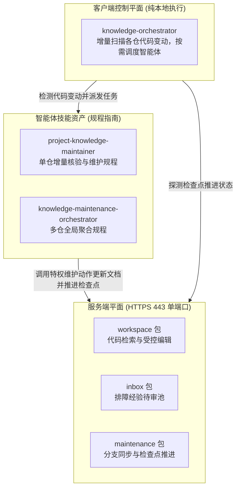
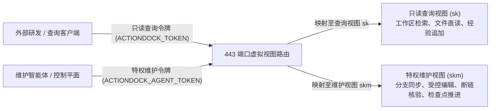
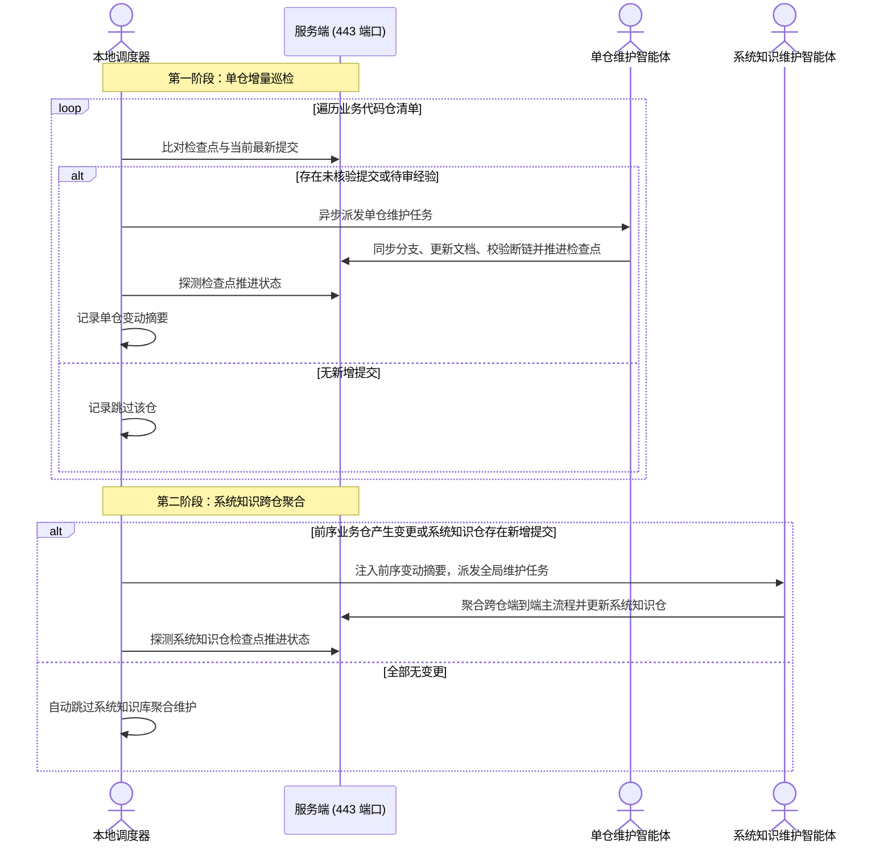

# 全景架构设计指南

---

## 系统分层架构

knowledge-dock 由服务端平面、客户端控制平面与智能体技能资产三层协同构成：

- 服务端平面（`server/`）：工程代码与知识文档的宿主环境，一体化容器部署，对外收敛至标准 HTTPS 443 端口。负责提供代码与文档全文正则检索、受控文件编辑、系统命令调度、检查点数据持久化与 Git 凭据免密同步能力。
- 客户端控制平面（`client/`）：本地客户端编排包 `knowledge-orchestrator`。作为纯本地执行的轻量调度器，不产生大模型推理开销，负责按照配置清单增量探测各代码仓提交状态，执行两阶段调度并派发智能体任务。
- 智能体技能资产（`skills/`）：维护指南与工作流规范资产，为维护智能体提供标准操作规程，指导智能体执行代码分支同步、增量语义分析、文档受控更新、断链校验与检查点推进。

---

## 单端口虚拟视图隔离模型

传统方案通常依赖多端口暴露或反向代理网关进行权限切分。knowledge-dock 基于 ActionDock 原生单端口虚拟视图（Virtual Views）特性，将全部服务能力统一收敛至标准 443 端口，依据鉴权令牌自动实现权限隔离：

- 只读查询视图（对应配置名称 `sk`）：面向日常研发人员与只读查询智能体，基于只读查询令牌 `ACTIONDOCK_TOKEN` 鉴权。该视图仅开放全文正则检索（`workspace/search.rg`）、受控分段读取（`workspace/files.read`）以及排障经验结构化追加（`knowledge/knowledge.collect`）。完全屏蔽文件写入与系统命令调度动作，从网络入口彻底阻断代码与文档的非受控篡改。
- 特权维护视图（对应配置名称 `skm`）：面向受信任网络与维护智能体，基于特权维护令牌 `ACTIONDOCK_AGENT_TOKEN` 鉴权。提供完整的工作区文件读写、局部精准编辑、终端命令调度、断链核验、双分支同步与检查点推进动作集合。

---

## 双分支隔离模型与冲突安全中止机制

为了确保主干业务代码的稳定性与工程知识自维护的独立演进，纳管的业务代码仓统一采用双分支治理模型：

- 主干业务分支（如 `release`、`main` 或 `master`）：由人类研发团队日常维护与发布，存放纯粹的业务源码与工程配置。
- 专属知识分支（如 `docs`）：由维护智能体自主维护，承载经过结构化提炼的工程知识体系，知识文档严格收敛在 `docs/knowledge/` 目录下。
- 冲突安全中止机制：在执行增量同步时，维护流程首先尝试将主干业务分支代码合并至专属知识分支。若检测到文件级冲突，系统严禁强制覆盖，而是自动触发合并中止与安全回滚（`git merge --abort`），输出冲突文件清单并交由智能体进行上下文语义消解，确保知识维护过程绝不影响主干业务分支。

---

## 检查点基线推进机制

知识库自维护的核心增量控制依托于基于提交哈希的检查点推进机制：

- 增量扫描基准原理：检查点记录当前已核验完成的代码提交哈希作为水位基线。调度器在后续巡检中，仅需比对上次检查点提交与当前最新提交之间的增量差异区间，实现定向分析。
- 无文档变更时的推进必要性：当代码变更仅涉及内部实现重构、变量更名、注释修整或测试用例补充，未改变任何外部行为契约与业务逻辑时，智能体判定无需修改文档。此时系统同样必须调用完成动作推进检查点水位至最新提交哈希，以确立后续增量比对基线。若不推进检查点，后续调度巡检仍会将已审阅的提交纳入增量区间，导致重复无效扫描与算力浪费。
- 状态持久化机制：检查点状态记录存储于独立持久化数据卷中，容器重启或重建不丢失状态，具备原生断点续传能力。

---

## 排障经验待审池与生命周期流转

为避免日常排障与运维经验碎片化散落或直接篡改正式知识库，系统设立了结构化待审池机制：

- 物理存储隔离：待审池目录独立挂载，与正式工程工作区保持物理隔离。
- 受控追加流转：外部通过只读查询视图仅可执行经验结构化追加动作（`knowledge.collect`），待审数据不对外开放检索，杜绝未审信息干扰正常知识检索。
- 审核提炼与归档闭环：特权维护智能体在巡检时扫描待审池，结合业务源码核验属实后，结构化提炼并合入对应规范目录中（如操作规程、业务规则或接口说明目录），随后调用归档动作（`knowledge.archive`）完成生命周期闭环。

---

## 两阶段流水线调度拓扑

针对多代码仓与微服务架构，集中式长会话极易因上下文超限或单点阻塞导致流水线中断。系统采用两阶段流水线拓扑：

- 第一阶段（单代码仓增量巡检）：调度器按清单遍历业务代码仓，若检测到未核验提交或待审经验，即时派发单仓维护智能体进行分支同步、增量分析、文档维护、断链校验与检查点推进。单仓任务完成后该智能体会话即刻销毁并释放资源，调度器汇总各仓变更摘要。
- 第二阶段（系统知识跨仓聚合）：若第一阶段中任一业务代码仓产生了有效知识变更，或系统知识仓本身存在新增提交，调度器将前序代码仓的变动摘要注入模板，唤醒系统维护智能体聚合跨仓端到端主流程与全局架构；若所有业务仓均无变动且系统基线已对齐，调度器自动跳过第二阶段，实现按需聚合。
