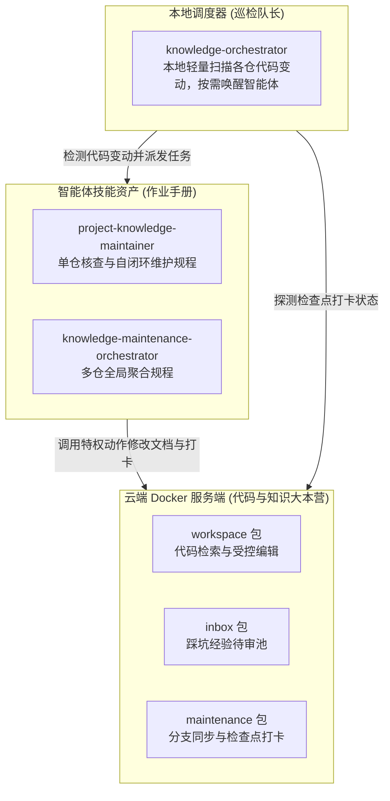
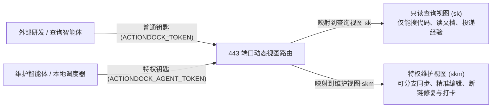
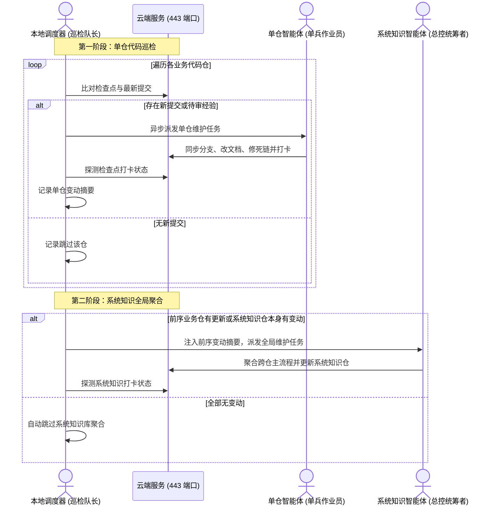

# knowledge-dock 架构指南

---

## 整体分工：三层协同

系统通过三层协作实现知识库的自维护：

- 云端 Docker 服务端（`server/`）：代码与文档的宿主环境，对外仅暴露 HTTPS 443 单端口。负责代码与文档的全文检索、受控文件编辑、命令执行、检查点数据存储与 Git 免密同步。
- 本地客户端调度器（`client/`）：相当于巡检队长。纯本地运行的轻量脚本，不调用大语言模型，零推理开销。它定时向云端比对各仓库的代码变动，发现有新提交就异步唤醒智能体去干活。
- 智能体技能资产（`skills/`）：相当于单兵作业手册。提供经过工程验证的标准指导语与工作流规范，教智能体拿到任务后如何拉取分支、比对代码差异、精准编辑文档、修复死链与打卡推进检查点。

---

## 普通钥匙与特权钥匙：单端口 443 的安全隔离

传统系统往往需要为不同权限开放多个端口，或搭建复杂的反向代理网关。knowledge-dock 依托 ActionDock 原生多视图能力，统一收敛至标准 HTTPS 443 端口：

- 普通钥匙（查询令牌，对应视图 `sk`）：面向外部日常研发人员与只读查询助手。该视图仅开放全文检索（`search.rg`）、分段读文档（`files.read`）与投递踩坑经验（`knowledge.collect`）。完全不暴露任何文件修改或系统命令执行动作，从网络入口彻底消除误动代码与文档的风险。
- 特权钥匙（维护令牌，对应视图 `skm`）：面向经过授权的维护智能体与调度控制平面。具备完整的工作区读写、局部精准编辑、终端命令调度、断链核验、双分支同步与检查点推进动作集合。

---

## 双分支隔离：井水不犯河水

为了兼顾业务代码的稳定性与知识库的自维护演进，每个纳管的业务代码仓均采用双分支治理模型：

- 业务主分支（如 `release`）：由人类研发团队日常维护，用于业务发布与构建，存放纯粹的业务源码与工程配置。
- 专属知识分支（如 `docs`）：由维护智能体自主打理，承载经过结构化提炼的工程知识体系。
- 冲突安全中止机制：智能体工作时，会先尝试将业务主分支代码合并到知识分支。如果检测到代码或文件冲突，系统绝不强制覆盖，而是立刻执行合并回滚并返回冲突文件清单，交由智能体根据上下文语义处理，既保证知识库与代码同步，又绝不影响业务主分支。

---

## 检查点打卡戳：杜绝重复无效扫描

知识库自维护的核心机制是检查点打卡戳：

- 巡检打卡原理：就像保安巡检大楼打卡一样，检查点记录的是「当前已核验到哪一个提交哈希」。下一次巡检时，调度器只需比对上次打卡提交与当前最新提交之间的差量，仅针对新增区间进行分析。
- 没改文档也必须打卡：当代码变动仅涉及内部变量重命名、注释修整或测试用例调整，未改变任何外部行为契约时，智能体判定无需修改文档，此时同样必须调用完成动作推进检查点打卡（标记无需修改文档）。如果不打卡，下一次调度器巡检时还会把这部分提交当成新代码，拉着智能体重新分析一遍，造成算力与时间的浪费。
- 状态持久化：检查点记录在独立的数据卷中，容器重启或重建不会丢失打卡记录，支持天然断点续传。

---

## 收件箱缓冲池：先缓冲、再整理归纳

线上排障踩坑经验如果允许大家随手修改正式文档，容易造成文档内容碎片化、格式错乱甚至自相矛盾。系统通过收件箱待审池实现缓冲：

- 独立物理存储：待审池目录独立挂载，与正式工作区物理隔离。
- 只写不读缓冲机制：外部使用普通钥匙即可向待审池投递结构化排障记录（`knowledge.collect`）。待审池对外不提供直接检索访问，未审核信息不会干扰外部正常查阅。
- 提炼与归档闭环：特权维护智能体在巡检时扫描待审池，核对业务源码确认属实后，提炼归并到正式知识分类目录中（如操作手册、规则或接口文档），然后将候选记录打标归档。

---

## 两阶段分工：先单兵核查，后总控聚合

面对几十甚至上百个微服务工程，如果用一个大模型会话从头跑到尾，极易因上下文打满、注意力分散或网络超时而崩溃。系统将调度拆解为两阶段：

- 第一阶段（单代码仓代码巡检）：调度器按清单遍历业务代码仓，发现有新提交就派发一个单仓智能体去处理。单仓任务完成后该智能体会话立即销毁并释放资源。调度器收集每个仓的变动摘要。
- 第二阶段（系统知识库全局聚合）：如果第一阶段中有任何业务代码仓产生了有效变更，或者系统知识仓自身有新提交，调度器将前序代码仓的变动摘要注入模板，唤醒系统级维护智能体更新跨仓端到端主流程与全局架构；如果所有业务仓均无变动且系统基线已对齐，调度器自动跳过第二阶段，实现按需聚合。
