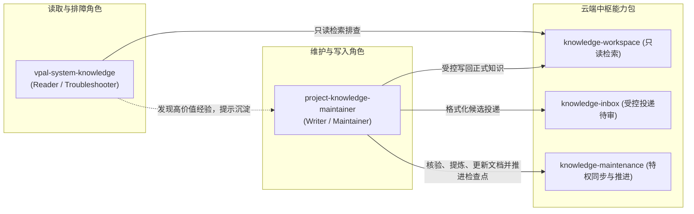

# 全景架构设计指南：自动维护与反馈闭环实践

---

## 前言与起因

在构建面向业务研发团队与多智能体协同的工程知识体系时，我们此前的第一阶段实践已经沉淀了扎实的基础：现有知识库此前已经具备了仓库级（在 `docs/knowledge/` 目录下规划并建立了 `flow`、`module`、`rule`、`interface`、`data`、`runbook` 六类骨架）与系统级（跨代码仓的端到端业务主流程与全局架构）的 Markdown 知识结构，并且通过统一的云主机对外提供了集中式的只读检索服务。

然而，随着各业务系统版本迭代速度的成倍提升，知识体系迈入第二阶段时，我们遭遇了三个致命的硬痛点：

- 知识维护严重依赖人工：业务代码每天高频发版，研发人员在紧迫的项目排期下极少会主动维护和补充工程文档，单靠人工肉眼核对与手工补录，无论制度如何考核都难以长期持续；
- 本地知识极易滞后过期：研发人员或本地运行的排障智能体，其本地工作区的代码仓往往未能及时同步远端主干分支的最新提交，在进行线上故障排查或深层代码推演时，经常检索到已失效的历史文档，进而导致排障诊断发生严重误判；
- 知识贡献缺少受控统一入口：线上应急排障所验证的高价值经验、日常人工补充以及设计文档中的业务映射，都极度缺乏一条安全可控的通道汇入正式知识库。如果直接放开权限让研发人员或临时会话随意改动正式文档分支，不仅会导致排版与结构四分五裂，更会混入未经求证的主观猜测与偶发个案，造成正式知识库的严重污染。

面对这三大矛盾，我们摒弃了建立独立外部知识库或依赖人工补录的传统思路，在架构草案中确立了整个工程的终极目标：

> **Git 管正式知识，云主机提供最新只读视图，代码变更自动维护知识，人工贡献统一进入 Knowledge Inbox。**

围绕这一终极目标，我们在底层运行环境、网络拓扑、增量控制与智能体协作规范上，推导并建立了完整的架构闭环体系。

---

## 知识读取：为什么统一走云主机

在过往的开发习惯中，工程师或本地排障工具往往优先翻阅当前工作区本地存储的文档。但在多微服务、高频发版的生产协作中，这一做法被证明是导致知识脱节的根源。

本地工作区的代码分支极易长期停滞，研发人员拉出特性分支开发后往往数周不更新本地主干，本地存储的 Markdown 规范极易沦为过时信息。如果排障智能体依赖本地文档推导线上问题，无异于刻舟求剑。

为此，我们在知识读取维度确立了严格的全局统一规则：

- 知识检索与生产排障：统一跨网络请求云主机知识服务，获取经过常态化同步与核验的最新知识视图；
- 当前特性分支业务分析：遵循「本地当前源码 + 云主机最新知识」的组合模式，本地代码负责提供未发布的改动上下文，云主机知识负责提供权威的全局契约与基线。

这一规则的技术定位非常明确：

> **Git 是唯一事实源，云端知识中枢对外提供最新只读视界。**

通过将只读视界完全收敛在云端，我们确保了本地智能体、排障自动化流水线以及研发人员在任何时刻看到的都是同一份权威事实，消除了单机环境差异与信息孤岛。

---

## 代码自动维护流水线：Cron 只调度，Action 统一执行

为了彻底摆脱对人工维护的依赖，知识库必须具备跟随业务代码提交自动核验与生长的能力。然而，在早期的自动化尝试中，维护逻辑往往被随意写成一段段分散的定时任务脚本，或者由调度程序直接执行底层的 Git 指令，导致环境极其脆弱且难以审计。

在当前架构中，我们确立了明确的分工原则：定时调度器仅负责按周期触发流水线，一切代码同步、差异核验与状态推进完全交由标准化的 Action 工具包统一执行。

服务端封装了高权限的特权维护包 `actiondock-knowledge-maintenance`，对外提供三个核心动作：

- `maintenance.sync`：负责纳管代码仓的分支双向对齐。拉取生产分支（如 `release`）并合并至专属知识分支（`docs`）。同步过程中严格禁止执行破坏性的硬重置（`git reset --hard`）或强制推送（`git push --force`）。若在合并时检测到任何文件冲突，脚本绝不私自做主，而是立即安全中止（`git merge --abort`）并退出返回冲突文件清单，交由智能体结合业务语义进行上下文消解；
- `maintenance.list`：负责精确返回真正存在未审代码变动的仓库清单。系统为每个纳管仓库维护检查点基线水位记录 `last_knowledge_checked_commit`。每次比对时，该动作将生产分支最新提交哈希与已记录的检查点哈希进行差集比对，仅将存在有效新提交的仓库组装为待处理任务，调度程序无需自行遍历庞大的仓库树；
- `maintenance.complete`：负责在智能体核验结束后推进检查点水位。智能体完成代码分析并确认知识库状态后，调用此动作将该仓检查点推进至最新提交哈希。

在这一维护闭环中，我们坚守一项核心铁律：

> **代码变更只触发检查，知识失效才触发更新。**

业务代码的变更仅代表可能存在知识漂移，是触发审查的必要条件，但绝非修改文档的充分条件。当一次提交仅仅是内部方法重构、私有逻辑抽离或单测扩充时，对外的公开接口、业务规则与时序契约并未发生变化，既有文档依然准确，此时严禁更动文档。

而无论文档最终是否发生改动，智能体都必须调用 `maintenance.complete` 坚决推进检查点基线。推进检查点的技术必要性在于：推进水位是系统标记「该段代码差异已经通过完整知识维护流程核验」的唯一凭证。若因为没有改动文档而放弃推进检查点，检查点将长期滞后，下一次定时巡检仍会将已审计代码判定为新增量，引发重复分析与死循环比对，破坏增量系统的收敛性。

---

## Knowledge Inbox 统一知识贡献入口

除了代码提交引发的知识变更，企业知识的另一大源泉是一线排障过程中的故障处理经验与人工补充。若缺乏受控通道，这些知识要么转瞬即逝，要么以极不规范的形式污染主干。

Knowledge Inbox 是整个架构中所有人工知识进入正式知识库前的唯一受控写入口。它将人工贡献划分为两类核心场景：

- 生产排障经验（`troubleshooting`）：收集在处理生产故障、客诉阻断或异常日志排查时发现的关键事实，例如特定参数组合触发的隐蔽熔断或未声明的限流规则；
- 日常维护补充（`maintenance`）：涵盖系统端到端主流程补充、单仓知识修正、业务规则扩充、接口与消息队列契约增补以及依据最新系统设计文档补全知识。用户在提交时无需自行判断属于新增还是修正，统一由维护智能体与现有知识对比后进行裁定。

### 结构化候选文档规范

Knowledge Inbox 采用 Markdown 文件格式存储于待审池中，而非结构僵化的数据库记录。其核心规范定义为：

> **YAML Frontmatter + 固定语义标记节（Semantic Sections）**

系统为两类输入分别规定了标准语义标记节：

- 生产排障类候选模板包含固定语义节：`<!-- section:context -->`（问题背景与现象）、`<!-- section:evidence -->`（证据链）、`<!-- section:findings -->`（已验证结论）、`<!-- section:candidates -->`（建议沉淀的知识）、`<!-- section:unknowns -->`（未确认事项）、`<!-- section:maintainer -->`（处理记录）；
- 日常维护类候选模板包含固定语义节：`<!-- section:context -->`（维护背景）、`<!-- section:content -->`（建议内容）、`<!-- section:evidence -->`（依据）、`<!-- section:target -->`（建议归属）、`<!-- section:unknowns -->`（未确认事项）、`<!-- section:maintainer -->`（处理记录）。

该规范奉行核心原则：模板只约束语义分节的结构标记，绝不约束正文的具体写法。贡献者可以在各节内部自由使用自然语言、无序列表、表格、代码片段或时序图。自动化解析程序完全依赖注释标签进行切片与提取，不依赖标题文本。

### 候选文档设计三原则

为了杜绝低质信息污染知识库，候选文档必须严格恪守三项设计原则：

- 保存事实不保存思维链：文档应忠实记录故障现象、排查步骤、关键日志证据与最终验证的事实，去除冗长的主观心路历程与试错推测；
- 未确认事项必须保留：允许且鼓励明确记录「尚未验证」、「缺少对端代码」或「仅在特定测试环境复现」等未知信息，严禁为了追求文档的形式完整而主观臆断或过度脑补；
- 待审池与正式知识库边界清晰：待审池负责保存具体案例、偶发日志、关联订单号与详细排查证据，正式知识库则收敛提炼为稳定的通用规则、架构流程、标准接口与排障规程。

### 维护智能体消费原则

在对待审池进行消费与处理时，维护智能体必须严格执行核心铁律：

> **候选文档是贡献单元，不是正式知识存储单元。**

严禁机械式地执行「一篇候选文档新建一个正式知识文件」。待审池中的文档仅仅是原料，维护智能体必须结合代码仓源码进行交叉求证，核验属实后将其提炼、打补丁或重构到既有的规范目录（`flow`、`rule`、`runbook` 或系统架构文档）中。合入完成后，对候选文档执行归档操作，确保待审池流转收敛。

---

## 运行时基础设施与物理分层设计

在系统架构的设计与演进中，我们确立了明确的物理分层与职责解耦边界。

### 控制平面与事实平面的职责解耦

knowledge-dock 的核心架构设计并非受限于物理位置的本地与远端划分，而是**控制平面与事实平面的职责解耦**，即调度编排与原子能力的彻底分离：

- 服务端事实平面（`server/`）：专注于提供纯粹、轻量、无状态的原子能力。承载全局代码镜像、双分支代码同步（`maintenance.sync`）、差异扫描（`maintenance.list`）、检查点基线推进（`maintenance.complete`）、工作区只读检索与受控编辑（`knowledge-workspace`）以及排障经验待审池（`knowledge-inbox`）。服务端作为全局代码镜像与正式知识体系的权威事实源，对外仅暴露受控的 Action 动作，不承担任何上层批处理编排调度逻辑；
- 编排控制平面（`client/packages/knowledge-orchestrator`）：专注于提供轻量批处理两阶段流水线调度。负责多代码仓按清单巡检、比对增量差异、组装安全命令模板、派发智能体任务、轮询探测检查点推进状态并结算审计报告。

这种解耦架构具有高度的通用性与拓扑对称性：

- 拓扑对称性与环境解耦：流水线调度器既可以运行在本地开发机（配合本地运维终端与本地智能体），也完全可以部署在独立的远程调度机、远程工作区 Valet 或 CI/CD 自动化流水线中（配合远端智能体执行环境）。调度器与服务端之间通过标准网络协议与 ActionDock 接口通信，两者在架构逻辑上完全对称，执行环境完全解耦；
- 命令行参数语义边界：调度器作为主控编排器在当前执行机环境中运行，通过数据入参 `profile="skm"` 指明目标知识服务实例（默认即为 `skm`），无需通过 ActionDock 全局控制选项 `--profile` 打包转移自身执行上下文。在 ActionDock 命令行语法中，双短横线（`--`）之前的 `--profile` 属于框架级全局控制选项，用于指示 ActionDock 将当前 Action 动作连同其本地依赖整体打包并通过网络转发至对应 Profile 所在的目标服务中执行；而双短横线之后的入参属于动作的数据入参。调度器在当前执行机运行，仅需将目标连接配置作为数据参数传递给内部查询动作即可。

### 服务端单端口三包分层与视图隔离

服务端完全基于 ActionDock 规范构建，在单一容器内划分为三大物理隔离平面：

```text
               客户端 / 排障 Agent / Valet
                           │
       [对外网络暴露面]      │ (HTTPS 443 / 统一鉴权)
       ────────────────────┼────────────────────────
                           ▼
               ┌───────────────────────┐
               │    knowledge-server   │
               │   (ActionDock Serve)  │
               └───────────┬───────────┘
                           │
           ┌───────────────┴───────────────┐
           ▼                               ▼
     [Read Plane]                   [Feedback Plane]
  knowledge-workspace               knowledge-inbox
  (只读全文检索与浏览)              (结构化候选知识投递)
  * 零写权限、路径逃逸防护           * 仅允许追加，禁止修改删除
       ─────────────────────────────────────────────
       [受控维护网络平面]
                           ▲
                           │ (特权令牌受控调用)
                           │
             [Privileged Maintenance Plane]
                 knowledge-maintenance
         (双分支代码同步、变更扫描、检查点推进)
```

- 只读平面（`server/packages/knowledge-workspace`）：暴露 `search.rg`、`files.read`、`files.list` 等动作。严格剥离一切写能力，强制执行符号链接逃逸检查与凭据脱敏，隐藏宿主机真实物理拓扑；
- 反馈追加平面（`server/packages/knowledge-inbox`）：暴露 `knowledge.collect` 动作。定位为受控追加，仅接受符合 Frontmatter 与语义标记节契约的候选文档写入待审池，客户端无权修改或删除正式文档；
- 特权维护平面（`server/packages/knowledge-maintenance`）：暴露 `maintenance.sync`、`maintenance.list`、`maintenance.complete` 等动作。承载高权限的分支同步、增量探测与检查点基线推进。

在网络暴露层面，服务端基于 ActionDock 原生虚拟视图（Virtual Views）规范统一收敛在标准的 HTTPS 443 单一端口：

- 只读查询视图（视图标识 `sk`）：面向外部日常研发人员与只读排障智能体，由只读查询令牌 `ACTIONDOCK_TOKEN` 鉴权，仅开放只读检索与候选收集动作；
- 特权维护视图（视图标识 `skm`）：面向流水线调度器与维护智能体，由特权维护令牌 `ACTIONDOCK_AGENT_TOKEN` 鉴权，开放完整的工作区受控读写、待审消费与分支维护动作。

### 仓储双分支治理与免大文件克隆

在底层代码仓管理上，系统全面贯彻两项治理标准：

- 双分支隔离治理模型：主干业务分支（如 `release`、`main`）由人类开发团队提交发版，保持纯粹源码；专属知识分支（`docs`）承载工程知识，文档改动严格收敛在 `docs/knowledge/` 目录下，严禁污染业务代码。合并冲突一律安全中止并由智能体进行语义消解；
- 免大文件部分克隆（Blobless Clone）：纳管仓库使用 `--filter=blob:none` 参数克隆，在初始化阶段仅拉取提交元数据与目录树，仅在全文检索或具体读取时按需下载文件内容对象，节约 90% 以上的磁盘与拉取耗时。

---

## 技能资产分工矩阵

为了让智能体各司其职，我们在技能规范层明确划分了两种角色的分工矩阵：



两项技能的职责分工如下：

- `vpal-system-knowledge`（只读排障角色）：负责日常知识查询、线上生产排障、调阅云端最新知识视图并结合本地代码进行特征分析。在排障过程中敏锐发现知识缺口，排障结束后提示是否需要将排查成果沉淀为知识。该技能严格遵循只读原则，绝不直接调用知识写接口；
- `project-knowledge-maintainer`（维护写入角色）：负责知识库的全量初始化与增量更新、日常知识补充与修正。负责将排障结论整理为标准 Candidate Markdown 文档并调用 `knowledge.collect` 投递至待审池；在维护流水线中负责消费待审池、执行源码交叉核验、去重冲突消解以及合入正式知识库，并在确认无误后推进检查点。

---

## 总结与核心结论

通过将 Git 版本控制、云端只读事实、自动化维护流水线与 Knowledge Inbox 反馈闭环有机结合，knowledge-dock 构建了一个能够伴随业务代码自演进的工程知识有机体。

回顾设计初心与实践演进，整套架构归结为六条不可动摇的核心结论：

- Git 管正式知识；
- 云端知识中枢对外提供最新只读视界；
- Knowledge Inbox 是人工知识贡献的统一写入口；
- 调度编排与原子能力职责解耦，流水线调度器负责批处理编排，Git 同步与检查点基线由 knowledge-maintenance 管理；
- vpal-system-knowledge 负责只读检索与发现，project-knowledge-maintainer 负责受控写入与维护；
- 代码变更驱动自动更新，排障和人工补充驱动知识持续增长。
