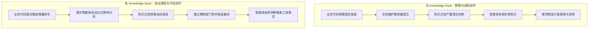
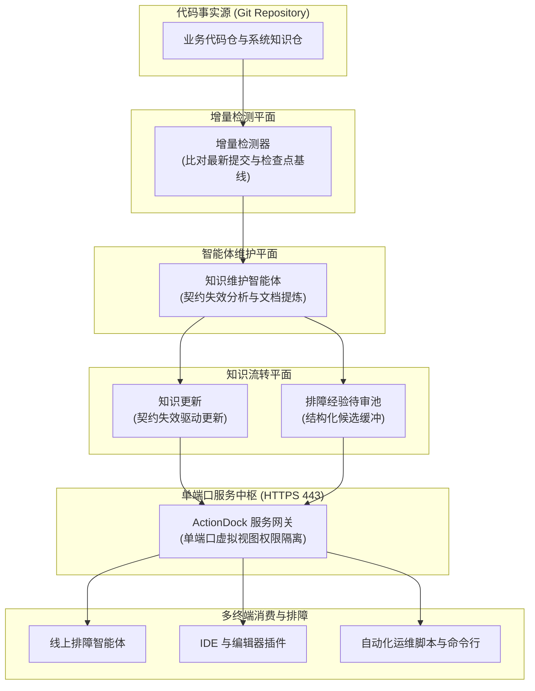
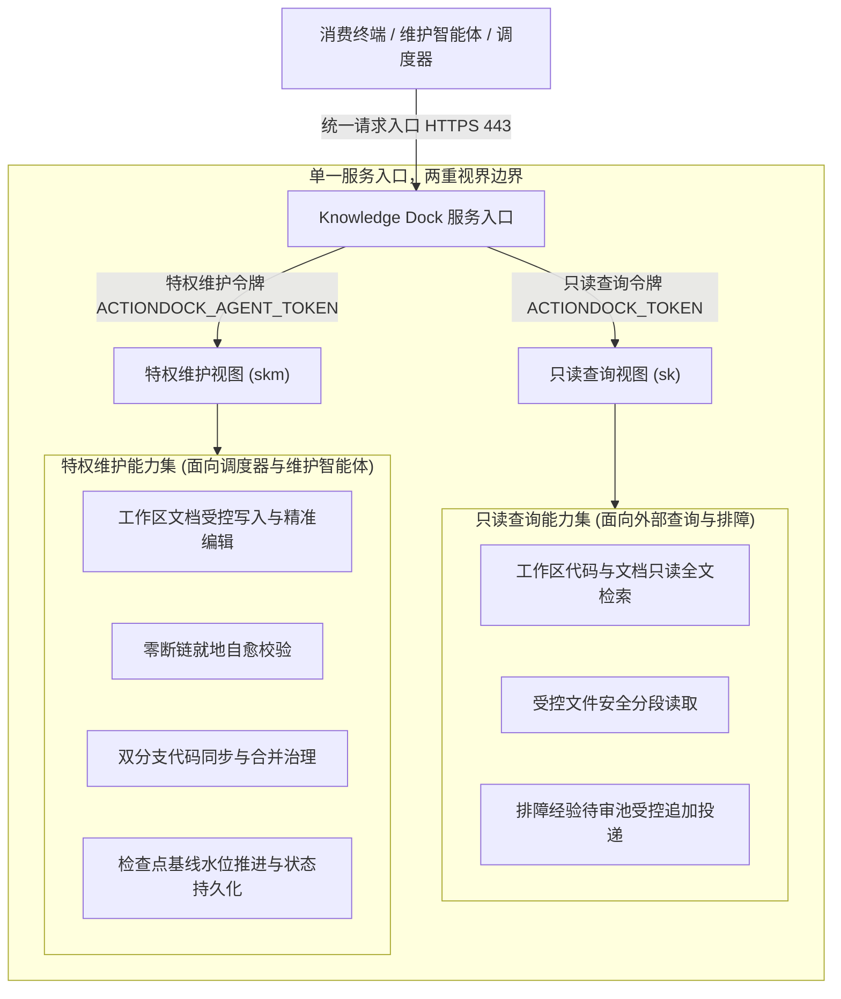

# 全景架构设计指南

> Knowledge Dock 是一个让 AI 智能体永远基于最新工程事实工作的知识基础设施。代码变化，知识自动演进。
> (Knowledge Dock keeps engineering knowledge permanently synchronized with your codebase.)

---

## 隐性危机与工程痛点

在现代微服务架构与多智能体协同开发实践中，业务代码每天都在经历高频迭代与上线发版。然而，伴随业务代码飞速演进的，是技术文档与工程知识的长期失修与严重滞后。

这一断层在引入 AI 智能体参与生产排障、代码理解与方案设计时，演化为致命的隐性危机：
- **知识更新滞后失修**：业务代码频繁发版，开发团队在交付压力下难以持续维护技术文档，基于人工约束的文档补录机制在高频迭代下彻底失效；
- **智能体推导产生误判**：排障助手与 IDE 智能体若基于陈旧失效的契约与时序进行推导，极易给出背离生产事实的错误结论，诱发故障扩散与严重资损；
- **排障经验缺乏闭环**：线上排障沉淀的高价值经验缺乏标准化通道进入正式知识库，直接修改正式文档导致推测污染，不记录则随着故障结束而彻底流失。

Knowledge Dock 的核心使命，正是彻底消弭业务代码演进与工程知识之间的脱节鸿沟，让智能体永远基于最新工程事实工作。

---

## 直观对比：引入 Knowledge Dock 前后

在传统的研发模式与 Knowledge Dock 驱动的自维护工程体系之间，存在本质性的工程反差：



工作模式对比：
- **无 Knowledge Dock 场景**：改动代码后文档被遗忘，智能体检索失效知识导致诊断错误，研发团队陷入「越用智能体越不敢信」的信任恶性循环；
- **有 Knowledge Dock 场景**：代码提交触发自动化增量核验，维护智能体按需更新知识骨架，智能体与工程师永远获取经过代码交叉验证的权威事实。

---

## 核心设计原则与项目口号

Knowledge Dock 秉持清晰的项目核心主张：

> **人类提供经验事实，智能体负责维护工程记忆。**
> (Humans provide experience. Agents maintain engineering memory.)

系统架构严格落地四大核心设计原则：

- **Git 是唯一事实源（Git is Source of Truth）**：架构中不设立独立的外置专有文档数据库。所有正式知识均以纯文本 Markdown 结构收敛在代码仓专属知识分支中，确保文档与代码同源同宗，具备完整的版本追溯与审计能力；
- **代码变化不等于知识更新（Change does not mean Knowledge Update）**：增量代码提交仅作为触发核验的必要信号。架构明确将代码重构、单测扩充等内部实现细节与对外契约解耦，只有当公开接口、时序契约与业务规则失效时，维护智能体才会执行文件更新；
- **人工贡献统一进入待审池（Human Contribution is Reviewed）**：线上排障经验与人工补充统一进入 Knowledge Inbox 待审池。架构严格限制外部写权限，确保所有人工输入必须经过代码源码交叉比对求证后方可转正，构筑防污染隔离墙；
- **智能体负责整理维护（Agent modifies knowledge, not humans）**：人类工程师仅需提供关键事实与排障证据，智能体负责承担文档结构切片、超链接有效性核验、跨文档影响评估以及分支提交等繁重的工程性维护开销。

---

## 为什么不是又一个 RAG

在面向 AI 智能体的知识工程中，检索增强生成（RAG）常被用于文档切片与向量检索。然而，在严肃工程架构与生产排障领域，单纯依赖传统 RAG 存在天然瓶颈。

### 方案横向对比矩阵

| 对比维度 | 传统 RAG | Knowledge Dock |
|---|---|---|
| **核心目标** | 在已有存量文本中模糊匹配高相关性切片 | 保持工程知识与业务代码绝对同步演进 |
| **事实输入** | 外挂静态文档、企业 Wiki 或离线知识库 | 纳管 Git 仓库主干分支最新提交代码 |
| **维护更新** | 依赖人工周期性手工重写文档并重新切片 | 依赖代码变更触发增量检测，智能体自动化更新 |
| **生命周期** | 静态单向消费，缺乏版本控制与失效感知闭环 | 端到端全生命周期闭环，支持检查点基线与待审池流转 |
| **可信度来源** | 语义向量近似度打分，无法验证内容真伪 | 代码源码级别交叉核验，通过零断链质量门禁阻断虚假推断 |

> **传统 RAG 帮助智能体找到知识，Knowledge Dock 帮助智能体信任知识。**
> (RAG helps AI find knowledge. Knowledge Dock helps AI trust knowledge.)

传统 RAG 假设知识库本体是正确且最新的，专注于检索匹配；Knowledge Dock 专注于知识库本体的工程化生命周期治理，确保交付给人类与智能体的每一篇文档都是经过代码交叉验证的真实事实。

---

## 逻辑架构总览

系统端到端逻辑架构拓扑如下：



系统核心组件协同关系：
- **代码事实源（Git Repository）**：企业内部托管的代码仓库与系统架构仓库，作为系统唯一的权威真实事实源；
- **增量检测器（Change Detector）**：负责比对仓库生产分支最新提交与检查点基线水位，筛选出存在有效未审提交的目标仓库；
- **知识维护智能体（Knowledge Maintenance Agent）**：负责分析代码变更影响、执行契约失效判定、更新知识骨架、修复断链并推进基线；
- **排障经验待审池（Knowledge Inbox）**：外部经验与人工补充的受控待审池，阻断未经求证的信息直接写入正式知识库；
- **知识服务中枢（Knowledge Service）**：基于单端口虚拟视图技术，在 HTTPS 443 端口分别提供面向外部的只读查询能力与面向内部的受控维护能力；
- **消费与交互终端**：包含开发者的日常开发工具、自动化运维脚本以及线上只读排障助手。

### 知识全生命周期

在 Knowledge Dock 架构中，工程知识从代码变更产生到多端视界分发，经历严格的闭环生命周期：

```text
Code Change (研发团队推送业务代码变更)
    │
    ▼
Detect Change (比对提交哈希与检查点基线水位)
    │
    ▼
Analyze Impact (维护智能体比对源码差异并评估契约影响)
    │
    ▼
Generate Candidate Update (按需生成文档更新或提炼待审候选)
    │
    ▼
Review (零断链门禁校验与业务代码防污染核验)
    │
    ▼
Merge Knowledge (提交推送到专属知识分支 docs)
    │
    ▼
Publish View (推进检查点基线，云端中枢对外分发最新权威视界)
```

生命周期关键阶段说明：
- **代码变更捕获（Code Change）**：业务代码合并至生产主干分支，产生新的提交哈希；
- **增量差异检测（Detect Change）**：比对当前分支最新提交与检查点基线水位，筛选出存在有效未审提交的目标仓库与差异代码集；
- **影响范围分析（Analyze Impact）**：维护智能体对差异代码进行语义分析，执行契约失效判定，确认受波及的模块、接口或业务规则；
- **候选文档生成（Generate Candidate Update）**：若对外契约改变，智能体针对性更新知识骨架文档；若存在待审池经验，则结合代码交叉核验后提炼转正；
- **质量门禁审查（Review）**：执行零断链门禁，对所有相对引用与锚点执行完整性核验；校验业务代码未受篡改，严守业务代码防污染红线；
- **知识分支合并（Merge Knowledge）**：将验证通过的知识文档变更提交推送到专属知识分支；
- **发布视界与基线推进（Publish View）**：坚决推进检查点基线水位至当前最新提交，云端知识中枢对外分发最新权威只读视界。

---

## 运行时架构与安全边界

Knowledge Dock 倡导极简与轻量至上的工程哲学，弱化底层物理包细节，采用「单一服务入口，两重视界边界」（One endpoint, two trust boundaries）的设计范式。

### 单端口多视图权限隔离

服务端基于 ActionDock 原生虚拟视图特性，在标准 HTTPS 443 统一端口下运行，仅通过请求头中的鉴权令牌划定严格的信任边界，无需部署与维护复杂的前置反向代理网关：



视图安全特性说明：
- **只读查询视图**：由只读查询令牌 `ACTIONDOCK_TOKEN` 鉴权，面向外部日常研发人员与只读排障助手。仅开放代码检索、文档读取与经验入池追加，严格剥离任何文件覆写与分支操作能力；
- **特权维护视图**：由特权维护令牌 `ACTIONDOCK_AGENT_TOKEN` 鉴权，面向受信任网络内的维护智能体与流水线调度器。开放工作区受控编辑、断链自愈、双分支同步与检查点基线推进能力；
- **单端口收敛优势**：消除多端口微服务网络配置复杂度与跨域问题，天然适配企业私有云与容器化环境。

### 双分支隔离治理模型

为了保持工程代码与知识库的整洁共存，系统在底层代码仓执行双分支隔离治理模型：
- **主干业务分支**：如 `release` 或 `main` 分支，由人类业务开发团队日常提交与发版，保持纯粹的工程业务代码；
- **专属知识分支**：统一命名为 `docs` 分支，承载该代码仓的工程知识文档。文档改动严格收敛在 `docs/knowledge/` 目录下，严禁污染业务代码；
- **冲突安全中止机制**：分支同步过程中若检测到代码级冲突，自动化程序严禁私自裁决，立即安全中止并由智能体进行语义消解。

### 检查点基线推进机制

系统为每个纳管代码仓维护检查点基线水位（`last_knowledge_checked_commit`）：
- **增量扫描基准**：每次巡检时，系统比对业务分支最新提交哈希与已记录的检查点哈希，仅将存在有效新提交的仓库标记为待处理任务；
- **推进基线的技术必要性**：无论代码变更是否触发文档改动，推进基线均为标记该批次提交已通过完整审计与评估的唯一凭据；若不推进检查点，后续维护将持续对已审计代码重复发起冗余比对与全量扫描，破坏增量闭环收敛性并带来不必要的计算开销。

---

## 真实案例：支付超时状态（PAY_TIMEOUT）驱动的知识自演进

以支付核心服务（`payment-core`）在一次敏捷迭代中的真实业务变更为例，展现 Knowledge Dock 如何以轻量切口实现多文档自演进闭环：

### 业务代码变更事实
研发团队合并代码变更，在支付单枚举类中新增 `PAY_TIMEOUT`（支付超时已关闭）状态；在超时未收到渠道回调时触发关单并异步解冻库存；若关单后发生延迟扣款通知，触发系统自动冲正退款并记录错误码 `ERR_PAY_TIMEOUT_CHARGEBACK`。

### 端到端自演进流转
- **捕获增量信号**：调度器检测到 `payment-core` 最新提交与已记录检查点基线存在差异，提取变更源文件；
- **智能体契约失效判定**：维护智能体分析差异代码，判定对外公开枚举、业务时序图及退款业务规则均发生实质性改变；
- **多文档联动精准更新**：
  - 更新业务时序文档（`docs/knowledge/flow/payment.md`）：在支付流程时序图中补齐超时关单分支（`PAY_TIMEOUT`）与异步库存解冻调用；
  - 更新业务规则文档（`docs/knowledge/rule/refund.md`）：增补超时冲正退款规则，明确渠道延迟扣款由系统自动调用渠道退款接口原路冲正；
  - 更新应急排障预案（`docs/knowledge/runbook/payment-error.md`）：新增针对 `ERR_PAY_TIMEOUT_CHARGEBACK` 错误码的应急诊断流程与幂等流水号核验指引；
- **通过质量门禁并发布**：智能体执行 `links.verify` 校验相对链接与锚点，确认零断链且业务源码目录零修改后，将更新推入 `docs` 分支并推进检查点基线。线上排障智能体即刻获得最新时序与排障事实。

---

## 极速上手

系统提供标准化的极速接入路径，仅需完成以下步骤即可实现工程知识自演进闭环：

### 连接代码仓库

在纳管清单配置文件 `server/config/repos.json` 中声明代码仓库地址、业务主干分支与专属知识分支：

```json
[
  {
    "name": "payment-core",
    "url": "git@github.com:example/payment-core.git",
    "production_branch": "release",
    "docs_branch": "docs"
  }
]
```

### 启动服务容器

在项目根目录配置环境变量文件 `.env`，生成并填入只读查询令牌与特权维护令牌（两者长度须达 32 字符以上且互不相同），启动一体化容器：

```bash
cp .env.example .env
# 分别生成高强度只读查询令牌与特权维护令牌
openssl rand -hex 32
openssl rand -hex 32
docker compose up -d --build
```

### 运行首次增量扫描

在客户端控制平面触发增量扫描，建立纳管仓库的初始检查点基线水位：

```bash
node client/packages/knowledge-orchestrator/src/cli.js --scan
```

### 唤醒智能体检索与消费

在客户端执行机注册只读查询配置，使用单端口查询视图获取权威代码与知识视界：

```bash
ad profile add sk -s https://<服务地址>:443 -t <ACTIONDOCK_TOKEN> -k -d "知识中枢只读查询服务"
ad run workspace/search.rg --profile sk -- pattern="PAY_TIMEOUT"
```
