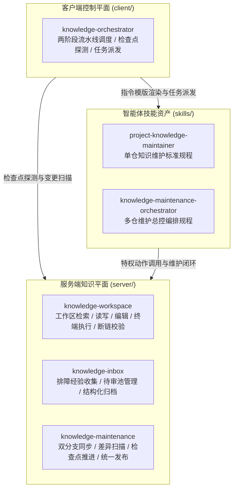
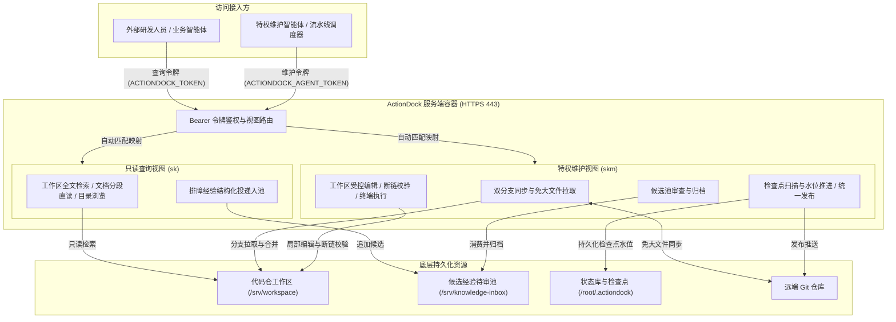
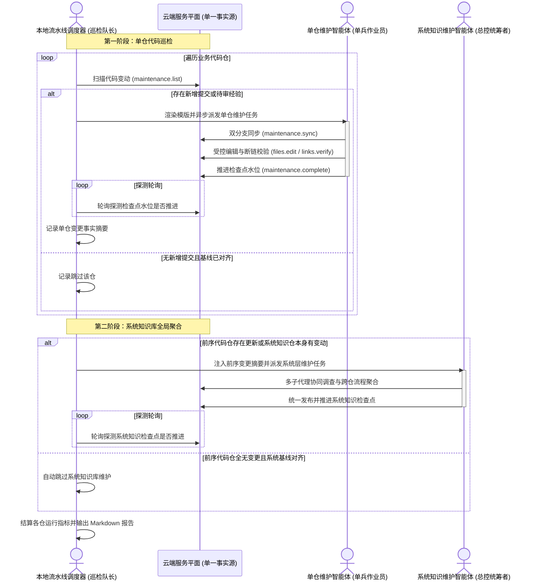
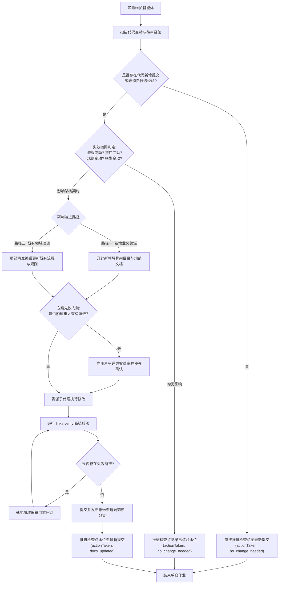

# 全景架构设计白皮书

---

## 架构初衷与边界划分

knowledge-dock 是基于 ActionDock 规范构建的工程自维护知识中枢与智能体编排工作空间。在高频迭代的现代软件工程实践中，代码与架构知识脱节、本地环境滞后以及线上排障经验碎片化是阻碍研发团队与智能体协作的核心痛点。

本项目采用清晰的物理分层代码库架构，将服务端知识中枢、本地客户端编排平面与智能体技能资产彻底解耦，理顺人类研发人员、运维人员与自动化智能体之间的协作边界。

### 物理分层边界定义

- **服务端平面**（`server/`）：
  - 核心职责：提供高吞吐、只读优先且具备受控维护能力的云端知识中枢服务。
  - 边界约束：统一收敛在 443 原生单端口运行，通过虚拟视图技术实现物理隔离；运行环境严格封装于容器内部，面向外部提供工程代码全文检索、文档受控直读、排障经验投递，以及面向特权智能体的双分支同步、工作区编辑与检查点管理能力。
  - 核心组件：包含负责工作区文件操作与检索的 `knowledge-workspace`、负责排障经验收集与归档的 `knowledge-inbox`，以及负责版本同步与检查点推进的 `knowledge-maintenance`。
- **客户端平面**（`client/`）：
  - 核心职责：提供本地宿主机或终端运行的轻量级批处理流水线调度引擎。
  - 边界约束：属于纯本地控制动作，绝不打包进云端容器镜像；调度器不加载大语言模型，无长会话推理开销，专注于两阶段任务拓扑扫描、命令模版安全渲染、异步任务派发与检查点状态轮询。
  - 核心组件：包含提供批量调度能力的 `knowledge-orchestrator` 包。
- **智能体技能资产**（`skills/`）：
  - 核心职责：提供符合专业标准的知识维护智能体工作流程规范与提示词资产。
  - 边界约束：解耦底层环境实现，以统一的规程约束智能体在单仓或多仓环境下的行为；涵盖单仓五步作业法、多子代理协同分工机制、人机方案讨论门禁与零断链自愈铁律。
  - 核心资产：包含负责单仓全生命周期维护的 `project-knowledge-maintainer` 技能，以及负责多仓全局编排的 `knowledge-maintenance-orchestrator` 技能。

---

## 核心设计理念

- **代码即唯一事实源**：正式知识与工程代码同仓存放，全部纳入版本控制系统管理，与业务代码一同经历严格的代码评审与审计，杜绝独立第三方系统的滞后与失真。
- **云端统一最新只读视界**：外部研发人员与智能体统一向云端单端口服务发起只读检索，确保获取到的始终是常态同步的最新工程事实，彻底消除本地未及时拉取代码导致的判断偏差。
- **双分支物理隔离模型**：业务生产分支与知识分支物理解耦，知识库的更新迭代不污染业务主干的提交历史；分支合并遇到冲突时触发安全中止，交由智能体消解。
- **检查点水位推进机制**：代码变更驱动知识有效性核验；审查确认无需修改文档时同样必须推进检查点，防止重复无效扫描，保障算力利用率。
- **贡献单元与正式知识单元解耦**：线上排障经验以临时贡献单元的形式暂存待审池，经自动化去重与提炼后再合入正式知识库，确保核心知识库整洁规范。
- **单端口虚拟视图权限隔离**：依托 ActionDock 原生多视图能力在 443 端口实现权限自动切分，外部只读与受控追加，内部特权受控维护。
- **状态库持久化保障**：检查点状态持久化存储于独立数据卷中，容器重启或环境重建不丢失检查点基线，支持天然断点续传。

---

## 服务端平面架构深度剖析

### 单端口多视图安全隔离

在传统的微服务或知识库管理架构中，不同权限通常依赖多端口暴露或复杂的反向代理网关。knowledge-dock 采用 ActionDock 原生虚拟视图技术，仅对外暴露标准 HTTPS 443 端口：

- **只读查询视图**（视图标识 `sk`）：面向外部日常研发人员与只读查询智能体，绑定专用查询令牌。通过视图级白名单严格收敛暴露动作：仅允许使用全文检索（`workspace/search.rg`）、分段直读（`workspace/files.read`）、目录浏览（`workspace/files.list`）以及候选经验投递（`knowledge/knowledge.collect`）。视图内部严禁暴露任何文件写入、局部编辑或系统命令执行动作，从架构层面根除外部误改风险。
- **特权维护视图**（视图标识 `skm`）：面向经过授权的维护智能体与调度控制平面，绑定高强度特权维护令牌。具备完整的工作区读写、局部精准编辑、终端命令调度、断链核验、双分支同步与检查点推进动作集合。
- **视图动态映射与无泄露传递**：容器启动时，由引导脚本在内存中根据环境变量动态生成视图规则定义文件，并通过设置严格权限的临时文件传递给服务进程，彻底杜绝命令行参数泄露安全令牌的隐患。

### 双分支物理隔离模型

为平衡生产代码的稳定性与知识库的自维护演进，系统为每个纳管的业务代码仓设计了双分支物理治理模型：

- **主干生产分支**（如 `release`）：由人类研发团队日常维护并用于发布构建，存放纯粹的业务源码与工程配置。
- **专属知识分支**（如 `docs`）：由维护智能体自主维护，承载经过结构化提炼的工程知识库体系。
- **冲突安全中止机制**：在执行代码同步时，维护脚本尝试将生产分支合并至知识分支。一旦检测到代码或文件冲突，脚本绝不强制覆盖或静默合并，而是立即执行合并回滚并返回详细的冲突文件清单，交由维护智能体结合上下文进行语义消解，确保知识版本与代码历史绝对严谨。

### 免大文件拉取设计

在微服务矩阵中，代码仓库的历史大对象与媒体资源往往占用巨大存储与带宽，严重拖慢同步效率。knowledge-dock 深度结合 Git 部分克隆特性：

- **按需拉取提交树**：通过设置免大文件抓取开关，克隆与抓取时仅拉取提交历史、树对象与必需的源码文本对象，排除历史大文件。
- **资源损耗极小化**：有效降低云端容器与宿主机的磁盘空间占用，成倍缩短多仓批量拉取与扫描时的网络等待延迟。

### 候选待审池解耦设计

排障经验与工程知识若直接写入正式文档，极易造成文档结构碎片化、内容重复甚至相互矛盾。为此，系统设立了独立的经验待审池：

- **独立物理存储**：待审池独立挂载在专用持久化目录中，与工作区代码及正式知识物理隔离。
- **只进不出缓冲机制**：外部查询视图仅拥有向待审池写入结构化候选文档的追加权限，对外不提供直接检索访问，杜绝未审核信息干扰外部检索。
- **生命周期归档管理**：特权维护智能体在巡检时定期扫描待审池，核验内容真实性并提炼归并至正式知识库分类中；完成消费后调用归档动作打标留痕，形成闭环。

### 状态库持久化机制

ActionDock 运行时状态库用于记录每个受纳管仓库的前置检查点提交哈希及运行元数据：

- **基线防丢保障**：状态库目录挂载至宿主机独立持久化卷。若未进行持久化，容器重启或重新构建后检查点水位归零，系统将误判所有仓库为首次接入，进而触发全量全盘建库流程，产生严重的算力与网络资源浪费。
- **可靠基线比对**：持久化状态库确保每次巡检都能精准定位上一次成功交付的提交哈希，仅对新增区间进行增量扫描。

---

## 客户端平面架构深度剖析

### 两阶段流水线调度引擎

本地控制平面编排包实现了高度解耦的两阶段拓扑调度引擎：

- **第一阶段：单代码仓代码巡检**：
  - 调度器按顺序遍历受纳管的各个业务代码仓，向云端查询检查点水位与最新提交差异。
  - 发现提交增量时，渲染指令模版并异步派发单兵维护任务，驱动远端智能体完成分支同步、增量核验、断链自愈与检查点推进。
  - 调度器持续跟踪单仓检查点推进状态，并提炼沉淀每个代码仓的维护决议与变更事实摘要。
- **第二阶段：系统知识库全局聚合**：
  - 系统知识库承载跨仓端到端主流程、业务领域全景映射与全局数据库拓扑。
  - 调度器综合判定：若前序第一阶段有任何业务代码仓产生了有效变更，或系统知识仓自身有新提交，调度器将前序代码仓的变更摘要作为上下文自动注入模版，唤醒系统知识库维护智能体执行跨仓聚合维护。
  - 若所有业务代码仓均无变更且系统知识库自身基线已对齐，调度器自动跳过第二阶段，实现按需聚合。

### 解耦协作模型：宏观调度队长与单兵作业员

在面对数十上百个微服务的大规模项目时，传统的单个长会话智能体维护模式极易崩溃：

- **痛点分析**：长会话会导致大语言模型上下文窗口迅速饱和，注意力分散，容易产生幻觉；同时长时间持有网络连接极易因超时或网络抖动而整体溃败。
- **解耦设计**：
  - **宏观调度队长**（本地调度器）：纯本地无状态执行，不调用大语言模型，零推理开销；仅负责按拓扑清单批量扫描变动、异步派发子任务，并通过低频轻量请求轮询云端检查点是否推进，天然抵御网络波动与超时中断。
  - **单兵作业员**（单仓维护智能体）：被调度器唤醒后，智能体持有独立的单次会话，上下文严格聚焦在当前指定的单一代码仓内；在完成单仓自闭环并推进检查点后，会话立即销毁并完全释放计算资源。

### 云端检查点为单一事实源与天然断点续传

- **去本地账本化**：调度器完全以云端状态库中的检查点提交哈希为唯一事实源，本地不维护任何易丢失的进度账本或中间状态文件。
- **随时中断与安全续传**：无论是在第一阶段单仓维护中途强制退出，还是遇到网络故障，重新启动流水线调度器时，调度器会重新比对云端最新检查点，已完成检查点推进的仓库将在一秒内被自动识别并跳过，天然具备幂等性与断点续传能力。

---

## 智能体协同演进机制

### 三路自动化判定树

面对代码变更与待审经验输入，智能体严格依托三路判定树进行决策分流：

- **路径一：全新业务领域识别与目录初始化**：
  - 触发条件：代码仓首次接入，或系统知识库检测到前序提交引入了全新的业务领域模块。
  - 执行动作：遵循业务领域识别与规范布局标准，初始化六大规范分类目录，建立领域索引与全局概览文档。
- **路径二：既有业务领域端到端流程与契约增量更新**：
  - 触发条件：代码变更或候选经验涉及已有业务模块，经分析确实改变了既有接口契约、流程步骤或状态流转规则。
  - 执行动作：采用局部受控精准编辑打补丁，严禁全量重写；同步更新关联文档并就地执行断链校验。
- **路径三：无实质架构变更的水位快速推进**：
  - 触发条件：代码变更仅涉及内部代码重构、变量重命名、性能微调、注释修整或测试用例调整，未改变任何外部可见的行为契约。
  - 执行动作：判定无需修改文档，直接调用完成动作将检查点推进至最新提交，记录已核验基线并快速结束。

### 多子代理并行协同机制

在系统知识库聚合或大型单仓全盘建库场景中，主智能体作为决策与编排中枢，绝不陷入单线程全量修改：

- **职责边界清晰划分**：主智能体负责全局统筹、任务拆解、向子代理派发精确的输入输出路径与模式规范，并严格负责质量门禁验收。
- **并行调查与编写**：按规范分类（如流程、模块、规则、接口、数据、操作手册）委派独立的专业子代理并行阅读源码或兄弟仓，各子代理互不干扰、独立产出，最后由主智能体进行交叉校验与链接缝合。

### 人机方案讨论门禁（先议后行）

自动化并不等同于盲目修改。对于系统级重大架构变更，系统设计了严格的人机方案讨论门禁：

- **草案先行**：在开辟新业务域或重大流程重构前，智能体必须先基于客观代码证据提炼出《业务域演进方案草案》，明确罗列新增领域、关联代码仓、核心流程与数据映射。
- **停等确认**：在终端向人类工程师呈递草案并暂停写入，听取人类专家的调整建议或确认指示。获得明确授权后，方可启动子代理进行受控写入，避免智能体盲目重构导致知识库失控。

---

## 核心设计指标与能力对比

| 架构维度 | 传统手工 Wiki / 文档库 | 本地切片与向量检索方案 | knowledge-dock 知识中枢方案 |
|---|---|---|---|
| **事实源载体** | 独立于代码的第三方平台，容易形成孤岛 | 开发者本地磁盘或集中式向量数据库 | Git 代码仓库，知识与代码统一版本控制与评审 |
| **基准时效性** | 依赖人工主动更新，极易滞后成为僵尸文档 | 受限于本地拉取频率，本地未同步时易生幻觉 | 云端常态同步，提供最新统一事实源 |
| **自维护驱动** | 纯靠人工自觉，无自动化驱动机制 | 代码变动后需全量重新切片向量化 | 代码变更自动驱动增量扫描与智能体自闭环 |
| **冲突处理** | 人工覆盖保存，极易发生版本踩踏 | 无法感知代码分支冲突，检索结果错乱 | 分支合并冲突安全中止并留痕，由智能体消解 |
| **排障经验沉淀** | 散落在聊天群聊或工单中，难以沉淀 | 偶发排障线索混入语料库，噪声巨大 | 设立独立候选待审池缓冲，经提炼归档后再合入 |
| **访问与权限** | 粗粒度页面权限或全局读写 | 缺乏网络隔离，本地脚本具备无限制权限 | 原生单端口虚拟视图，外部只读与内部特权隔离 |
| **调度稳定性** | 人工逐个梳理，效率低下 | 单长会话批处理易出现上下文溢出与超时 | 两阶段流水线解耦队长与作业员，支持断点续传 |
