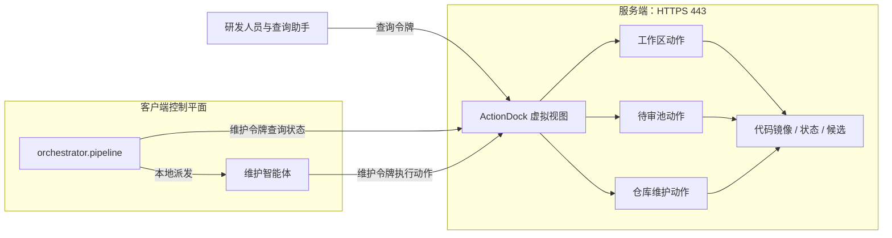

# 架构与边界

knowledge-dock 解决的是知识与代码的版本关系。检索可以帮助找到文档，但无法证明文档仍适用于当前代码；因此系统以代码提交为审查信号，以 Git 中的正式知识为输出，以检查点记录已经审查到的提交。

## 数据与状态

| 对象 | 存放位置 | 作用 |
|---|---|---|
| 业务代码 | 纳管仓的主干分支 | 需要核对的实现事实 |
| 正式知识 | 业务仓的 `docs` 分支，或系统知识仓的主干分支 | 对外检索的版本化文档 |
| 检查点 | ActionDock 持久化状态 | 记录已完成审查的代码提交哈希 |
| 候选经验 | 排障经验待审池 | 保存尚未成为正式知识的人工输入 |

“Git 是单一事实源”专指正式知识的版本与内容。检查点和待审候选属于流程状态，不是正式知识的另一份副本。知识文档随知识分支提交版本化；检查点保存在独立状态库，因此备份和恢复时两者都需要考虑。

代码变更触发审查，不等于每次提交都重写文档。维护智能体需要核对接口、流程、规则、数据语义和排障步骤是否失效；内部重构可能只需要推进检查点。

## 运行边界

服务端集中保存工作区并提供原子 Action。`orchestrator.pipeline` 在执行机本地运行，负责仓库巡检、任务派发、轮询和报告；它需要一个实际可用的智能体派发命令，服务端不会自行生成或运行维护智能体。

ActionDock 的单端口虚拟视图权限隔离按令牌限制动作暴露面：

| 视图 | 令牌 | 可调用能力 |
|---|---|---|
| 查询视图 `sk` | `ACTIONDOCK_TOKEN` | 全文检索、文件读取、目录浏览、向待审池追加候选 |
| 维护视图 `skm` | `ACTIONDOCK_AGENT_TOKEN` | 工作区读写、终端执行、待审池管理、仓库同步与发布、检查点维护 |

虚拟视图是同一服务进程中的动作访问控制，不是进程或文件系统的物理隔离。尤其 `workspace/bash.exec` 在维护视图下执行终端命令，必须严格保护维护令牌，并由可信执行环境使用。查询令牌也应保密，因为它能够写入待审池。

## 仓库治理

业务仓采用双分支隔离治理模型：研发团队维护 `sourceBranch`（例如 `release`）；知识维护使用 `knowledgeBranch`（通常为 `docs`）。`maintenance.sync` 拉取远端后，将主干变更合入知识分支；发生冲突时中止合并并返回冲突文件，由维护人员或智能体根据代码语义处理。系统知识仓使用单分支快进同步。

正式知识改动应收敛在业务仓的 `docs/knowledge/`。检查点基线推进机制记录本轮已审查的主干提交；即使确认无需改文档，也要调用 `maintenance.complete`，否则下一轮仍会看到同一批提交。

## Action 与质量边界

ActionDock 提供结构化参数、受管进程和虚拟视图，适合把检索、编辑、同步、发布等动作交给智能体调用。它不替代语义判断：知识是否失效、候选经验是否成立，仍需依据源码和证据评估。

当前实现中，`workspace/links.verify` 负责报告断链，但不会自动修改文档。`maintenance.publish` 可以在未传 `files` 时执行 `git add -A`；它目前不调用链接检查，也不内置 `docs/knowledge/` 路径白名单。因此“零断链门禁”和“业务代码防污染红线”是发布规程必须执行的检查，不能理解为 `maintenance.publish` 已自动强制。具体步骤见[运维手册](operations.md)。

## 与其他方案的关系

- Wiki 和向量检索解决文档保存与召回，knowledge-dock 关注文档何时因代码变更而失效。它们可以作为消费或加速层，但不应成为正式知识的独立版本源。
- 直接向智能体开放 SSH 可以完成类似操作，却难以给查询用户限定动作范围。虚拟视图将查询与维护动作分开；维护视图中的终端能力仍需按特权能力管理。
- 纯本地脚本适合单仓维护。集中工作区让多执行机查询同一份代码镜像，客户端仍可使用自己的智能体运行环境与调度方式。

继续阅读：[维护流程](workflow.md)、[部署指南](deployment.md)、[工作区动作](../server/packages/knowledge-workspace/README.md)。
