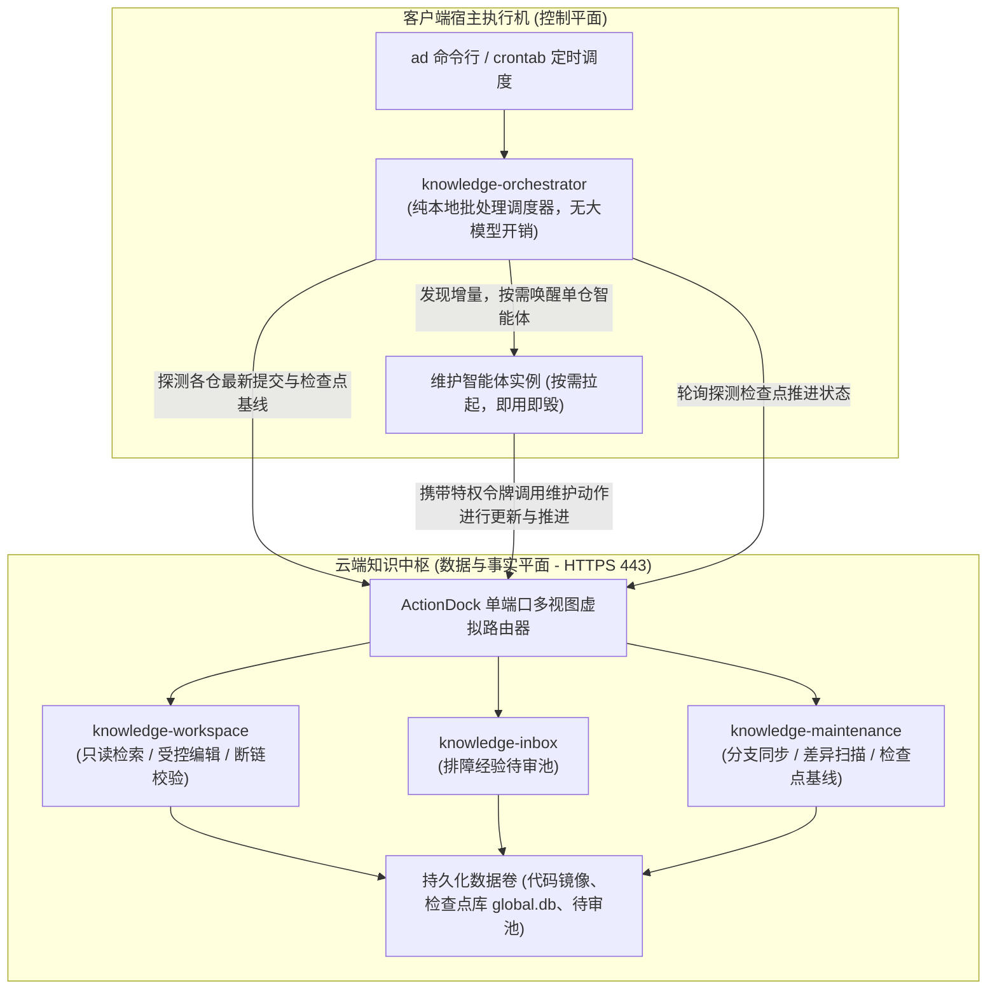
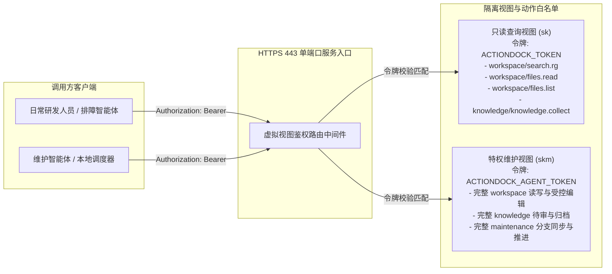
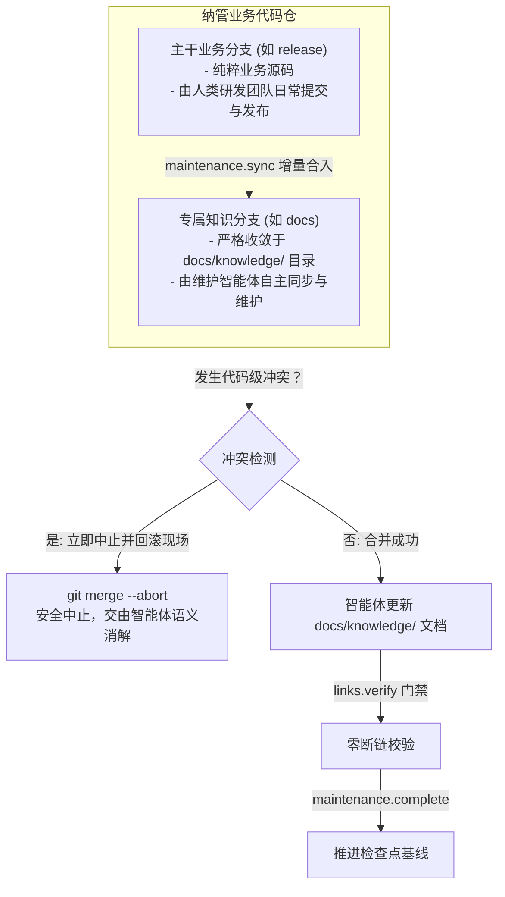
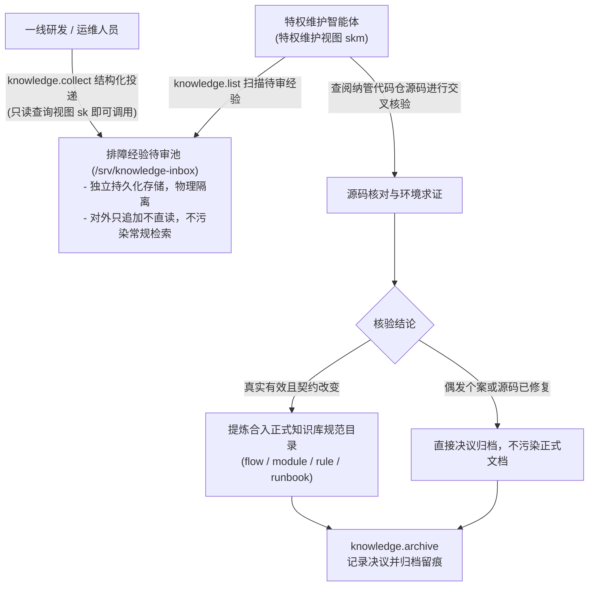
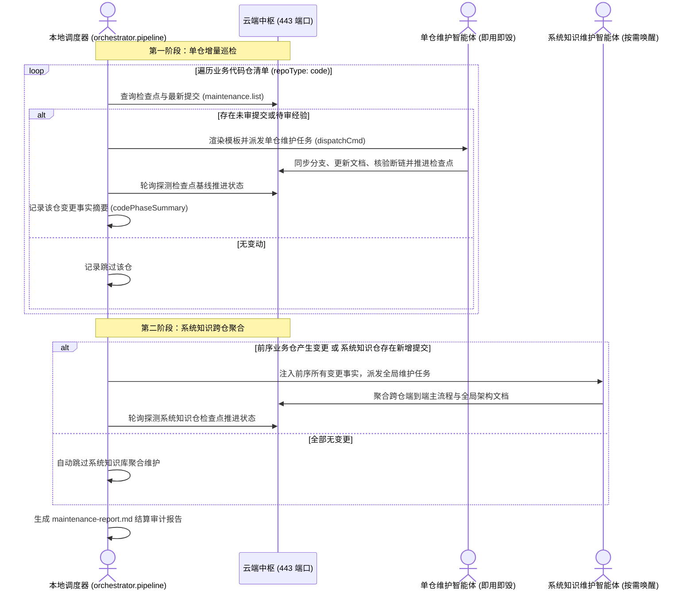

# 全景架构设计与权衡手记

---

## 前言与起因

在早期的研发运维与智能体排障实践中，团队曾尝试接入中心化的知识图谱、企业维基以及外部代码分析平台。该套方案整体完全部署在远端，检索依赖外部服务调用，但在实际运转中逐渐暴露出几个不可忽视的工程痛点：

- 代码与文档严重脱节：业务代码在持续迭代发版，而外部知识库依赖人工在排障或上线后二次补录。随着版本快速演进，文档迅速沦为陈旧信息，代码已重构更名，文档中记录的接口参数与核心枚举却仍停留在历史版本；
- 本地代码未拉取导致误诊：研发人员在本地或远程工作区排查线上告警时，若本地工作区未及时拉取最新发布分支代码，智能体会基于陈旧代码做出一系列假设与推演，甚至在错误的分支上下文上得出南辕北辙的排障结论；
- 外部知识平台维护责任失焦：由于外部平台独立于代码仓库，知识补录往往由专人滞后整理，缺乏代码作者的第一手工程背景，导致信息在流转过程中失真；
- 依赖重型中枢服务导致无法离线闭环：排障链路深度绑定远端重型服务，网络抖动或鉴权失效即导致排障链路彻底瘫痪，开发机无法独立执行本地离线阅读与快速检索。

为了根治上述问题，在设计 knowledge-dock 方案时，我明确确立了一个核心基准：**让知识随代码仓库同步自维护**，让知识资产与工程源码完全保持一致。这种模式具备四项核心工程优势：

- 版本强一致：知识文档作为工程资产随分支流转，发版、回滚或分支切换时，知识与代码版本天然精准对齐，从根源上杜绝代码已更新而文档仍停留在老版本的脱节；
- 研发流程内生：知识维护完全融入日常开发与发布流程，随改动一同进行代码审查，流程契约与架构决策变更一目了然；
- 责任归属明确：代码改动者与维护智能体同步推进，谁改动代码谁负责核验知识，避免外部知识平台二次录入时的理解偏差与信息滞后；
- 本地离线闭环：代码拉取到本地，完整的知识结构随之就位，无需依赖外部中心化服务，本地排查与离线阅读体验顺畅。

因此，knowledge-dock 的核心定位是：为智能体与研发团队构建的自维护工程知识中枢与编排工作空间，在云端提供统一的只读代码与知识事实源，并通过增量控制与智能体调度实现全生命周期的自维护闭环。

---

## 物理分层演进：调度在本地，事实在云端

在方案最初的架构探索中，我曾尝试将整套系统打包为一个全托管的服务端容器。彼时的设想十分简单：既然云端容器已经托管了全部代码镜像，那么把批量巡检、智能体派发与流水线轮询调度器也直接塞进服务端的 `server/packages/knowledge-maintenance` 包中，由云端负责执行一切任务。

然而，这个看似一体化的设计在首次真机联调时带来了极其惨痛的教训。

当时在客户端执行机发起调度时，由于习惯性地追加了控制选项：

```bash
# 最初导致严重灾难的错误调用范例
ad run orchestrator.pipeline --profile skm -- dispatchCmd='...'
```

这一命令直接触发了 ActionDock 运行时的底层机制：命令行参数中的 `--profile skm` 属于框架级的全局控制选项，其含义是将当前指定的 Action 工具及其上下文打包，通过 HTTPS 传输到远端 `skm` 视图所在的容器内执行。

结果灾难接踵而至：
- 远端容器内部仅具备轻量运行时环境，根本没有安装流水线调度器所需的本地依赖；
- 更致命的是，流水线调度器的核心职责是调度宿主机本地已配置好的各类智能体工具；当调度器被强行送入云端容器执行时，容器根本无法反向调用客户端宿主机上的智能体；
- 调度器在云端试图再次向云端发起维护请求，直接引发死循环嵌套，导致云端连接池被耗尽，整个服务进程瞬间卡死并最终崩溃。

这次严重的踩坑促使我重新审视执行机的物理边界。为 AI 建设基础设施时，必须极其清醒地界定系统的控制平面与数据平面。

调度器本质上是一个批处理控制器，它的生命周期应当是按需唤醒、即用即毁的；而服务端容器是长期常驻的知识事实源，负责承载代码镜像与受控读写操作。如果把调度器塞入服务端，不仅破坏了容器的无状态性与轻量性，更违背了职责单一原则。

基于这次教训，我们果断对代码库进行了彻底的物理分层重构，确立了「**调度在本地，事实在云端**」的铁律：



物理分层的职责边界划分如下：

- 本地客户端控制平面（`client/packages/knowledge-orchestrator`）：纯本地运行，严禁在命令行添加 `--profile` 控制选项。它负责解析纳管清单、向远端查询增量差异、渲染安全的命令模板、异步派发智能体任务、轮询状态并生成结算审计报告；
- 服务端事实平面（`server/`）：一体化容器部署，作为全局代码镜像与正式知识体系的权威事实源。对外仅暴露受控的 Action 动作，不承担任何调度逻辑；
- 智能体技能资产（`skills/`）：规范指南资产，指导智能体执行代码核验、受控编辑、断链校验与基线推进。

通过将调度控制平面完全剥离至本地，云端服务端恢复了纯粹、安全与高吞吐的原本形态。

---

## 单端口虚拟视图设计：443 端口的细粒度权限隔离

在服务端对外暴露能力时，权限隔离是不可逾越的红线。

传统的多租户或权限隔离方案通常有两种思路：
- 多端口暴露：为查询、维护、待审分别开放不同的 TCP 端口（例如 8080、8081、8082）。但多端口方案在企业内网环境下运维成本极高，云防火墙策略、安全组规则与容器端口映射极其繁琐，且增加了攻击暴露面；
- 反向代理网关分流：在应用前置 Nginx 或 Envoy 网关，通过路由路径匹配进行分流与鉴权。但这引入了额外的组件依赖与网络跳数，且网关无法理解 ActionDock 内部细粒度的包与动作语义。

为了在极致轻量的前提下实现绝对的安全隔离，knowledge-dock 选型基于 ActionDock 2.0 原生单端口虚拟视图（Virtual Views）规范。我们在服务端统一仅监听标准的 HTTPS 443 单一端口，内部根据请求中携带的 HTTP 承载令牌（Bearer Token），在协议层直接映射至隔离的虚拟视图：



在工程落地中，单端口虚拟视图的设计细节体现在：

- 查询视图（对应配置名称 `sk`）：面向外部日常研发人员与只读排障智能体，由环境变量 `ACTIONDOCK_TOKEN` 鉴权。该视图严格执行动作白名单机制，仅允许执行代码全局正则检索（`workspace/search.rg`）、受控分段读取（`workspace/files.read`）、目录浏览（`workspace/files.list`）以及排障经验结构化追加（`knowledge/knowledge.collect`）。所有写操作（`files.write`、`files.edit`）与终端命令执行（`bash.exec`）在此视图下被网络入口直接阻断；
- 特权维护视图（对应配置名称 `skm`）：面向本地调度器与维护智能体，由环境变量 `ACTIONDOCK_AGENT_TOKEN` 鉴权。允许访问 `workspace`、`knowledge` 与 `maintenance` 包下的全部特权动作，支持代码分支同步、受控文档编辑、断链自愈核验与检查点基线推进；
- 默认视图彻底关闭：对于未携带令牌或携带无效令牌的请求，映射至默认视图，该视图在容器自举时被分配为随机不可逆哈希，杜绝任何匿名访问可能。

在客户端使用时，研发人员只需在本地注册一条只读配置：

```bash
ad profile add sk -s https://<云端服务地址>:443 -t <ACTIONDOCK_TOKEN> -k -d "知识中枢只读查询服务"
```

日常排查线上问题时，一条命令即可完成全仓代码与知识文档的毫秒级检索：

```bash
ad run workspace/search.rg --profile sk -- pattern="MK40001"
```

这种机制实现了极致的极简与轻量：无需任何反向代理网关，仅通过单个 443 端口与双令牌校验，便在网络边界处构筑了严密的安全隔离屏障。

---

## 仓储治理工程细节：双分支隔离与免大文件拉取

在多代码仓知识维护的落地中，代码与文档如何共存是决定系统能否在生产稳定推行的关键。

### 双分支隔离治理模型

如果在主干业务分支（如 `release`、`main` 或 `master`）上直接由智能体提交文档改动，不仅会污染业务开发者的提交历史，而且一旦智能体发生误操作，极易干扰正常发版甚至引发代码冲突。

为此，knowledge-dock 建立了严格的**双分支隔离治理模型**：



双分支治理模型的核心机制包括：

- 业务代码防污染红线：所有工程知识文档必须严格收敛在 `docs/knowledge/` 目录下，严禁在业务源码目录创建或改动任何代码文件；
- 分支职责解耦：主干业务分支保持纯粹，专供业务迭代与发版流水线使用；知识分支（默认为 `docs`）承载工程知识体系，便于快速试错迭代而不干扰主干发布；
- 冲突安全中止机制：在执行同步时，系统调用 `maintenance.sync` 动作首先将主干分支合并至知识分支。若检测到文件级冲突，系统严禁自动化强制合并，而是立即执行 `git merge --abort` 终止合并，完整保留现场，输出冲突文件清单并交由智能体进行上下文语义消解。

### Git 免大文件部分克隆

当纳管的代码仓数量达到几十上百个时，传统的全量克隆（Full Clone）会遭遇严峻的瓶颈：一个历史悠久的企业级核心业务仓动辄数个 G 字节，全量下载需要耗费大量时间与带宽，且迅速占满容器磁盘。

实际上，知识库自维护与代码检索主要关注的是代码提交历史、目录树结构以及具体文本文件的内容，根本不需要拉取历史上的重型二进制大文件与全量历史大对象。

针对这一工程痛点，我们在底层采用了 Git 免大文件部分克隆（Blobless Clone）优化机制：

```bash
# Git 免大文件部分克隆核心参数
git clone --filter=blob:none <仓库克隆地址>
```

该机制在克隆阶段仅下载所有提交记录和目录树，不预先拉取历史文件的文件内容对象（Blob）。当 `ripgrep` 检索或智能体读取当前指定版本的文件时，Git 才会按需拉取对应文件的 Blob 对象。实测数据显示，该优化使得多仓初始同步与拉取时间缩短了 90% 以上，磁盘存储占用从数十 GB 级锐减至数 GB 级，保障了系统的极简与高效。

---

## 增量控制与检查点基线哲学

代码提交后，知识库到底何时需要更新？每次轮询如何避免海量提交的重复比对？

这是知识自维护体系中最核心的增量控制问题。

### 以知识失效而非改动量驱动更新

一个常见的认知误区是：代码改动量大，文档就必须大修；代码改动量小，文档就可以忽略。

在 knowledge-dock 的工程哲学中，更新的唯一基准是：**以已记录的知识是否失效为判定标准，与代码改动量的大小无关**。

- 哪怕一次代码重构修改了上百个文件、重命名了几千行内部变量，只要对外的核心流程、公开接口、业务规则与数据模型未发生实质变更，工程文档记录的契约依然有效，此时严禁修改文档；
- 反之，哪怕代码仅修改了一行核心枚举映射（例如将状态码 `0` 的业务含义调整为已废弃），导致既有文档描述变错，就必须立即修正文档。

### 无文档变更时推进检查点的技术必要性

在多仓自动化巡检过程中，频繁出现的场景是：某批次代码提交仅包含内部逻辑重构、辅助私有方法抽取、注释调整或单测扩充。维护智能体在核验源码后，判定知识并未失效，因此无需改动任何工程文档。

在此类场景下，系统是否还需要推进检查点？

**答案是：必须坚决推进检查点！**

检查点不仅是进度记录，更是增量审计的法定基线。其技术必要性在于：

- 增量扫描基准原理：检查点在持久化数据库（`global.db`）中记录该仓库当前已完成审计的代码提交哈希。调度器在后续巡检时，仅比对上次检查点与当前最新提交之间的增量区间；
- 避免冗余死循环扫描：推进检查点是系统标记「该批次代码提交已通过完整审计与核验」的唯一凭据。如果因为未修改文档而放弃推进检查点，检查点水位将永久停滞在历史旧提交上。当下次定时巡检触发时，调度器依然会把这一批已经核验过的代码判定为未审计的新增量，再次唤醒智能体重复分析，导致后续维护陷入无休止的冗余比对与算力浪费；
- 规范调用范例：判定无需更新文档时，智能体必须调用 `maintenance.complete` 动作，指定参数 `actionTaken="no_change_needed"` 完成基线对齐：

```bash
ad run maintenance/maintenance.complete --profile skm -- \
  path="/srv/workspace/order-service" \
  commit="c7a1b2d3e4f5..." \
  actionTaken="no_change_needed" \
  summary="内部结构优化与单测扩充，核心业务契约未失效"
```

通过这一基线机制，无论代码变动是否引发文档修改，每次巡检结束后检查点均向前推进，确保全系统增量闭环的收敛性与确定性。

---

## 排障经验待审池缓冲闭环

在日常排障过程中，一线研发人员与运维人员经常会排查出关键的业务陷阱或特殊配置注意事项。如何将这些高价值的经验沉淀为团队的公共知识资产？

最直观的做法似乎是开放文档权限，允许研发人员直接编辑正式知识库。然而在实际工程中，这种做法往往会导致灾难：
- 格式混乱不齐：不同人员书写风格差异极大，缺乏统一的目录结构与术语标准；
- 未经验证的推测混入权威知识：研发人员常常在急于交差时将偶发环境故障或主观猜测直接写入文档，极易在后续排障中误导其他同事；
- 碎片化孤岛文档泛滥：缺乏全局视角的补充会导致大量重复、相互矛盾甚至过期的碎片文档产生。

为此，knowledge-dock 建立了「**缓冲入池，去重转正**」的排障经验待审池机制：



待审池的工程闭环设计体现在：

- 权限最小化与物理隔离：待审池目录独立挂载（`/srv/knowledge-inbox`），与正式知识库工作区完全隔离。一线研发在只读查询视图（`sk`）下仅开放追加动作（`knowledge.collect`），无法直接修改任何正式文档；
- 只追加不直读：待审池中的候选文档不对外开放全文检索，从根源上杜绝未经验证的碎片信息干扰正常的代码与知识检索；
- 特权智能体提炼转正：维护智能体在巡检时扫描待审池，结合当前代码仓源码进行交叉核验，去粗取精，将经验归纳提炼到标准的知识库规范目录中（如将应急步骤合入操作手册，将参数约束合入业务规则）；
- 归档留痕：提炼完成后调用 `knowledge.archive` 动作，记录决议与审计说明，形成不可篡改的经验流转闭环。

---

## 两阶段流水线调度拓扑

在面对几十上百个微服务代码仓的大型工程体系时，若采用单一大模型长会话进行串行处理，会遭遇严重的工程瓶颈：上下文长度急剧膨胀、注意力漂移、耗时不可控，且一旦某个仓库因网络或语法解析卡死，整条流水线将全盘中断。

为了保证流水线的极度健壮与高效，knowledge-dock 采用了**两阶段流水线调度拓扑**：



两阶段拓扑的精妙设计在于：

- 第一阶段（单代码仓增量巡检）：调度器按清单遍历业务代码仓，每个仓库独立评估。一旦发现增量，按需唤醒单仓维护智能体。单仓任务完成后该智能体会话即刻销毁并释放资源。即使个别仓库发生超时或异常，调度器记录失败后继续处理下一仓库，杜绝单点阻塞；
- 第二阶段（系统知识跨仓聚合）：系统知识库（`system-knowledge`）承载跨微服务的全局业务主流程与端到端交接点。调度器汇总第一阶段所有产生变更的代码仓事实摘要，通过模版占位符 `{{codePhaseSummary}}` 注入派发命令，仅在确有跨仓变更发生时才按需唤醒系统知识维护智能体；若所有业务仓均无变动，调度器自动跳过第二阶段，实现按需聚合；
- 审计留痕：流水线运行结束时，调度器在本地自动生成 Markdown 格式的结算审计报告（`maintenance-report.md`），详尽记录各仓库的处理耗时、目标提交、执行状态与明细说明。

---

## 现状、系统边界与总结

截至目前，knowledge-dock 在工程实践中已形成稳固的技术边界与运行规范：

- 架构分层高度纯粹：客户端控制平面负责本地批处理调度，服务端基于单端口 443 虚拟视图提供统一代码与知识事实源，智能体技能资产负责驱动具体的分析与编辑工作；
- 增量控制确定收敛：基于提交哈希的检查点机制全面替代了全量比对，以契约失效为准则驱动更新，确保无文档变更时依然推进基线，消除了冗余计算；
- 经验沉淀规范有序：排障经验待审池实现了缓冲入池、去重转正与归档留痕，保护正式知识库不受随意修改干扰；
- 零断链与防污染红线严格落地：超链接就地自愈门禁与业务代码防污染红线，确保了知识资产的工程级健壮性。

回顾整套系统的设计与演进历程，支撑其从最初的混乱探索走向工业级稳定的，正是我们在一次次踩坑与复盘中沉淀的核心工程原则：

**调度在本地，事实在云端**；
**以知识失效而非改动量驱动更新**；
**检查点不仅是进度记录，更是增量审计的法定基线**；
**缓冲入池，去重转正**；
**业务代码防污染红线**；
**代码在，知识就在**。
