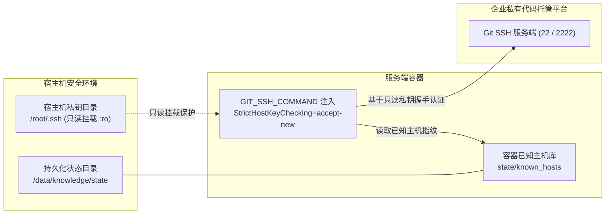

# 部署与交付实战指南

---

## 宿主机持久化目录规划

为了确保容器销毁重建、镜像升级与异常重启时业务数据与增量检查点基线不丢失，所有持久化数据统一收敛在宿主机环境变量 `KNOWLEDGE_DATA_DIR`（默认为 `/data/knowledge`）所指定的根目录下。

在宿主机终端执行以下命令创建标准持久化目录结构：

```bash
mkdir -p /data/knowledge/{state,workspace,inbox,config,certs,logs,remotes}
```

持久化目录规划与职责说明表：

| 目录名称 | 容器挂载目标路径 | 访问权限 | 核心职责与设计考量 |
|---|---|---|---|
| `state/` | `/root/.actiondock` | 读写 | 状态存储目录。持久化全局检查点数据库 `global.db` 与容器专用的已知主机指纹文件 `known_hosts`。承载各仓检查点基线，若该目录丢失将导致基线重置，引发后续全量冗余扫描 |
| `workspace/` | `/srv/workspace` | 读写 | 工作区目录。托管所有纳管的业务代码仓镜像与系统知识仓。全文检索、分段读取与受控编辑均在此目录下严格收敛执行 |
| `inbox/` | `/srv/knowledge-inbox` | 读写 | 待审池目录。接收由只读视图提交的排障候选经验文件，与正式工作区保持物理隔离，不对外开放检索 |
| `config/` | `/etc/actiondock` | 读写 | 配置目录。存放多仓库清单配置文件 `repos.json`，供服务启动与自举检查时加载 |
| `certs/` | `/etc/actiondock/certs:ro` | 只读 | 证书目录。挂载企业正式 TLS 证书文件 `cert.pem` 与私钥文件 `key.pem`。若目录为空，服务启动时将自动生成高强度自签名证书 |
| `logs/` | `/var/log/actiondock` | 读写 | 日志目录。持久化服务访问日志、视图路由记录与特权维护执行审计日志 |
| `remotes/` | `/data/knowledge/remotes` | 读写 | 演练仓目录。用于离线功能验证与本地演练场景的 Git 裸仓存储 |

---

## 环境变量与安全边界规范

复制环境配置模板并生成高强度随机令牌：

```bash
cp .env.example .env
openssl rand -hex 32
openssl rand -hex 32
```

编辑 `.env` 文件，填入生成的随机字符串与宿主机挂载路径：

```dotenv
# 查询视图令牌 (面向外部日常查询与排障助手，仅具备只读检索与经验追加权限)
ACTIONDOCK_TOKEN=e1a2b3c4d5e6f7a8b9c0d1e2f3a4b5c6d7e8f9a0b1c2d3e4f5a6b7c8d9e0f1a2

# 特权维护视图令牌 (面向维护智能体与本地调度器，具备文件编辑与检查点推进权限)
ACTIONDOCK_AGENT_TOKEN=f2b3c4d5e6f7a8b9c0d1e2f3a4b5c6d7e8f9a0b1c2d3e4f5a6b7c8d9e0f1a2b3

# 服务对外监听端口 (默认为 443)
PORT=443

# 宿主机持久化根目录
KNOWLEDGE_DATA_DIR=/data/knowledge

# 宿主机 SSH 密钥目录 (容器将以只读模式挂载)
SSH_DIR=/root/.ssh

# Git 提交身份凭据
GIT_AUTHOR_NAME="Knowledge Maintainer"
GIT_AUTHOR_EMAIL="maintainer@actiondock.local"
```

安全设计约束说明：

- 双令牌强随机与互斥校验：只读查询令牌 `ACTIONDOCK_TOKEN` 与特权维护令牌 `ACTIONDOCK_AGENT_TOKEN` 在权限范围上完全互斥。容器自举脚本内嵌强约束校验逻辑：两个令牌均必须配置、字符长度必须达到 32 字符以上、两者严禁相同，且严禁使用默认占位符，否则直接中断启动流程并报错退出；
- 弱口令与占位符拦截：自举脚本会对令牌进行关键词模式匹配，若检测到包含测试占位字符，将立即拒绝启动，杜绝因疏忽导致弱凭据暴露在线上网络；
- 令牌传递防泄漏设计：容器自举脚本在组装视图配置时，将令牌配置以受限权限（`chmod 600`）写入临时文件，启动参数仅引用该临时文件，从底层杜绝令牌暴露在系统进程参数列表（`ps aux`）中。

---

## 私有 Git 免密连接安全模型

在企业生产环境中，纳管代码仓通常托管在私有代码托管平台中，需要通过 SSH 密钥进行免密拉取与推送。针对容器化环境下的凭据管理，系统设计了严密的安全模型：



免密连接安全机制核心要点：

- 私钥目录只读挂载：宿主机私钥目录通过 `:ro` 模式只读挂载至容器中。容器内的维护进程可以使用该私钥完成与 Git 平台的身份认证，但任何进程均无权修改或写入宿主机私钥文件，从文件系统层面构筑了不可逾越的安全红线；
- 主机指纹解耦持久化：传统容器在首次连接新 Git 平台时，往往会因未知主机指纹弹窗阻断自动化流程。系统通过环境变量注入：
  ```bash
  export GIT_SSH_COMMAND="ssh -o StrictHostKeyChecking=accept-new -o UserKnownHostsFile=/root/.actiondock/known_hosts"
  ```
  该机制自动接受首次连接的新主机指纹，并将指纹持久化保存在独立挂载的 `state/known_hosts` 中。容器重启或重建后指纹依然完好留存，既保证了全自动化无人值守同步，又杜绝了对宿主机原生 `known_hosts` 的污染。

---

## 配置纳管仓库清单

在宿主机 `/data/knowledge/config/repos.json` 中配置需要纳管的代码仓清单列表：

```json
[
  {
    "path": "/srv/workspace/order-service",
    "url": "git@gitlab.corp.example.com:ecommerce/order-service.git",
    "repoType": "code",
    "sourceBranch": "release",
    "knowledgeBranch": "docs"
  },
  {
    "path": "/srv/workspace/system-knowledge",
    "url": "git@gitlab.corp.example.com:ecommerce/system-knowledge.git",
    "repoType": "system_knowledge",
    "sourceBranch": "master"
  }
]
```

核心字段规范与治理类型考量：

- 路径 `path`：容器内工作区的绝对路径，统一以 `/srv/workspace/` 为前缀；
- 地址 `url`：Git 仓库远端克隆地址。首次巡检时若本地目录为空，系统将自动基于 Git 免大文件部分克隆完成初始化；
- 治理类型 `repoType`：
  - `code`：业务代码仓类型。遵循双分支隔离治理模型，必须明确指定 `sourceBranch` 与 `knowledgeBranch`；
  - `system_knowledge`：全局系统知识仓类型。承载跨仓端到端主流程与全局架构文档，采用单分支直接更新模型；
- 主干业务分支 `sourceBranch`：人类研发团队维护与发布的业务主干分支（如 `release`、`main` 或 `master`）；
- 专属知识分支 `knowledgeBranch`：专门承载工程知识体系的分支（通常命名为 `docs`，仅 `code` 类型必需）。

---

## 容器构建与编排启动

在工程根目录（包含 `docker-compose.yml`）执行构建并后台启动容器：

```bash
docker compose up -d --build
```

查看容器运行状态：

```bash
docker compose ps
```

查看实时运行日志以核验自举就绪状态：

```bash
docker compose logs -f knowledge-server
```

当控制台输出以下日志时，表明单端口虚拟视图服务已成功监听 443 端口：

```text
============================================================
Starting ActionDock Knowledge Server (Single-Port Virtual Views Mode)
Port:           443 (HTTPS, Virtual Views)
Workspace Root: /srv/workspace
Inbox Root:     /srv/knowledge-inbox
============================================================
```

---

## 客户端配置与隔离验证

在客户端执行机终端注册视图配置并执行正反向功能验证：

```bash
# 注册面向日常查询与排障助手的只读查询视图 (sk)
ad profile add sk -s https://<云端服务地址>:443 -t <ACTIONDOCK_TOKEN> -k -d "知识中枢只读查询服务"

# 注册面向维护智能体与本地调度器的特权维护视图 (skm)
ad profile add skm -s https://<云端服务地址>:443 -t <ACTIONDOCK_AGENT_TOKEN> -k -d "知识中枢特权维护服务"
```

正向功能验证：

```bash
# 验证只读视图下的全局代码正则检索
ad run workspace/search.rg --profile sk -- pattern="OrderPaymentService"

# 验证只读视图下的排障经验结构化追加
ad run knowledge/knowledge.collect --profile sk -- \
  title="订单支付超时排障" \
  content="遇到渠道超时需在网关层做幂等校验并开启指数退避重试..."
```

逆向安全越权测试（权限隔离门禁）：

```bash
# 在只读查询视图 (sk) 下尝试调用文件写入动作，将被视图白名单直接拦截报错
ad run workspace/files.write --profile sk -- path="order-service/hack.md" content="test"
```

预期终端输出权限拦截错误，证明单端口虚拟视图在 443 端口已实现严密的安全隔离。

---

## 生产排障速查

- 端口网络连通性异常：
  - 检查宿主机防火墙是否已放行 TCP 443 端口（例如 `ufw allow 443/tcp` 或 `iptables` 规则）；
  - 检查云服务器提供商控制台的安全组出入站规则，确认允许来源客户端 IP 访问 443 端口；
  - 若宿主机原生 443 端口已被现有 Nginx 等服务占用，可在 `.env` 中调整映射端口为 `PORT=8443`，并执行 `docker compose up -d` 重新映射；
- Git 同步认证失败：
  - 检查宿主机私钥文件权限是否为 600（执行 `chmod 600 /root/.ssh/id_rsa`）；
  - 在宿主机进入容器执行 SSH 联通性测试：
    ```bash
    docker compose exec knowledge-server ssh -T git@gitlab.corp.example.com
    ```
  - 确认该私钥在代码托管平台拥有对应仓库的读取与推送写入权限；
- TLS 证书不受信任警告：
  - 若使用系统自动生成的自签名证书，在客户端使用 `ad` 命令行时必须追加 `-k`（或 `--insecure`）选项跳过证书链完整性校验；
  - 若使用企业正式 CA 签发的证书，将证书公钥 `cert.pem` 与私钥 `key.pem` 放置在宿主机 `$KNOWLEDGE_DATA_DIR/certs/` 目录下，并执行 `docker compose restart knowledge-server` 重启生效；
- 容器启动后异常退出：
  - 执行 `docker compose logs knowledge-server` 检查退出日志；
  - 重点核对 `.env` 文件中的两个令牌是否均已设置、互不相同、长度均达到 32 字符以上，且未包含默认占位符；
- 双分支合并冲突导致同步中止：
  - 进入容器对应仓库工作区执行 `git status`；
  - 排查是否在知识分支误改了业务源码；执行 `git merge --abort` 安全回滚恢复现场，交由维护智能体进行上下文语义消解。
