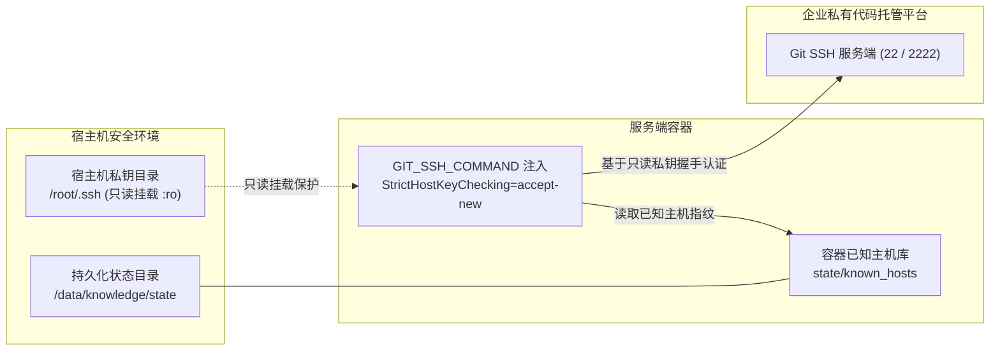

# 部署与交付实战指南

> 工程知识基础设施的部署交付不是简单地启动一个容器，而是构建一个环境自闭包、持久化与物理安全边界严密的工程基座。

本指南面向运维工程师与云原生架构师，详细阐述单端口虚拟视图权限隔离架构、宿主机持久化规划、私有 Git 免密连接安全模型、容器化编排以及生产排障应急处置。

---

## 部署架构与单端口虚拟视图权限隔离

服务端基于 ActionDock 原生虚拟视图特性，统一收敛至标准 HTTPS 443 端口，对外提供单端口多视界访问服务。

统一规范表述为「单端口虚拟视图权限隔离」（Virtual Views），基于只读查询令牌 `ACTIONDOCK_TOKEN` 与特权维护令牌 `ACTIONDOCK_AGENT_TOKEN` 在 443 端口实现细粒度动作暴露隔离。

### 单端口虚拟视图免除前置网关的设计考量

在传统多服务或多权限架构中，通常需要在应用前端挂载 Nginx、Kong 或 API 网关进行请求分流与鉴权校验。这种模式在带来外部网络拓扑复杂度的同时，埋下了严重的工程隐患：

- **免除前置网关的必然性**：ActionDock 原生虚拟视图特性支持在同一监听端口（443）上根据传入的请求令牌自动映射并暴露对应的能力白名单。这一机制从根本上免除了在容器前置独立部署 Nginx、Kong 或 API 网关等反向代理组件的运维复杂度与单点故障风险，彻底避免了外部网关路由配置漂移、证书重复管理与网络策略遗漏可能引发的安全越权灾难；
- **协议层物理剥离越权风险**：查询视界在请求反序列化与路由分发的第一阶段，仅将白名单内允许的只读检索与受控追加 Action 注册进内存路由树。即使外部请求尝试伪造参数或调用文件覆写、Git 提交等维护动作，服务端在协议层直接阻断并返回拒绝访问，杜绝依赖提示词或应用层后置逻辑进行安全拦截。

### 视图隔离与特权矩阵对照表

| 视图标识 | 监听端口 | 鉴权令牌 | 访问对象 | 暴露能力白名单 | 禁用与物理隔离动作 |
|---|---|---|---|---|---|
| 查询视界（`sk`） | 443 (HTTPS) | `ACTIONDOCK_TOKEN` | 外部开发人员、线上排障助手、IDE 插件 | 代码全文检索（`workspace/search.rg`）、受控文件分段直读（`workspace/files.read`）、目录浏览、排障经验待审池受控追加（`knowledge/knowledge.collect`） | 严禁文件写入与受控编辑、严禁终端命令执行、严禁 Git 分支操作与检查点推进 |
| 维护视界（`skm`） | 443 (HTTPS) | `ACTIONDOCK_AGENT_TOKEN` | 受信任网络内的维护智能体、客户端控制平面调度器 | 受控文件写入（`workspace/files.write`）、精准编辑（`workspace/files.edit`）、受限终端执行（`workspace/bash.exec`）、零断链门禁校验（`workspace/links.verify`）、业务代码防污染红线核验与回滚、双分支同步与发布提交、检查点基线推进（`maintenance/maintenance.complete`）、待审池消费与归档（`knowledge/knowledge.archive`） | 无（全量受控特权能力集） |

---

## 宿主机持久化目录规划

为了确保容器销毁重建、镜像升级与异常重启时业务数据与增量检查点基线不丢失，所有持久化数据统一收敛在宿主机环境变量 `KNOWLEDGE_DATA_DIR`（默认为 `/data/knowledge`）所指定的根目录下。

在宿主机终端执行以下命令创建标准持久化目录结构：

```bash
mkdir -p /data/knowledge/{state,workspace,inbox,config,certs,logs,remotes}
```

### 持久化目录规划与职责说明表

| 目录名称 | 容器挂载目标路径 | 访问权限 | 核心职责与关键考量 |
|---|---|---|---|
| `state/` | `/root/.actiondock` | 读写 | 持久化全局检查点数据库 `global.db` 与容器专用的已知主机指纹文件 `known_hosts`。承载各仓检查点基线，统一规范表述为「检查点基线推进机制」（基于提交哈希的增量扫描基准）。无文档变更时推进检查点的技术必要性在于：无论代码变更是否触发文档改动，推进基线均为标记该批次提交已通过完整审计与评估的唯一凭据；若不推进检查点，后续维护将持续对已审计代码重复发起冗余比对与全量扫描，破坏增量闭环收敛性并带来不必要的计算开销。若该目录丢失将导致基线重置，引发全量冗余扫描与计算浪费 |
| `workspace/` | `/srv/workspace` | 读写 | 工作区目录。托管所有纳管的业务代码仓镜像与系统知识仓。全文检索、分段读取与受控编辑均在此目录下严格收敛执行 |
| `inbox/` | `/srv/knowledge-inbox` | 读写 | 排障经验待审池目录。接收由只读视图提交的排障候选经验文件，与正式工作区保持物理隔离，不对外开放检索 |
| `config/` | `/etc/actiondock` | 读写 | 配置目录。存放多仓库清单配置文件 `repos.json`，供服务启动与自举检查时加载 |
| `certs/` | `/etc/actiondock/certs:ro` | 只读 | 证书目录。挂载企业正式 TLS 证书文件 `cert.pem` 与私钥文件 `key.pem`。若目录为空，服务自举时将自动生成自签名证书 |
| `logs/` | `/var/log/actiondock` | 读写 | 日志目录。持久化服务访问日志、视图路由记录与特权维护执行审计日志 |
| `remotes/` | `/data/knowledge/remotes` | 读写 | 演练仓目录。用于离线功能验证与本地演练场景的 Git 裸仓存储 |

---

## 环境变量与安全边界规范

复制环境配置模板并生成高强度随机令牌：

```bash
cp .env.example .env
openssl rand -hex 32
openssl rand -hex 32
```

编辑 `.env` 文件，填入生成的随机字符串与宿主机挂载路径：

```dotenv
# 查询视图令牌 (面向外部日常查询与排障助手，仅具备只读检索与经验追加权限)
ACTIONDOCK_TOKEN=e1a2b3c4d5e6f7a8b9c0d1e2f3a4b5c6d7e8f9a0b1c2d3e4f5a6b7c8d9e0f1a2

# 特权维护视图令牌 (面向维护智能体与本地调度器，具备文件编辑与检查点推进权限)
ACTIONDOCK_AGENT_TOKEN=f2b3c4d5e6f7a8b9c0d1e2f3a4b5c6d7e8f9a0b1c2d3e4f5a6b7c8d9e0f1a2b3

# 服务对外监听端口 (统一收敛至标准 443 端口)
PORT=443

# 宿主机持久化根目录
KNOWLEDGE_DATA_DIR=/data/knowledge

# 宿主机 SSH 密钥目录 (容器将以只读模式挂载)
SSH_DIR=/root/.ssh

# Git 提交身份凭据
GIT_AUTHOR_NAME="Knowledge Maintainer"
GIT_AUTHOR_EMAIL="maintainer@actiondock.local"
```

### 环境变量配置表

| 变量名称 | 是否必填 | 默认值 / 推荐格式 | 核心作用与安全约束 |
|---|---|---|---|
| `ACTIONDOCK_TOKEN` | 是 | 64 位十六进制随机串 | 只读查询视图鉴权令牌。面向外部查询用户与排障助手，仅允许只读与候选追加 |
| `ACTIONDOCK_AGENT_TOKEN` | 是 | 64 位十六进制随机串 | 特权维护视图鉴权令牌。面向受信任维护智能体与调度器，具备文件写入与检查点推进权限 |
| `PORT` | 否 | `443` | 服务对外监听端口。基于单端口虚拟视图技术，统一监听 HTTPS 标准端口 |
| `KNOWLEDGE_DATA_DIR` | 否 | `/data/knowledge` | 宿主机持久化存储根目录。承载状态、工作区、待审池与日志目录 |
| `SSH_DIR` | 否 | `/root/.ssh` | 宿主机私钥目录。容器内以只读挂载（`:ro`）使用，确保宿主机私钥绝对防篡改 |
| `GIT_AUTHOR_NAME` | 否 | `Knowledge Maintainer` | 智能体在知识分支执行自动化提交时的作者标识名 |
| `GIT_AUTHOR_EMAIL` | 否 | `maintainer@actiondock.local` | 智能体在知识分支执行自动化提交时的作者电子邮箱 |

### 安全设计防御机制

- **双令牌强随机与互斥校验**：只读查询令牌 `ACTIONDOCK_TOKEN` 与特权维护令牌 `ACTIONDOCK_AGENT_TOKEN` 在权限范围上完全互斥。容器自举脚本内嵌强约束校验逻辑：两个令牌均必须配置、字符长度必须达到 32 字符以上、两者严禁相同，且严禁使用默认占位符，否则直接中断启动流程并报错退出；
- **弱口令与占位符拦截**：自举脚本会对令牌进行关键词模式匹配，若检测到包含测试占位字符，将立即拒绝启动，杜绝因疏忽导致弱凭据暴露在线上网络；
- **令牌传递防泄漏设计**：容器自举脚本在组装视图配置时，将令牌配置以受限权限（`chmod 600`）写入临时文件，启动参数仅引用该临时文件，从底层杜绝令牌暴露在系统进程参数列表（`ps aux`）中。

---

## 私有 Git 免密连接安全模型

在企业生产环境中，纳管代码仓通常托管在私有代码托管平台中，需要通过 SSH 密钥进行免密拉取与推送。针对容器化环境下的凭据管理，系统设计了严密的安全模型：



### 免密连接安全机制核心要点

- **私钥目录只读挂载**：宿主机私钥目录通过 `:ro` 模式只读挂载至容器中。容器内的维护进程可以使用该私钥完成与 Git 平台的身份认证，但任何进程均无权修改或写入宿主机私钥文件，从文件系统层面构筑了不可逾越的安全红线；
- **主机指纹解耦持久化**：传统容器在首次连接新 Git 平台时，往往会因未知主机指纹交互式弹窗阻断自动化流程。系统通过环境变量注入：
  ```bash
  export GIT_SSH_COMMAND="ssh -o StrictHostKeyChecking=accept-new -o UserKnownHostsFile=/root/.actiondock/known_hosts"
  ```
  该机制自动接受首次连接的新主机指纹，并将指纹持久化保存在独立挂载的 `state/known_hosts` 中。容器重启或重建后指纹依然完好留存，既保证了全自动化无人值守同步，又杜绝了对宿主机原生 `known_hosts` 的污染。

---

## 配置纳管仓库清单与治理模型

统一规范表述为「双分支隔离治理模型」，主干业务分支与知识分支解耦，遇冲突安全中止并由智能体进行语义消解。

在宿主机 `/data/knowledge/config/repos.json` 中配置需要纳管的代码仓清单列表：

```json
[
  {
    "path": "/srv/workspace/order-service",
    "url": "git@gitlab.corp.example.com:ecommerce/order-service.git",
    "repoType": "code",
    "sourceBranch": "release",
    "knowledgeBranch": "docs"
  },
  {
    "path": "/srv/workspace/system-knowledge",
    "url": "git@gitlab.corp.example.com:ecommerce/system-knowledge.git",
    "repoType": "system_knowledge",
    "sourceBranch": "master"
  }
]
```

### 仓库配置字段规范说明表

| 字段名称 | 数据类型 | 必填条件 | 核心作用说明 |
|---|---|---|---|
| `path` | 字符串 | 必填 | 容器内工作区的绝对路径，统一以 `/srv/workspace/` 为前缀 |
| `url` | 字符串 | 必填 | Git 仓库远端克隆地址。首次巡检时若本地目录为空，系统将自动基于 Git 机制完成克隆与拉取 |
| `repoType` | 字符串 | 必填 | 仓库治理类型。分为 `code`（业务代码仓，遵循双分支隔离治理模型）与 `system_knowledge`（全局系统知识仓，单分支直接更新模型） |
| `sourceBranch` | 字符串 | 必填 | 主干业务分支。人类研发团队维护与发布的业务主干分支（如 `release`、`main` 或 `master`） |
| `knowledgeBranch` | 字符串 | `repoType: code` 必填 | 专属知识分支。专门承载工程知识体系的分支（通常命名为 `docs`，系统知识仓无需此项） |

---

## 容器构建与编排启动

在工程根目录（包含 [`server/Dockerfile`](file:///root/code/knowledge-dock/server/Dockerfile) 与 [`docker-compose.yml`](file:///root/code/knowledge-dock/docker-compose.yml)）执行构建并后台启动容器：

```bash
docker compose up -d --build
```

查看容器运行状态：

```bash
docker compose ps
```

查看实时运行日志以核验自举就绪状态：

```bash
docker compose logs -f knowledge-server
```

当控制台输出以下日志时，表明单端口虚拟视图服务已成功监听 443 端口：

```text
============================================================
Starting ActionDock Knowledge Server (Single-Port Virtual Views Mode)
Port:           443 (HTTPS, Virtual Views)
Workspace Root: /srv/workspace
Inbox Root:     /srv/knowledge-inbox
============================================================
```

---

## 客户端配置与隔离验证

在客户端执行机终端注册视图配置并执行正反向功能验证：

```bash
# 注册面向日常查询与排障助手的只读查询视图 (sk)
ad profile add sk -s https://<云端服务地址>:443 -t <ACTIONDOCK_TOKEN> -k -d "知识中枢只读查询服务"

# 注册面向维护智能体与本地调度器的特权维护视图 (skm)
ad profile add skm -s https://<云端服务地址>:443 -t <ACTIONDOCK_AGENT_TOKEN> -k -d "知识中枢特权维护服务"
```

### 正向功能验证

```bash
# 验证只读视图下的全局代码正则检索
ad run workspace/search.rg --profile sk -- pattern="OrderPaymentService"

# 验证只读视图下的排障经验结构化追加
ad run knowledge/knowledge.collect --profile sk -- \
  title="订单支付超时排障" \
  content="遇到渠道超时需在网关层做幂等校验并开启指数退避重试..."
```

### 逆向安全越权测试（权限隔离门禁）

```bash
# 在只读查询视图 (sk) 下尝试调用文件写入动作，将被视图白名单直接拦截报错
ad run workspace/files.write --profile sk -- path="order-service/hack.md" content="test"
```

预期终端输出权限拦截错误，证明单端口虚拟视图在 443 端口已实现严密的安全隔离。

---

## 生产排障应急处置速查表

| 故障现象 | 潜在根本原因 | 排查定位手段 | 处置命令与应急恢复 |
|---|---|---|---|
| 端口网络连通性异常（Connection Refused 或 Timeout） | 宿主机防火墙未放行、云安全组入站未开或宿主机 443 端口被既有 Nginx 占用 | 执行 `ss -tlnp \| grep 443` 查看端口占用情况 | 执行 `ufw allow 443/tcp`；若端口被占用可在 `.env` 中调整为 `PORT=8443` 并执行 `docker compose up -d` |
| Git 远端同步认证失败（Permission Denied publickey） | 宿主机私钥文件权限过宽、密钥未配置托管平台权限或指纹匹配异常 | 查看容器日志；在容器内测试 SSH 连接 | 执行 `chmod 600 /root/.ssh/id_rsa`；执行 `docker compose exec knowledge-server ssh -T git@gitlab.corp.example.com` 验证连通性 |
| TLS 证书不受信任警告 | 客户端校验未跳过系统自动生成的自签名证书 | 检查客户端是否包含自签名警告输出 | 在客户端调用命令时追加 `-k`（`--insecure`）参数；或将企业正式证书 `cert.pem` 与 `key.pem` 放置在 `$KNOWLEDGE_DATA_DIR/certs/` 后重启容器 |
| 容器启动后立即异常退出 | `.env` 环境变量配置缺失、令牌长度不足 32 字符、两令牌相同或包含默认占位符 | 查看容器自举退出日志 `docker compose logs knowledge-server` | 检查并重新生成两枚互不相同的 64 位随机十六进制令牌填入 `.env`，重新启动容器 |
| 双分支合并冲突导致同步中止 | 维护智能体在知识分支误改了业务代码，合并主干时引发内容冲突 | 进入容器对应代码仓执行 `git status` 查看冲突文件 | 执行 `git merge --abort` 退出合并，回滚非法改动，由维护智能体结合代码上下文进行语义消解 |

---

## 部署交付设计总结

整个部署交付架构可以凝练为四句话：

- **单端口 443 原生划分双重视界，免除前置网关杜绝单点隐患。**
- **双分支物理隔离业务与文档，冲突安全中止交由智能体语义消解。**
- **状态数据库与主机指纹独立持久化，保障基线稳定与免密同步。**
- **只读私钥挂载与双令牌强校验，从文件系统与协议层筑牢安全防线。**

---

## 延伸阅读导航

- **流水线编排实战指南**：了解三阶段流水线调度拓扑与命令安全渲染机制，参见 [orchestration.md](file:///root/code/knowledge-dock/docs/orchestration.md)；
- **知识运维与质量门禁**：获取检查点基线运维、待审池流转操作与零断链门禁自愈手册，参见 [operations.md](file:///root/code/knowledge-dock/docs/operations.md)；
- **全景架构设计指南**：了解系统核心组件、逻辑架构拓扑、运行时架构与安全边界，参见 [architecture.md](file:///root/code/knowledge-dock/docs/architecture.md)；
- **动作体系与底座工程**：深入理解面向智能体工作空间的设计约束与确定性硬门禁机制，参见 [action-design.md](file:///root/code/knowledge-dock/docs/action-design.md)；
- **核心流程与生命周期**：掌握代码变更自维护、待审池流转闭环与三阶段流水线调度机制，参见 [workflow.md](file:///root/code/knowledge-dock/docs/workflow.md)。
