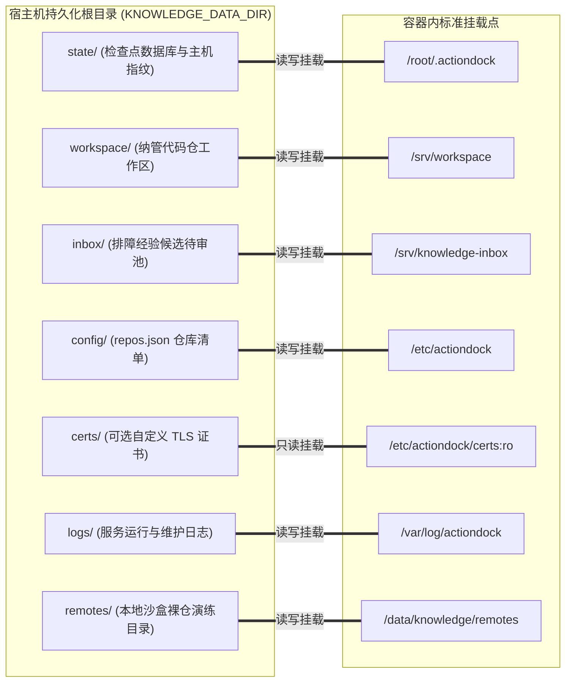

# 服务端部署与运维指南

---

## 概述与架构定位

knowledge-dock 服务端平面（`server/`）是基于 ActionDock 规范构建的一体化知识服务容器。服务原生收敛在标准 HTTPS 443 单端口运行，依托虚拟视图技术，仅通过鉴权令牌在网络接入层自动切分只读查询视图（面向外部用户与业务智能体，提供只读全文检索与排障经验投递）与特权维护视图（面向维护智能体，提供代码分支同步、受控编辑、断链校验与检查点推进）。

本文档面向系统运维工程师与基础设施管理人员，规范服务端的环境准备、持久化目录规划、配置约束、容器编排启动、常用运维操作与故障排障速查。

---

## 物理工程结构与文件对应

服务端平面在代码库中严格物理收敛于 `server/` 目录与根目录编排配置文件中：

- 容器构建定义文件：`server/Dockerfile`，基于基础镜像装配必要的底层工具链（Git、ripgrep、OpenSSH 等）与 ActionDock 运行时。
- 容器启动引导脚本：`server/entrypoint.sh`，负责 Git 免密凭据装配、全局环境初始化、本地包软链注册、安全令牌强约束校验以及根据动态视图规则启动单端口多视图前台服务。
- 仓库清单配置目录：`server/config/`，存放纳管仓库清单模板 `repos.json.example`，挂载至容器 `/etc/actiondock`。
- 一体化编排文件：`docker-compose.yml`，定义容器运行规格、端口映射、双令牌环境变量与持久化挂载卷配置。

---

## 环境准备与前置要求

部署前请确保宿主机满足以下基础设施与运行时条件：

- **操作系统**：Linux 操作系统发行版（CentOS 7+、Ubuntu 20.04+、Debian 11+ 或更高版本）。
- **容器引擎与编排工具**：Docker（版本大于等于 20.10）与 Docker Compose（版本大于等于 2.0）。
- **私有 Git 访问凭据**：宿主机需配置能够免密拉取与推送受纳管 Git 仓库的专用 SSH 密钥对（如 `/root/.ssh/id_rsa`），并确保密钥文件的宿主机权限合规（目录权限 700，私钥文件权限 600）。
- **网络与防火墙**：宿主机及云厂商安全组需对外放行标准 HTTPS 443 端口（或通过环境变量自定义的访问端口）。

---

## 宿主机持久化目录规范规划

为保障容器重建、平滑升级以及主机断电后数据基线与检查点不丢失，所有持久化数据统一收敛在环境变量 `KNOWLEDGE_DATA_DIR`（默认为 `/data/knowledge`）所指引的宿主机目录树下。

### 目录创建与初始化

在宿主机终端执行以下命令创建标准持久化目录结构：

```bash
mkdir -p /data/knowledge/{state,workspace,inbox,config,certs,logs,remotes}
```



### 各持久化子目录职责与要求

- **状态库持久化目录** `state/`：
  - 容器挂载目标：`/root/.actiondock`。
  - 目录核心职责：存放 ActionDock 状态库（包含记录各仓库最新核验提交哈希的检查点数据库 `global.db` 与运行时配置 `runtime.db`），以及容器专用的已知主机指纹文件 `known_hosts`。
  - 重要运维警示：此目录属于绝对不可丢失的关键数据。若该目录丢失或未正确挂载，容器重启后各仓库水位归零，系统会误判所有仓库为首次接入，触发不必要的全盘建库流程，产生严重的模型推理与网络开销。
- **代码仓工作区目录** `workspace/`：
  - 容器挂载目标：`/srv/workspace`。
  - 目录核心职责：存放受纳管的所有业务代码仓与系统级知识仓。底层通过绝对路径隔离，支持免大文件拉取同步与受控编辑。
- **排障经验待审池目录** `inbox/`：
  - 容器挂载目标：`/srv/knowledge-inbox`。
  - 目录核心职责：存放外部研发人员或业务智能体投递的结构化排障候选文档。待审池与正式知识库物理隔离，仅在维护智能体审核消费并提炼后归档。
- **配置文件目录** `config/`：
  - 容器挂载目标：`/etc/actiondock`。
  - 目录核心职责：存放多代码仓纳管配置文件 `repos.json`。
- **可选证书目录** `certs/`：
  - 容器挂载目标：`/etc/actiondock/certs:ro`。
  - 目录核心职责：用于挂载用户提供的正式商业 TLS 证书文件（`cert.pem` 与 `key.pem`）。若目录为空，服务启动时将自动生成高强度自签名证书。
- **日志持久化目录** `logs/`：
  - 容器挂载目标：`/var/log/actiondock`。
  - 目录核心职责：持久化服务前台访问日志、视图路由审计日志与维护任务追踪日志。
- **沙盒裸仓演练目录** `remotes/`：
  - 容器挂载目标：`/data/knowledge/remotes`。
  - 目录核心职责：存放用于本地沙盒演练、离线测试或开发调试的 Git 裸仓。

---

## 环境变量配置与双令牌安全约束

在项目根目录下通过 `.env` 文件声明全局环境变量。服务启动时，引导脚本会对鉴权令牌执行严格的安全合规检查。

### 配置文件初始化与高强度令牌生成

复制模板文件并使用系统原生工具生成两枚互不相同的高强度随机字符串（长度至少 32 字符，推荐 64 字符十六进制串）：

```bash
cp .env.example .env
openssl rand -hex 32
openssl rand -hex 32
```

### 环境变量定义明细

编辑 `.env` 文件，填入生成的随机字符串与本地环境路径：

```dotenv
# 查询视图令牌 (面向外部用户与业务智能体，仅允许只读检索与经验投递)
ACTIONDOCK_TOKEN=e1a2b3c4d5e6f7a8b9c0d1e2f3a4b5c6d7e8f9a0b1c2d3e4f5a6b7c8d9e0f1a2

# 特权维护视图令牌 (面向受控维护智能体与控制平面，具备工作区读写、编辑与检查点推进权限)
ACTIONDOCK_AGENT_TOKEN=f2b3c4d5e6f7a8b9c0d1e2f3a4b5c6d7e8f9a0b1c2d3e4f5a6b7c8d9e0f1a2b3

# 服务对外监听端口 (默认为 443，可按需调整为 8443 等端口)
PORT=443

# 宿主机持久化根目录绝对路径
KNOWLEDGE_DATA_DIR=/data/knowledge

# 宿主机 SSH 密钥目录绝对路径
SSH_DIR=/root/.ssh

# Git 知识库自维护提交时的作者身份
GIT_AUTHOR_NAME="Knowledge Maintainer"
GIT_AUTHOR_EMAIL="maintainer@actiondock.local"
```

### 启动脚本安全强约束规则

为杜绝生产环境弱口令隐患，`server/entrypoint.sh` 在启动服务前会无条件执行以下硬性安全校验：

- **非空与长度门禁**：`ACTIONDOCK_TOKEN` 与 `ACTIONDOCK_AGENT_TOKEN` 必须全部设置，且各自长度均不得少于 32 字符。
- **双令牌互斥门禁**：查询令牌与特权维护令牌严禁相同，防止权限意外混合。
- **示例占位符拦截**：若令牌中包含诸如 `your-random-secure`、`your-token-here`、`example-token` 或 `changeme` 等测试占位关键字，脚本将直接退出并阻断容器启动。

---

## 待维护仓库清单配置规范（`repos.json`）

受纳管的代码仓库清单存放在 `$KNOWLEDGE_DATA_DIR/config/repos.json`（或项目中的 `server/config/repos.json`）。该文件为 JSON 数组格式，用于声明需要知识自维护的代码仓与系统知识仓。

### 配置文件结构示例

```json
[
  {
    "path": "/srv/workspace/order-service",
    "url": "git@github.com:example/order-service.git",
    "repoType": "code",
    "sourceBranch": "release",
    "knowledgeBranch": "docs"
  },
  {
    "path": "/srv/workspace/payment-service",
    "url": "git@github.com:example/payment-service.git",
    "repoType": "code",
    "sourceBranch": "main",
    "knowledgeBranch": "docs"
  },
  {
    "path": "/srv/workspace/system-knowledge",
    "url": "git@github.com:example/system-knowledge.git",
    "repoType": "system_knowledge",
    "sourceBranch": "master"
  }
]
```

### 配置字段说明与治理类型区分

- **工作区路径** `path`（字符串，必需）：仓库在容器内的绝对工作空间路径，必须以 `/srv/workspace/` 为前缀。
- **远端克隆地址** `url`（字符串，可选）：远端私有或公开 Git 仓库地址。若工作区目录下尚无该工程，系统在首次同步时将自动执行克隆；若宿主机已提前克隆至该目录，此项可留空。
- **架构治理类型** `repoType`（字符串，必需）：
  - `code`：业务代码仓类型。采用双分支隔离模型，智能体在 `knowledgeBranch` 上自主维护文档，不污染 `sourceBranch`。
  - `system_knowledge`：系统级全局知识仓类型。采用单分支直接治理模型，由调度器第二阶段智能体直接聚合跨仓知识并推送到主干。
- **主干生产分支** `sourceBranch`（字符串，必需）：业务代码主干分支（如 `release`、`main` 或 `master`）。
- **专属知识分支** `knowledgeBranch`（字符串，`code` 类型必需）：专门用于承载工程知识体系的分支名称（通常命名为 `docs`）。对于 `system_knowledge` 类型此字段不生效。

---

## 私有 Git 免密连接安全模型

在无人值守的知识自维护场景中，容器需要自动拉取主干分支并将更新后的文档推送至远端。传统的直接向容器挂载可写 `.ssh` 目录存在安全风险与已知主机指纹污染问题。knowledge-dock 采用解耦设计：

- **只读挂载私钥**：宿主机的 `${SSH_DIR}` 以只读模式（`:ro`）挂载至容器内 `/root/.ssh`，容器内部无权修改或写入宿主机密钥文件。
- **独立持久化已知主机指纹**：
  - 容器启动脚本在环境变量中导出：
    ```bash
    export GIT_SSH_COMMAND="ssh -o StrictHostKeyChecking=accept-new -o UserKnownHostsFile=${KNOWLEDGE_DATA_DIR}/state/known_hosts"
    ```
  - 容器在首次连接新的私有 Git 服务器时，自动接收并记录远端主机指纹，且该指纹文件落盘在可写的持久化目录 `${KNOWLEDGE_DATA_DIR}/state/known_hosts` 中。
  - 容器重启或宿主机环境更新均不会丢失已信任的远端主机指纹，同时完全避免对宿主机原始 `known_hosts` 文件产生写操作干扰。

---

## 容器构建、启动与验证

### 启动服务容器

在项目根目录下通过 Docker Compose 构建并启动常驻后台服务：

```bash
# 构建镜像并启动容器
docker compose up -d --build

# 检查容器运行状态与健康检查结果
docker compose ps
```

### 查看实时启动日志

通过容器日志观察启动引导过程与虚拟视图初始化输出：

```bash
docker compose logs -f knowledge-server
```

启动成功时，日志中将打印单端口虚拟视图模式已就绪信息，表明 443 端口已在安全多视图模式下对外提供服务。

### 容器健康检查机制

编排文件内置了基于容器内查询令牌的自动化健康探针：

- 探针检测命令：`curl -kf -H "Authorization: Bearer ${ACTIONDOCK_TOKEN}" https://localhost:443/health`
- 检测周期与重试：每 30 秒执行一次，响应超时 5 秒，连续重试 3 次失败标记为不健康。

---

## 客户端连接配置与功能验证

在客户端执行机安装配置 ActionDock 客户端后，登记对应的虚拟视图连接凭据并验证功能。

### 登记只读查询视图配置与特权维护视图配置

```bash
# 登记面向外部用户与查询智能体的只读查询配置 (sk)
ad profile add sk -s https://<cloud-host-ip>:443 -t <ACTIONDOCK_TOKEN> -k -d "知识中枢只读查询服务"

# 登记面向受控维护智能体的特权维护配置 (skm)
ad profile add skm -s https://<cloud-host-ip>:443 -t <ACTIONDOCK_AGENT_TOKEN> -k -d "知识中枢特权维护服务"
```

### 验证只读查询能力与候选经验投递

```bash
# 验证代码与文档全文正则检索
ad run workspace/search.rg --profile sk -- pattern="OrderController"

# 验证文档分段直读
ad run workspace/files.read --profile sk -- path="order-service/docs/knowledge/index.md" startLine:=1 maxLines:=50

# 验证排障经验结构化投递至待审池
ad run knowledge/knowledge.collect --profile sk -- title="支付网关超时规避" tags.0="payment" tags.1="timeout" content="遇到超时需重试..."
```

### 验证权限安全边界（反向防穿透测试）

在只读配置 `sk` 下尝试调用特权编辑或同步动作，验证视图级动作白名单是否严格生效：

```bash
# 预期结果：命令直接报错被白名单拦截拒绝执行
ad run workspace/files.write --profile sk -- path="order-service/test.md" content="hack"
```

---

## 常用容器运维命令与排障速查

### 常用容器运维操作

- **进入容器内部调试环境**：
  ```bash
  docker compose exec knowledge-server bash
  ```
- **重启服务容器**：
  ```bash
  docker compose restart knowledge-server
  ```
- **平滑停止并销毁容器**（持久化数据保留在宿主机磁盘）：
  ```bash
  docker compose down
  ```

### 常见故障排障速查指南

- **网络连接超时或无法访问 443 端口**：
  - 排查宿主机内核防火墙（`iptables` 或 `firewalld`）是否放行 443 端口流量。
  - 排查云服务器控制台的安全组规则，确认入方向已允许客户端来源 IP 访问 TCP 443 端口。
  - 若宿主机 443 端口被既有 Web 服务占用，可在 `.env` 中调整 `PORT=8443`，并执行 `docker compose up -d` 重新映射。
- **Git 分支同步或推送报错认证失败（权限拒绝）**：
  - 检查宿主机 `${SSH_DIR}` 目录下的私钥文件是否存在且权限合规（`chmod 600 id_rsa`）。
  - 在宿主机执行 `ssh-add -l` 或进入容器执行 `docker compose exec knowledge-server ssh -T git@<git-host>` 测试与远端 Git 服务器的 SSH 握手。
  - 确认该私钥在远端代码托管平台拥有对应仓库的写入推送权限。
- **客户端报错证书不受信任或自签名警告**：
  - 若使用服务自动生成的自签名证书，ActionDock 命令行在注册或调用时必须附加 `-k` 选项跳过证书链校验。
  - 若已采购企业级正式 TLS 证书，将 `cert.pem` 与 `key.pem` 放置在宿主机 `$KNOWLEDGE_DATA_DIR/certs/` 目录下，并执行 `docker compose restart knowledge-server` 重启生效。
- **容器启动即退出并输出安全错误信息**：
  - 检查 `.env` 文件中的 `ACTIONDOCK_TOKEN` 与 `ACTIONDOCK_AGENT_TOKEN`。
  - 确认两枚令牌均已设置、互不相同、长度均达到 32 字符以上，且未包含默认占位字符。
- **工作区出现意外冲突导致同步中止**：
  - 查看日志或进入容器工作区执行 `git status`。
  - 检查是否在知识分支上误动了主干业务源码文件；若存在冲突，交由维护智能体执行冲突语义消解，或使用 `git merge --abort` 恢复初始状态。
