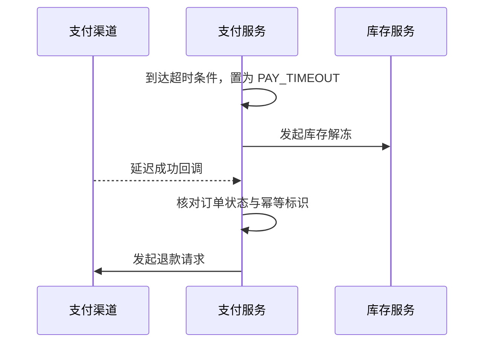

# 示例：支付超时状态如何改变知识

这是一个用于说明维护决策的构造场景，不对应本仓中的真实支付服务或实测收益。它展示一类常见情况：代码新增状态后，接口、流程和排障说明可能同时过期。

## 变更发生前

假设 `payment-service` 的支付单只有 `PAYING`、`SUCCESS` 和 `FAILED` 三类关键状态。原知识文档描述：支付渠道回调成功后订单完成；失败后订单关闭。排障手册没有“本地已关单、渠道稍后扣款成功”的分支。

本轮主干提交新增 `PAY_TIMEOUT`。伪代码仅表示需要核对的行为：

```diff
 enum PaymentStatus {
   PAYING,
   SUCCESS,
   FAILED,
+  PAY_TIMEOUT
 }

 if (order.isExpired() && order.status == PAYING) {
+  order.status = PAY_TIMEOUT;
+  inventory.unfreeze(order.id);
 }

+if (order.status == PAY_TIMEOUT && callback.isPaid()) {
+  refund.requestOnce(callback.channelTradeNo);
+}
```

维护智能体不能只凭新增枚举断定退款一定成功。还要检查退款调用、重试与幂等实现，确认哪些事实已由代码证明，哪些仍需业务方或渠道资料补充。

## 审查与落位

`maintenance.list` 返回本轮目标提交后，维护智能体对照源码和现有知识：

| 发现 | 需要核对的正式知识 |
|---|---|
| 对外状态可能新增 `PAY_TIMEOUT` | `interface/interface-payment-query.md` 的返回值说明 |
| 支付流程出现超时关闭与库存解冻 | `flow/flow-payment-state.md` 的状态转移与时序 |
| 延迟成功回调触发退款请求 | `rule/rule-refund.md` 的触发条件和幂等约束 |
| 值班人员需要识别该状态 | `runbook/runbook-payment-timeout.md` 的定位与恢复步骤 |

这些路径是示例落位，不表示每次变更都必须新建四篇文档。若既有文档已经准确描述该行为，只需记录审查结论。若退款重试次数无法从代码或配置确认，文档应标注未确认，而不是补写猜测。



## 发布与闭环

- 只修改证据支持的知识段落，保留相关源码路径和提交依据。
- 调用 `workspace/links.verify`，修复断链后重新检查。
- 核对 Git 改动与暂存文件均位于预期的 `docs/knowledge/` 路径。
- 调用 `maintenance.publish` 提交并确认推送结果。
- 用 `maintenance.list` 返回的主干目标提交调用 `maintenance.complete`。

再假设下一轮提交只重命名了一个内部变量，未改变任何已记录的业务行为。此时不应重复改写上述文档；记录“无需更新”的依据，并将检查点推进到新提交即可。这是增量维护收敛的关键。

相关规范见[知识格式](../knowledge-model.md)和[运维手册](../operations.md)。
