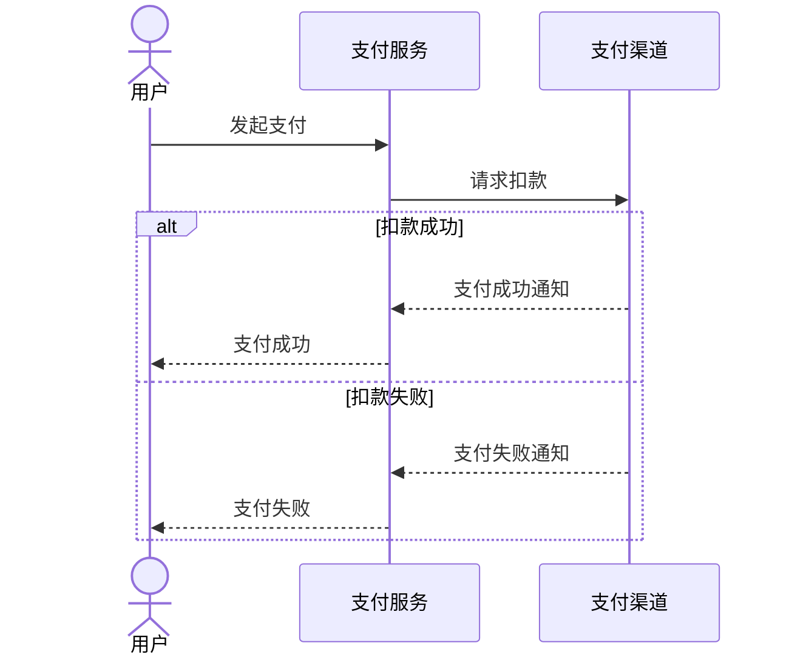
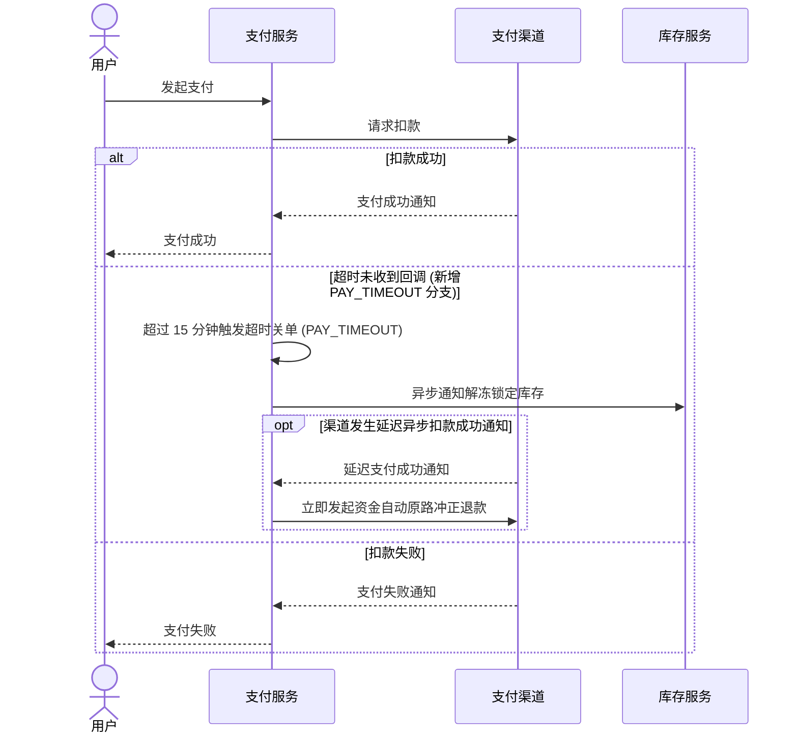

# 业务演进实战案例：支付超时自维护

> 业务演进不是文档过期的借口，而是驱动工程知识闭环自愈的时钟脉冲。当系统发生真实的业务迭代时，代码变化只是审查的信号，业务契约失效才是文档更新的理由。

本文以支付核心服务新增「支付单超时自动关单与资金冲正」业务功能为例，全景复盘系统如何在无需人工干预的情况下，通过多智能体协同与质量门禁，实现工程知识随业务代码提交自主演进的确定性闭环。

---

## 核心工程不变量

在整个业务演进闭环中，系统强制兑现四项核心工程不变量：

- 知识骨架切片不变量：知识更新必须严格落入既定的六类规范骨架目录，不同目录承担正交语义，杜绝无边界随意建档；
- 候选贡献单元与正式知识单元物理隔离不变量：贡献单元是原材料，正式文档是成品，两者物理隔离。排障经验与人工维护必须先暂存至排障经验待审池，经特权维护智能体结合代码源码交叉求证后方可提炼转正，严禁建立一对一的直通映射；
- 智能体最小特权分工不变量：调度器在客户端控制平面本地运行，维护智能体通过单端口虚拟视图权限隔离（Virtual Views）下的特权维护视图执行受控读写，杜绝越权外溢；
- 业务代码防污染红线不变量：知识更新严格收敛在 `docs/knowledge/` 目录下，严禁在业务源码目录生成临时文件或修改工程代码，违者阻断发布并全量回滚。

---

## 业务场景与演进契机

在某分布式电商交易体系中，支付核心服务（`payment-core`）负责处理收单、渠道扣款与清结算。在最新一次业务迭代中，研发团队合入了「支付单超时自动关单与资金冲正」功能。

该功能的业务代码核心变动包括：

- 支付单状态机枚举新增 `PAY_TIMEOUT`（支付超时已关闭）状态；
- 网关回调处理中新增超时判定分支：若支付超时未收到渠道扣款成功回调，状态由 `PAYING` 转移为 `PAY_TIMEOUT`，同时异步触发库存服务与营销券解冻；
- 若渠道在系统关单后发生延迟扣款成功通知，系统立即触发自动原路冲正退款，并向告警中心记录错误码 `ERR_PAY_TIMEOUT_CHARGEBACK`。

研发团队将特性代码合入主干分支（`release`）并完成线上发版。此时，生产代码已发生实质演进，而文档仍处于旧版状态。

---

## 代码变更捕获与增量差异提取

客户端控制平面（纯本地控制动作，命令行严禁附加 `--profile` 控制选项）的流水线调度器 [knowledge-orchestrator](file:///root/code/knowledge-dock/client/packages/knowledge-orchestrator) 启动多仓巡检：

- 调度器探测当前 `payment-core` 代码仓的最新提交哈希为 `commit_def456`，已记录的检查点基线水位为 `commit_abc123`；
- 计算哈希差集，发现存在有效未审提交；
- 提取本次提交的代码差异文件集：
  - `src/main/java/com/example/payment/domain/PaymentStatus.java`
  - `src/main/java/com/example/payment/service/PaymentCallbackService.java`
  - `src/main/java/com/example/payment/client/RefundClient.java`
- 调度器判定存在待审计增量，向受信任环境派发针对该仓的维护任务，唤醒知识维护智能体 [project-knowledge-maintainer](file:///root/code/knowledge-dock/skills/project-knowledge-maintainer)。

### 具象化源码变更对比片段

```java
// PaymentStatus.java 核心枚举扩充
public enum PaymentStatus {
    INIT,
    PAYING,
    SUCCESS,
    FAILED,
+   PAY_TIMEOUT // 支付超时已关闭
}
```

```java
// PaymentCallbackService.java 回调处理新增超时与冲正分支
if (isTimeout(order)) {
+   order.setStatus(PaymentStatus.PAY_TIMEOUT);
+   inventoryClient.unfreeze(order.getOrderNo());
+   if (channelCallback.isSuccess()) {
+       refundClient.autoChargeback(order.getChannelTradeNo(), "ERR_PAY_TIMEOUT_CHARGEBACK");
+   }
+   return;
}
```

```java
// RefundClient.java 新增自动原路冲正客户端调用
public void autoChargeback(String channelTradeNo, String reasonCode) {
+   // 幂等调用三方渠道资金自动冲正退款接口
+   channelGateway.refund(channelTradeNo, reasonCode);
}
```

---

## 智能体契约失效四问评估

知识维护智能体调取源码差异后，严格执行契约失效四问评估，拒绝盲目重写无关文档：

> 代码变化只是审查的信号，业务契约失效才是文档更新的理由。

| 评估维度 | 源码变动事实 | 契约失效裁定 | 拟变更知识骨架与目标文件 |
|---|---|---|---|
| 对外公开接口契约 | 支付单状态查询接口返回枚举集新增 `PAY_TIMEOUT`，属于对外结构与状态扩展 | 契约失效 | 接口契约骨架 `docs/knowledge/interface/payment-api.md` |
| 核心业务流程时序 | 支付生命周期由二元完结态变更为三元完结态，引入超时关单、解冻与延迟冲正时序 | 契约失效 | 业务时序骨架 `docs/knowledge/flow/payment.md` |
| 核心业务规则逻辑 | 新增超时关单后渠道延迟扣款自动触发冲正退款的幂等判定与手续费承担规则 | 契约失效 | 业务规则骨架 `docs/knowledge/rule/refund.md` |
| 核心数据模型定义 | 实体核心状态枚举类扩充 `PAY_TIMEOUT` 枚举常量及状态机跃迁路径 | 契约失效 | 数据模型骨架 `docs/knowledge/data/payment-state.md` |
| 应急排障预案 | 引入全新异常错误码 `ERR_PAY_TIMEOUT_CHARGEBACK`，需补全排障指引 | 预案缺失 | 运维排障骨架 `docs/knowledge/runbook/payment-error.md` |

裁定结论：多项核心业务契约发生实质漂移，必须启动多文档联动更新。

---

## 多文档联动影响分析与演进对比

知识维护智能体依据 [knowledge-model.md](file:///root/code/knowledge-dock/docs/knowledge-model.md) 规划的六类骨架，执行精准局部编辑。

### 业务时序文档演进

在 `docs/knowledge/flow/payment.md` 中，维护智能体将旧版的二元完结态时序升级为包含超时关单与资金冲正的完整时序图：

#### 演进前时序图



#### 演进后时序图



### 业务规则文档演进

在 `docs/knowledge/rule/refund.md` 中新增超时冲正退款规则章节：

```markdown
### 支付超时冲正退款规则

- 触发条件：订单本地状态已跃迁为 PAY_TIMEOUT，但三方支付渠道在关单后返回扣款成功回调；
- 资金流向：由系统自动调用渠道退款接口原路返还用户，扣款渠道手续费由平台兜底；
- 幂等保障：使用原始支付渠道流水号作为退款请求外部单号，重试窗口内确保单笔支付仅退款一次。
```

### 应急排障预案演进

在 `docs/knowledge/runbook/payment-error.md` 中新增异常错误码处理预案：

```markdown
### ERR_PAY_TIMEOUT_CHARGEBACK 支付超时冲正异常预案

- 现象描述：用户反馈银行卡扣款但订单显示已超时取消；
- 根因定位：渠道异步回调延迟超过系统关单阈值，且系统自动原路冲正时遭遇渠道网络抖动；
- 排障步骤：
  - 检索支付中枢日志，确认渠道流水号与订单关联状态；
  - 检查冲正重试队列是否存在堆积；
  - 若自动冲正已达最大重试次数，调用运维对账接口执行人工补单退款。
```

---

## 质量门禁核验与基线闭环

在执行提交发布前，维护流程依次通过硬性工程质量门禁：

- 零断链门禁核验：
  - 调用工作区能力包中的 [links-verify.ts](file:///root/code/knowledge-dock/server/packages/knowledge-workspace/actions/links-verify.ts)（`links.verify` 动作）；
  - 检测到 `docs/knowledge/runbook/payment-error.md` 引用了 `../flow/payment.md#payment-timeout` 锚点；
  - 校验器验证该锚点真实存在且有效，全仓断链统计为 0，门禁放行；
- 业务代码防污染红线核验：
  - 审查当前 Git 变更状态，确认所有改动文件均严格收敛在 `docs/knowledge/` 目录下；
  - 业务源码文件未发生任何修改，防污染红线通过；
- 双分支隔离治理模型协同：
  - 主干业务分支与知识分支解耦，遇冲突安全中止并由智能体进行语义消解；
  - 将文档改动提交并推送至专属知识分支（`docs`）；
- 检查点基线推进机制保障：
  - 调用特权维护动作 [maintenance-complete.ts](file:///root/code/knowledge-dock/server/packages/knowledge-maintenance/actions/maintenance-complete.ts) 将检查点水位从 `commit_abc123` 推进至 `commit_def456`；
  - 无文档变更时推进检查点的技术必要性在于：无论代码变更是否触发文档改动，推进基线均为标记该批次提交已通过完整审计与评估的唯一凭据；若不推进检查点，后续维护将持续对已审计代码重复发起冗余比对与全量扫描，破坏增量闭环收敛性并带来不必要的计算开销。

---

## 演进成效与工程收益

通过全自动闭环自维护体系，研发与运维团队获得了显著的工程收益：

- 零人工文档维护成本：业务研发人员未花费任何工时编写或调整文档格式，知识文档与上线代码始终保持高保真同步；
- 线上排障精准可靠：值班人员与只读排障助手调阅的是包含超时冲正逻辑的最新时序图与预案，彻底杜绝因参考滞后旧文档误判导致的资金损失事故；
- 人机协同效率倍增：人类提供事实证据，智能体负责工程对齐，使得软件资产在高频敏捷迭代中持续保持高信噪比与确定性质量。

---

## 案例总结

本实战案例所展示的工程演进机制可以凝练为四句话：

- 代码变更作为事实信号触发巡检，契约失效驱动精准文档补丁。
- 多骨架联动演进覆盖全生命周期，前置自愈消解潜在断链隐患。
- 双分支隔离与防污染红线筑牢底线，杜绝知识更新反向干扰生产业务。
- 检查点基线推进实现增量收敛闭环，推动工程知识随系统脉动自主演进。

---

## 延伸阅读导航

- 知识模型与内容组织规范：查阅六类知识骨架切片与语义标记节规范，参见 [docs/knowledge-model.md](file:///root/code/knowledge-dock/docs/knowledge-model.md)；
- 智能体体系设计与角色矩阵：了解多智能体协同机制与最小特权视界划分，参见 [docs/agent-design.md](file:///root/code/knowledge-dock/docs/agent-design.md)；
- 全景架构设计指南：了解双平面职责与支撑系统运转的工程不变量，参见 [docs/architecture.md](file:///root/code/knowledge-dock/docs/architecture.md)；
- 核心概念与设计原则：查阅四大核心设计原则与系统概念权威定义，参见 [docs/concepts.md](file:///root/code/knowledge-dock/docs/concepts.md)。
