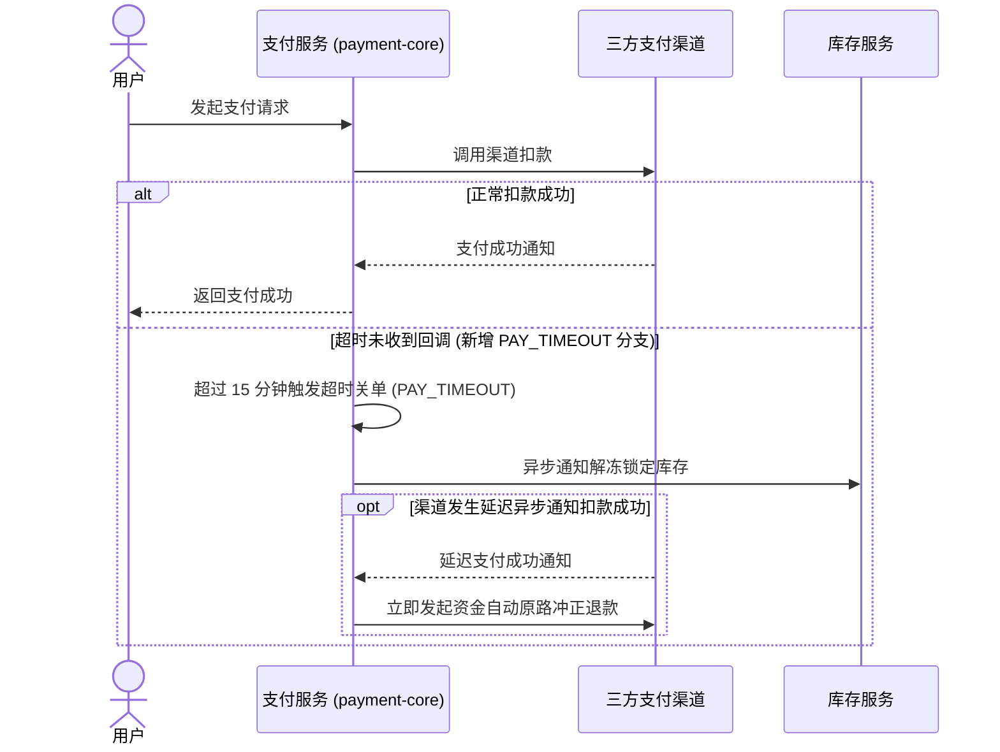

# 实战案例：支付超时状态（PAY_TIMEOUT）驱动的知识自演进

---

## 案例背景与业务场景

在某分布式交易体系中，支付核心服务（`payment-core`）负责承接订单支付与三方渠道对账。在一次敏捷迭代中，研发团队上线了「支付单超时自动关单与资金冲正」功能。

业务代码变更内容：

- 在支付单状态机枚举类中新增 `PAY_TIMEOUT`（支付超时已关闭）状态；
- 在支付网关回调处理中新增超时判定分支：若支付超时未收到渠道成功回调，状态由 `PAYING` 转移为 `PAY_TIMEOUT`，同时异步触发库存服务与营销券解冻；
- 若渠道在关单后发生延迟扣款通知，系统触发自动冲正退款，并向告警中心记录错误码 `ERR_PAY_TIMEOUT_CHARGEBACK`。

以下完整复盘 knowledge-dock 如何在无需人工干预的情况下，自动完成工程知识的端到端演进闭环。

---

## 演进阶段一：代码变更捕获与增量差异提取

研发团队将特性分支合入生产主干分支（`release`）并完成线上发版。

客户端流水线调度器（`knowledge-orchestrator`）触发巡检：

- 查询当前 `payment-core` 代码仓的最新提交哈希为 `commit_def456`，已记录的检查点基线为 `commit_abc123`；
- 比对哈希差集，发现存在 3 个有效未审提交；
- 提取代码差异文件集：
  - `src/main/java/com/example/payment/domain/PaymentStatus.java`
  - `src/main/java/com/example/payment/service/PaymentCallbackService.java`
  - `src/main/java/com/example/payment/client/RefundClient.java`
- 调度器判定存在有效增量，唤醒针对该仓的维护智能体。

---

## 演进阶段二：智能体契约失效评估

维护智能体调取代码差异并执行契约失效四问评估：

- **对外公开接口契约是否改变？**
  - 评估结论：是。支付状态查询接口的返回值枚举集新增 `PAY_TIMEOUT`，属于对外数据结构与状态扩展；
- **核心业务时序图与状态机是否改变？**
  - 评估结论：是。支付生命周期由原先的二元完结态（`SUCCESS` / `FAILED`）变更为三元完结态（新增 `PAY_TIMEOUT` 分支及异步冲正时序）；
- **核心业务规则与拦截条件是否改变？**
  - 评估结论：是。退款规则中新增「超时关单后渠道延迟扣款自动触发冲正退款」的幂等判定逻辑；
- **数据模型核心实体与枚举是否改变？**
  - 评估结论：是。支付单核心状态枚举变更。

评估裁定：业务契约发生实质性漂移，必须更新对应规范文档。

---

## 演进阶段三：多文档联动影响分析与精准更新

维护智能体扫描 `docs/knowledge/` 目录，精准锁定受波及的知识骨架文件并执行受控编辑：

### 1. 更新业务时序文档（`docs/knowledge/flow/payment.md`）

更新支付核心流程时序图，补充超时分支与解冻调用：



### 2. 更新业务规则文档（`docs/knowledge/rule/refund.md`）

在退款规则中增补超时冲正条款：

```markdown
### 支付超时冲正退款规则

- 触发条件：订单本地状态已跃迁为 PAY_TIMEOUT，但三方支付渠道在关单后返回扣款成功回调；
- 资金流向：由系统自动调用渠道退款接口原路返还用户，扣款渠道手续费由平台兜底；
- 幂等保障：使用原始支付渠道流水号作为退款请求外部单号，重试窗口内确保单笔支付仅退款一次。
```

### 3. 更新应急排障预案（`docs/knowledge/runbook/payment-error.md`）

在运维排障手册中新增异常错误码处理预案：

```markdown
### ERR_PAY_TIMEOUT_CHARGEBACK 支付超时冲正异常预案

- 现象描述：用户反馈银行卡扣款但订单显示已超时取消；
- 根因定位：渠道异步回调延迟超过系统关单阈值，且系统自动原路冲正时遭遇渠道网络抖动；
- 排障步骤：
  - 检索支付中枢日志，确认渠道流水号与订单关联状态；
  - 检查冲正重试队列是否存在堆积；
  - 若自动冲正已达最大重试次数，调用运维对账接口执行人工补单退款。
```

---

## 演进阶段四：质量门禁核验与基线闭环

在执行提交发布前，维护流程依次通过两项质量门禁：

- **零断链门禁校验**：
  - 执行 `links.verify` 校验动作；
  - 检测到 `docs/knowledge/runbook/payment-error.md` 引用了 `../flow/payment.md#payment-timeout` 锚点；
  - 校验器验证该锚点真实存在且有效，全仓断链统计为 0，门禁通过；
- **业务代码防污染红线核验**：
  - 执行 Git 状态检查；
  - 确认所有变更文件均严格收敛在 `docs/knowledge/` 目录下，业务代码源码文件无任何改动，红线通过；
- **提交推送与推进基线**：
  - 将文档改动提交并推送至专属知识分支（`docs`）；
  - 调用特权维护动作将检查点水位从 `commit_abc123` 推进至 `commit_def456`；
  - 全流程闭环结束，下一次巡检将自动跳过此批次代码，确保增量收敛。

---

## 演进成效与用户收益

通过全自动闭环维护，团队获得了以下核心成效：

- **零人工文档维护开销**：开发团队未投入任何文档编写工时，知识库与上线代码保持严格同步；
- **线上排障无缝协同**：一线值班人员在面对客诉与超时告警时，通过只读检索接口可直接获取最新时序图与冲正排障预案，杜绝按过时逻辑盲目手动补发发货通知的严重资损事故。
