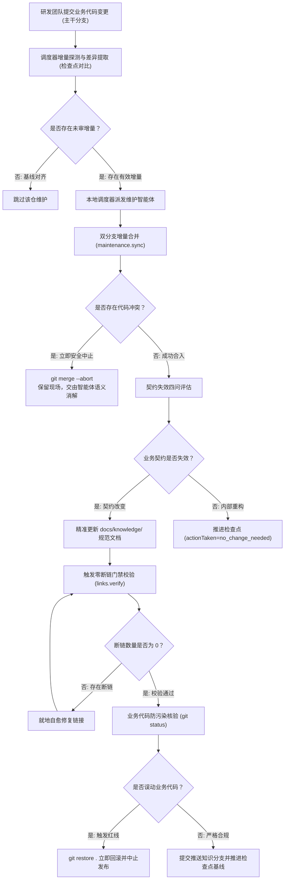

# 知识全生命周期运维规程

---

## 知识自维护全生命周期闭环

knowledge-dock 的知识自维护遵循严密的工程化闭环流转流程：



生命周期流转节点说明：

- 代码变更驱动：研发团队向主干业务分支提交代码变更；
- 增量差异比对：调度器探测最新提交哈希与已记录检查点基线之间的差异，精准计算受影响的代码文件与变更规模；
- 智能体语义分析：维护智能体受控拉取更新，比对源码变动，核验业务契约是否失效；
- 质量门禁校验：强制触发断链校验（`links.verify`），实现文档超链接、引用路径与锚点的就地闭环自愈；
- 防污染核验与发布推进：核验无业务代码污染后，将文档改动提交并推送至专属知识分支（`docs`），同步推进检查点基线水位至最新提交哈希。

---

## 排障经验待审池治理实战

在企业日常运维与排障中，一线研发排障后沉淀的经验极其宝贵，但若允许随意修改正式文档，极易引发格式冲突与推测污染。系统遵循「**缓冲入池，去重转正**」的原则，提供受控的待审流转机制：

### 经验结构化采集入池

一线研发或运维人员在只读查询视图（`sk`）下，通过标准化命令将排障记录结构化提交至待审池：

```bash
ad run knowledge/knowledge.collect --profile sk -- \
  title="支付网关网络抖动超时排障记录" \
  tags.0="payment" tags.1="timeout" \
  content="当支付网关返回网络抖动时，回调接口需校验幂等号并开启指数退避重试，避免重试并发打垮下游服务..."
```

提交内容作为独立的 Markdown 候选文件保存在宿主机持久化待审池目录中。该目录与正式工作区物理隔离，且不对外开放通用检索，彻底杜绝未经审核的主观信息干扰正常代码与知识检索。

### 待审经验扫描

维护智能体在巡检时通过特权维护视图（`skm`）拉取待审经验清单：

```bash
ad run knowledge/knowledge.list --profile skm -- status="pending"
```

该动作返回待审池中所有状态为 `pending` 的候选经验条目，包含文档编号、标题、提交时间与标签元数据。

### 源码比对核验

维护智能体查阅纳管代码仓源码，交叉核实排障场景与应对措施的技术准确性：
- 确认该问题是特定版本缺陷还是全局架构约束；
- 核验最新主干分支源码是否已经通过代码重构彻底修复该隐患；
- 确认相关配置项与超时阈值在当前代码中的实际定义。

### 规范提炼入库

将核验属实的有效经验提炼为标准知识单元，合入对应的规范目录中：
- 应急处置流程合入 `runbook/` 操作手册目录；
- 幂等与重试约束合入 `rule/` 业务规则目录；
- 回调与状态定义合入 `interface/` 接口契约目录。

严禁在工作区非受控创建孤岛碎片文件，确保所有沉淀知识融入统一体系。

### 决议归档留痕

提炼合并完成后，调用归档动作记录决策并移出待审池，形成完整的审计留痕：

```bash
ad run knowledge/knowledge.archive --profile skm -- \
  id="20260927-a1b2c3d4" \
  resolution="accepted" \
  note="已提炼并合入 order-service 的 runbook-payment.md 操作手册中"
```

若核验发现属于已修复代码或环境误报，则在归档时指定 `resolution="rejected"` 并注明驳回原因，确保全生命周期留痕可溯。

---

## 检查点基线推进机制深度推导

### 增量扫描基准原理

检查点机制的核心职能是记录「已核验代码提交哈希」作为基线水位。调度器在后续执行巡检时，仅扫描检查点哈希至分支最新提交之间的增量区间，避免全量重复扫描。

### 无文档变更时推进检查点的技术必要性

在多代码仓自维护过程中，常见的场景是新增代码提交仅包含内部重构、局部变量重命名、代码注释调整或单元测试用例补充，未对外部行为契约与业务逻辑产生实质影响，智能体判定无需修改工程文档。

在此类场景下，系统**必须强制调用完成动作推进检查点**：

- 确立增量扫描基准：检查点推进动作的技术本质是在系统中确立最新的增量扫描基准；
- 杜绝重复无效扫描：无文档变更时推进检查点的技术必要性在于，无论代码变更是否触发文档改动，推进基线均为标记该批次提交已通过完整审计与评估的唯一法定凭据。若不推进检查点，检查点水位将永久停滞在历史旧提交上；当下次调度巡检触发时，调度器仍会将已核验过的提交判定为未审增量，再次调度智能体重复执行无意义的代码扫描与分析，破坏增量闭环收敛性并带来不必要的计算开销；
- 调用规范范例：确认无需修改文档时，智能体通过指定参数 `actionTaken="no_change_needed"` 推进检查点基线：

```bash
ad run maintenance/maintenance.complete --profile skm -- \
  path="/srv/workspace/order-service" \
  commit="c7a1b2d3e4f5..." \
  actionTaken="no_change_needed" \
  summary="内部代码重构与单测补充，未改变任何业务契约"
```

---

## 契约失效判定四准则

面对增量代码提交，智能体须遵循「**以知识失效而非改动量驱动更新**」的原则，对照以下四个维度进行契约有效性审查。任一维度受影响即须更新对应文档；若均未受影响，则推进检查点结束流程：

- 流程契约变动：主调用链路、分支流转条件、异步事件发布机制或异常降级时序是否发生变更？
- 公开接口变动：对外暴露的接口路径、请求参数结构、响应体定义或状态错误码是否发生变更？
- 业务规则变动：核心业务计算逻辑、校验阈值、权限门禁或业务状态机流转约束是否发生变更？
- 数据模型变动：持久化实体模型、数据库表结构或核心枚举定义是否发生变更？

---

## 核心质量门禁与安全红线

### 零断链门禁

在编写或局部编辑 Markdown 文档时，路径拼写偏差或章节标题调整极易导致超链接失效，破坏知识图谱的连续性。

- 门禁触发时机：在文档修改完成、正式发布提交前，必须强制调用断链校验动作：
  ```bash
  ad run workspace/links.verify --profile skm -- path="/srv/workspace/order-service"
  ```
- 扫描覆盖范围：自动校验工作区内所有 Markdown 文档的相对文件引用路径、媒体静态资源路径与章节标题锚点；
- 就地自愈要求：若检测到断链数量大于 0，智能体必须对照输出的失效链接清单就地修正自愈，直至断链数量为 0 时方可执行后续发布与检查点推进。

### 业务代码防污染红线

知识库自维护的核心安全原则是：**严禁改动或污染业务源码目录与主干分支！**

- 目录严格收敛：所有工程知识文档必须严格收敛在 `docs/knowledge/` 目录下，严禁在业务源码目录创建任何说明文档、草稿或批注；
- 分支专属隔离：维护智能体仅允许向专属的 `docs` 知识分支推送更新，严禁向 `release`、`main` 或 `master` 等主干业务分支直接提交修改；
- 提交前状态核验：正式发布前，必须执行工作区状态核查指令：
  ```bash
  ad run workspace/bash.exec --profile skm -- command="git status" cwd="/srv/workspace/order-service"
  ```
- 误改应急回滚：若改动列表中混入任何业务源码文件，必须立即中止发布流程，并执行工作区还原指令丢弃未授权变更：
  ```bash
  ad run workspace/bash.exec --profile skm -- command="git restore ." cwd="/srv/workspace/order-service"
  ```
