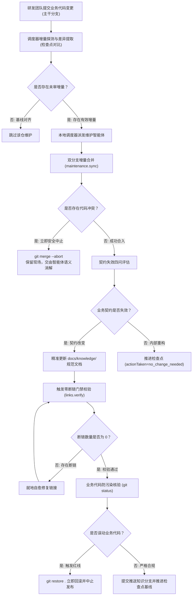

# 知识全生命周期运维规程

---

## 知识自维护全生命周期闭环

knowledge-dock 的知识自维护遵循严密的工程化闭环流转流程：



生命周期流转节点说明：

- 代码变更驱动：研发团队向主干业务分支提交代码变更；
- 增量差异比对：调度器探测最新提交哈希与已记录检查点基线之间的差异，精准计算受影响的代码文件与变更规模；
- 智能体语义分析：维护智能体受控拉取更新，比对源码变动，核验业务契约是否失效；
- 质量门禁校验：强制触发断链校验（`links.verify`），实现文档超链接、引用路径与锚点的就地闭环自愈；
- 防污染核验与发布推进：核验无业务代码污染后，将文档改动提交并推送至专属知识分支（`docs`），同步推进检查点基线水位至最新提交哈希。

---

## Knowledge Inbox 待审池治理实战

Knowledge Inbox 是所有人工知识进入正式知识库前的统一受控写入口。无论是线上生产排障所验证的高价值经验，还是日常人工对系统流程的补充修正，均统一经由待审池缓冲流转，杜绝未经求证的信息直接污染权威知识。

系统将人工知识贡献划分为两类核心模式：

- 生产排障经验（`troubleshooting`）：收集生产故障处置、日志排障与客诉处理过程中发现的深层技术事实与应对手段；
- 日常维护补充（`maintenance`）：涵盖系统主流程补全、单仓知识修正、业务规则扩充、接口契约更新以及依据设计文档录入新知识。

### 结构化 Candidate Markdown 规范

Knowledge Inbox 采用 Markdown 格式持久化于待审池中，核心规范定义为：

> **YAML Frontmatter + 固定语义标记节（Semantic Sections）**

系统为两类输入分别规定了标准语义标记节。

#### 生产排障候选模板（troubleshooting）

```markdown
---
schema_version: 1
title: budget limit 导致的营销活动过滤
domain: marketing
contribution_type: troubleshooting
knowledge_type: runbook
tags:
  - budget-limit
---

<!-- section:context -->
## 问题背景与现象

<!-- section:evidence -->
## 证据链

<!-- section:findings -->
## 已验证结论

<!-- section:candidates -->
## 建议沉淀的知识

<!-- section:unknowns -->
## 未确认事项

<!-- section:maintainer -->
## Maintainer 处理记录
```

#### 日常维护候选模板（maintenance）

```markdown
---
schema_version: 1
title: 实名认证绑卡端到端主流程补充
domain: certification
contribution_type: maintenance
knowledge_type: flow
tags:
  - 实名认证
---

<!-- section:context -->
## 维护背景

<!-- section:content -->
## 建议内容

<!-- section:evidence -->
## 依据

<!-- section:target -->
## 建议归属

<!-- section:unknowns -->
## 未确认事项

<!-- section:maintainer -->
## Maintainer 处理记录
```

#### 语义标记节核心约束

- 语义结构与表现形式解耦：模板只约束语义分节的注释标记（`<!-- section:xxx -->`），绝不限制具体正文写法。正文中可自由采用自然语言、无序列表、表格、代码片段或时序图；
- 自动化程序无缝解析：后端与智能体切片解析时仅依赖注释标签，不依赖具体的中文标题内容。

### 候选文档设计三原则

为了保障沉淀知识的客观性与工程质量，编写与提炼候选文档必须恪守三大原则：

- 保存事实不保存思维链：排障类候选仅保留故障现象、排查步骤、关键日志证据、已验证事实与待确认未知项，剔除主观猜测与无效的排查弯路；
- 未确认事项必须保留：允许且要求明确记录尚未验证的技术点、缺乏对端源码的推断或未完全复现的边缘场景，严禁为了保证文档形式完整而主观臆造；
- 待审池与正式知识库明确定位：待审池保存具体案例、偶发日志、关联订单与临时证据，正式知识库仅保存长期稳定的架构规则、通用流程、标准接口与排障手册。

### 经验结构化投递入池

一线研发人员或排障助手在只读查询视图（`sk`）下，即可调用收集动作投递候选文档：

```bash
ad run knowledge/knowledge.collect --profile sk -- \
  filename="marketing-budget-limit" \
  content="---
schema_version: 1
title: budget limit 导致的营销活动过滤
domain: marketing
contribution_type: troubleshooting
knowledge_type: runbook
tags:
  - budget-limit
---

<!-- section:context -->
## 问题背景与现象
营销活动计算过程中用户无法参与抽奖活动。

<!-- section:evidence -->
## 证据链
日志包含错误码 ACT_BUDGET_LMT，关联配置表 budget_threshold 为 0。

<!-- section:findings -->
## 已验证结论
当预算阈值触发时过滤用户活动资格。

<!-- section:candidates -->
## 建议沉淀的知识
在营销活动排障手册补充 ACT_BUDGET_LMT 处理步骤。

<!-- section:unknowns -->
## 未确认事项
未知是否所有子渠道均共享同一阈值。

<!-- section:maintainer -->
## Maintainer 处理记录
"
```

提交内容作为独立的 Markdown 候选文件保存在持久化待审池目录中，系统自动补充服务端审计元数据（`id`、`created_at`、`status`）。

### 待审经验扫描与维护智能体消费

在多仓知识维护流水线中，排障经验待审池由客户端编排器在第三阶段自动执行串行扫描与消费闭环；运维人员亦可在受控终端手动拉取清单：

```bash
ad run knowledge/knowledge.list --profile skm -- status="pending"
```

- 流水线自动串行消费机制：
  - 调度器自动通过特权维护视图拉取所有处于 `pending` 状态的待审候选文档列表；
  - 针对每一份候选文档，调度器按顺序单实例串行派发维护智能体，注入对应候选参数（包括候选标识、候选标题、文件名、候选路径与业务域）；
  - 调度器周期性轮询待审池清单，直至该候选文档在待审清单中消失（即由维护智能体核验归档移出待审池）或达到超时时限；
  - 全部候选文档逐一消费完毕后，生成待审池审计摘要并汇总至最终报告。

消费待审池时，维护智能体与运维人员必须严格遵循核心消费准则：

> 候选文档是贡献单元，不是正式知识存储单元。

严禁机械式地一文一建。维护智能体必须结合纳管代码仓的源码进行交叉核验：

- 查验源码事实：核实候选文档中记录的类名、枚举值、配置项与时序是否与主干源码一致；
- 提炼合入规范目录：核验无误后，将事实提炼归纳并合入正式知识库既有的规范文件（如将处理流程合入 `runbook/`，将规则合入 `rule/`，将主时序合入 `flow/`）；
- 决议归档留痕：合入完成后，调用归档动作记录决策并移出待审池：

```bash
ad run knowledge/knowledge.archive --profile skm -- \
  id="20260927-a1b2c3d4" \
  resolution="accepted" \
  note="已提炼并合入 marketing-service 的 runbook-activity.md 操作手册中"
```

归档决议状态包括：
- `accepted`：事实核验属实且填补知识缺口，已提炼合入正式库；
- `duplicate`：记录内容在现有知识库中已有完整准确说明；
- `insufficient_evidence`：关键证据不足或缺少对端源码支撑，暂不入库；
- `rejected`：经核实与主干源码事实相悖或属于已废弃遗留问题。

---

## 检查点基线推进机制深度推导

### 增量扫描基准原理

检查点机制的核心职能是在持久化数据库（`global.db`）中记录各代码仓当前「已核验代码提交哈希」作为基线水位。调度器在后续执行巡检时，仅扫描检查点哈希至分支最新提交之间的增量区间，避免全量重复扫描。

### 无文档变更时推进检查点的技术必要性

在多代码仓自维护过程中，常见的场景是新增代码提交仅包含内部重构、局部变量重命名、代码注释调整或单元测试用例补充，未对外部行为契约与业务逻辑产生实质影响，智能体判定无需修改工程文档。

在此类场景下，系统**必须强制调用完成动作推进检查点**：

- 确立增量扫描基准：检查点推进动作的技术本质是在系统中确立最新的增量扫描基准；
- 杜绝重复无效扫描：无文档变更时推进检查点的技术必要性在于，无论代码变更是否触发文档改动，推进基线均为标记该批次提交已通过完整审计与评估的唯一法定凭据。若不推进检查点，检查点水位将永久停滞在历史旧提交上；当下次调度巡检触发时，调度器仍会将已核验过的提交判定为未审增量，再次调度智能体重复执行无意义的代码扫描与分析，破坏增量闭环收敛性并带来不必要的计算开销；
- 调用规范范例：确认无需修改文档时，智能体通过指定参数 `actionTaken="no_change_needed"` 推进检查点基线：

```bash
ad run maintenance/maintenance.complete --profile skm -- \
  path="/srv/workspace/order-service" \
  commit="c7a1b2d3e4f5..." \
  actionTaken="no_change_needed" \
  summary="内部代码重构与单测补充，未改变任何业务契约"
```

---

## 契约失效判定四准则

面对增量代码提交，智能体须遵循「**以知识失效而非改动量驱动更新**」的原则，对照以下四个维度进行契约有效性审查。任一维度受影响即须更新对应文档；若均未受影响，则推进检查点结束流程：

- 流程契约变动：主调用链路、分支流转条件、异步事件发布机制或异常降级时序是否发生变更？
- 公开接口变动：对外暴露的接口路径、请求参数结构、响应体定义或状态错误码是否发生变更？
- 业务规则变动：核心业务计算逻辑、校验阈值、权限门禁或业务状态机流转约束是否发生变更？
- 数据模型变动：持久化实体模型、数据库表结构或核心枚举定义是否发生变更？

---

## 核心质量门禁与安全红线

### 零断链门禁

在编写或局部编辑 Markdown 文档时，路径拼写偏差或章节标题调整极易导致超链接失效，破坏知识图谱的连续性。

- 门禁触发时机：在文档修改完成、正式发布提交前，必须强制调用断链校验动作：
  ```bash
  ad run workspace/links.verify --profile skm -- path="/srv/workspace/order-service"
  ```
- 扫描覆盖范围：自动校验工作区内所有 Markdown 文档的相对文件引用路径、媒体静态资源路径与章节标题锚点；
- 就地自愈要求：若检测到断链数量大于 0，智能体必须对照输出的失效链接清单就地修正自愈，直至断链数量为 0 时方可执行后续发布与检查点推进。

### 业务代码防污染红线

知识库自维护的核心安全原则是：**严禁改动或污染业务源码目录与主干分支！**

- 目录严格收敛：所有工程知识文档必须严格收敛在 `docs/knowledge/` 目录下，严禁在业务源码目录创建任何说明文档、草稿或批注；
- 分支专属隔离：维护智能体仅允许向专属的 `docs` 知识分支推送更新，严禁向 `release`、`main` 或 `master` 等主干业务分支直接提交修改；
- 提交前状态核验：正式发布前，必须执行工作区状态核查指令：
  ```bash
  ad run workspace/bash.exec --profile skm -- command="git status" cwd="/srv/workspace/order-service"
  ```
- 误改应急回滚：若改动列表中混入任何业务源码文件，必须立即中止发布流程，并执行工作区还原指令丢弃未授权变更：
  ```bash
  ad run workspace/bash.exec --profile skm -- command="git restore ." cwd="/srv/workspace/order-service"
  ```
