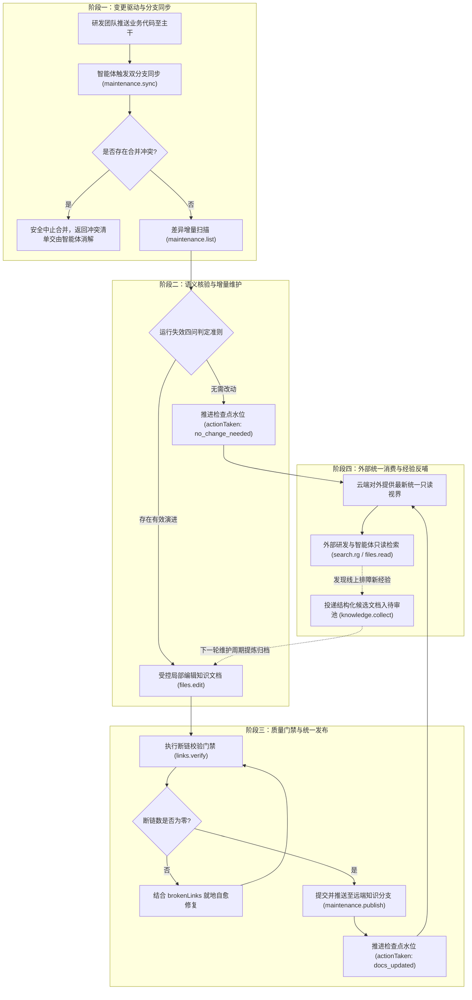
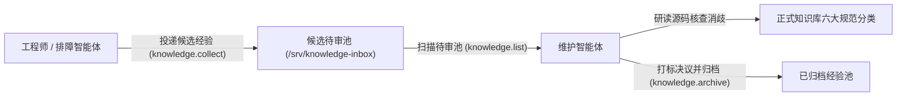

# 端到端知识运维与闭环规程

---

## 概述与规程定位

knowledge-dock 的核心生命力在于将知识维护从被动的人工编写转变为由代码变更驱动的主动持续演进。正式工程知识以 Markdown 形式存放在版本控制系统中，云端服务对外提供最新只读视界，排障经验通过待审池收敛沉淀，检查点推进作为全流程闭环的交付标志。

本文档面向知识体系管理人员、研发团队负责人以及一线维护工程师，规范工程知识的全生命周期闭环流转、线上排障经验入池与归档、检查点推进机制与失效四问判定准则、文档零断链门禁以及业务代码防污染红线。

---

## 知识全生命周期闭环流转

知识中枢的运行遵循端到端闭环模型，打通从代码提交到知识消费的完整链路：



### 闭环流转核心阶段规范

- **阶段一：变更驱动与分支同步**：
  - 研发团队日常将业务代码提交推送至生产主干分支（如 `release`）。
  - 维护任务触发后，首先调用 `maintenance/maintenance.sync` 将生产主干代码合并到知识分支。
  - 合并遇冲突时，底层立即触发 `git merge --abort` 安全中止并返回冲突文件列表，由维护智能体结合上下文消解冲突后重新同步。
  - 同步成功后，调用 `maintenance/maintenance.list` 比对检查点提交哈希与当前最新提交，获取增量变动列表。
- **阶段二：语义核验与增量维护**：
  - 智能体深入分析代码改动内容，严格遵循失效四问判定准则。
  - 若确需更新知识，优先调用局部受控精准编辑动作（`workspace/files.edit`）打补丁，严禁全量重写大文本以防丢失上下文。
- **阶段三：质量门禁与统一发布**：
  - 文档完成修改后，必须立即调用断链校验动作（`workspace/links.verify`），若存在死链必须就地自愈修复。
  - 校验通过后，调用 `maintenance/maintenance.publish` 提交并推送到远端知识分支。
  - 无论文档最终是否变动，必须调用 `maintenance/maintenance.complete` 显式推进检查点水位。
- **阶段四：外部统一消费与经验反哺**：
  - 云端服务对外统一暴露最新的代码事实与知识文档。外部开发者与业务智能体通过只读查询视图（`sk`）检索消费。
  - 排障过程中产生的新经验，通过追加动作（`knowledge/knowledge.collect`）投递入待审池，反哺下一轮维护周期。

---

## 线上排障经验收集与待审池闭环

在日常运维与人工排障过程中，工程师往往会发现代码未写明的边界限制、偶发异常的处理手段或配置注意事项。若直接在正式文档中随意涂写，极易导致文档结构混乱；若不加记录，经验又会迅速流失。

系统通过贡献单元与知识单元解耦模型，实现排障经验的规范闭环：



### 经验结构化投递（`knowledge.collect`）

外部研发人员或排障助手在只读查询视图（`sk`）下即可向待审池投递结构化排障经验：

```bash
ad run knowledge/knowledge.collect --profile sk -- \
  title="订单支付回调重试异常排障" \
  tags.0="order" tags.1="payment" tags.2="callback" \
  content="当支付网关返回网络抖动时，回调接口需校验幂等号并开启指数退避重试..."
```

投递的内容将作为独立的贡献单元暂存在 `/srv/knowledge-inbox/pending/` 目录下，对外不可直接检索，避免未审核信息污染知识中枢。

### 待审池管理与状态查验（`knowledge.list`）

维护智能体在巡检时通过特权维护视图（`skm`）查询当前积压的待审候选清单：

```bash
ad run knowledge/knowledge.list --profile skm -- status="pending"
```

该命令将返回所有待审经验的唯一标识符、标题、标签与提交时间戳。

### 去重提炼与正式入库规范

维护智能体消费待审经验时，严禁机械地为每篇候选经验直接创建独立的文档文件，必须遵循提炼归并原则：

- **核实代码事实**：智能体调阅相关业务源码，印证候选经验所述问题是否属实、是否因版本变更已自然修复。
- **归入标准分类**：将经验提炼为稳定知识，增量合入对应的正规分类目录中（如将操作步骤归入 `runbook/`，将重试约束归入 `rule/`，将接口变更归入 `interface/`）。
- **杜绝碎片冗余**：若既有文档已包含类似表述，智能体应补充其遗漏边界，而非重复叙述。

### 候选文档归档与决议打标（`knowledge.archive`）

提炼完成后，智能体必须对候选文件调用归档动作，从待审池移出并打上决议标记：

```bash
ad run knowledge/knowledge.archive --profile skm -- \
  id="20260927-a1b2c3d4" \
  resolution="accepted" \
  note="已提炼并合入 order-service 的 runbook-payment-retry.md 手册"
```

决议类型取值规范：
- `accepted`：已确认属实并提炼合入正式知识库。
- `duplicate`：经验与既有知识或其它候选重复，已合并处理。
- `insufficient_evidence`：缺少代码事实证据支撑，无法确认准确性。
- `rejected`：经验描述存在事实错误或属于过时临时配置，予以废弃。

---

## 检查点推进机制与失效四问判定准则

### 为何无需修改文档时也必须推进检查点？

在知识自维护体系中，维护人员最常产生的疑惑是：当代码改动没有引起文档变更时，是否需要推进检查点？

**答案是：必须推进，这是维护周期的绝对交付标志。**

其深层技术原理如下：
- **避免重复扫描与算力浪费**：Git 提交增量由上一次检查点提交与当前最新提交之间的差集决定。若因无需改动文档而放弃推进检查点，检查点水位将依然停留在陈旧位置。下一次定时巡检或批量跑批启动时，调度器会再次将这段历史提交识别为新增提交，重新唤醒智能体执行全套源码检索与语义核验，造成算力与时间的严重浪费。
- **显式留痕已核验事实**：推进检查点并传入 `actionTaken="no_change_needed"`，在状态库中严肃记录了当前工程事实已经过严谨审查，是知识库与代码基线同步完成的法定交付凭据。

### 失效四问判定准则

在面对代码增量提交时，智能体或维护人员必须逐项评估以下四个核心问题。只有当至少一个问题命中时，才触发正式文档的修改与增补；若四问均为否定，则直接推进检查点结束。

- **问题一：流程与时序是否改变？**
  - 代码变更是否调整了既有核心业务流程的主调用链路、执行分支、异步事件发布或异常降级时序？
  - 若仅为方法内部纯算法重构，未改变端到端流转逻辑，则判定为否。
- **问题二：接口与契约是否改变？**
  - 代码变更是否新增、修改或废弃了对外公开的 HTTP 接口、RPC 方法、消息队列主题、CLI 命令入参或错误响应结构？
  - 若接口字段、类型或错误码完全未动，则判定为否。
- **问题三：业务规则与不变量是否改变？**
  - 代码变更是否调整了系统级计算规则、校验阈值、权限门禁、幂等窗口或跨模块一致性约束？
  - 若仅为修饰符微调或纯技术细节，不涉及业务规则，则判定为否。
- **问题四：数据模型与存储拓扑是否改变？**
  - 代码变更是否新增或修改了数据库表结构（DDL）、核心实体状态机流转枚举、持久化字段语义或缓存键设计？
  - 若未涉及数据持久化模型与状态生命周期的变化，则判定为否。

若失效四问判定均为否，执行快速推进：

```bash
ad run maintenance/maintenance.complete --profile skm -- \
  path="/srv/workspace/order-service" \
  commit="a1b2c3d4e5f6..." \
  actionTaken="no_change_needed" \
  summary="内部代码重构与单测补充，未改变任何流程、接口、规则或数据模型"
```

---

## 零断链门禁与业务代码防污染红线

### 零断链门禁（`links.verify`）铁律

在知识文档的编写与局部编辑过程中，文件重命名、章节标题调整或相对路径拼写错误极易造成 Markdown 死链。断链会严重破坏知识索引图谱的完整性，导致后续智能体与人类研发无法顺畅导航。

- **门禁调用时机**：在完成文档新建（`files.write`）或局部编辑（`files.edit`）之后、调用发布提交（`maintenance.publish`）之前，必须强制执行 `workspace/links.verify`。
- **断链检测覆盖**：校验引擎自动扫描目标仓库下所有 Markdown 文档的相对路径文件引用、图片资源路径以及跨章节的标题锚点。
- **就地自愈要求**：若校验返回 `brokenCount > 0`，智能体必须查阅返回的 `brokenLinks` 清单，使用 `files.edit` 立即就地修复拼写或路径偏差，再次运行校验，直至 `brokenCount === 0` 方可进入发布与检查点推进步骤。未清零断链严禁交付。

调用示例：

```bash
ad run workspace/links.verify --profile skm -- path="/srv/workspace/order-service"
```

### 业务代码防污染红线

知识自维护的核心安全红线是：**无论何时何地，知识维护流程绝不允许污染业务源码目录与提交历史。**

- **文件存储收敛**：代码仓内的所有知识文档必须严格收敛在 `docs/knowledge/` 目录下。严禁在业务源码目录（如 `src/`、`lib/`、`internal/` 等）下擅自创建临时说明、草稿或批注。
- **分支专属隔离**：维护智能体只能向专属的 `docs` 知识分支推送提交，严禁直接向 `release`、`main` 或 `master` 等主干分支推送知识修改。
- **变更纯洁度审查**：在提交发布前，维护人员或智能体可通过 `workspace/bash.exec` 运行版本状态检查：
  ```bash
  ad run workspace/bash.exec --profile skm -- command="git status" cwd="/srv/workspace/order-service"
  ```
- **误改紧急回滚**：一旦发现变动列表中混入了任何非 `docs/` 目录的业务文件，必须立即中止发布流程，并执行命令丢弃误改：
  ```bash
  ad run workspace/bash.exec --profile skm -- command="git restore ." cwd="/srv/workspace/order-service"
  ```
