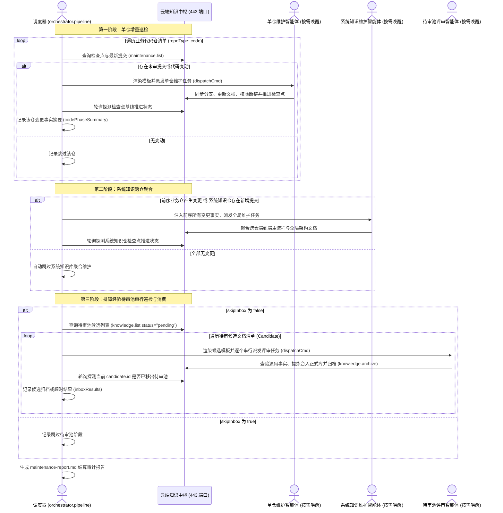

# 流水线编排实战指南

> 流水线编排不是把命令串成脚本，而是在本地受控管理状态变迁与故障隔离。

本指南面向工程架构师与流水线运维人员，详细阐述客户端控制平面的编排机理、三阶段调度拓扑、命令模板安全渲染以及生产运维范式。

---

## 编排架构与控制平面运行边界

在执行流水线编排调度前，必须严格厘清调度器与底层原子 Action 的运行机制与职责边界：

- **调度器运行机制**：流水线调度器（[`orchestrator.pipeline`](file:///root/code/knowledge-dock/client/packages/knowledge-orchestrator)）属于「客户端控制平面」（纯本地控制动作，命令行严禁附加 `--profile` 控制选项），运行在当前执行机（本地开发机、独立运维调度机或持续集成流水线容器）环境中，负责按清单巡检多代码仓、比对增量、组装安全命令模板、派发智能体任务并结算审计报告；
- **控制选项与数据入参的本质区别**：
  - ActionDock 命令行语法中，在双短横线（`--`）之前附加的 `--profile <name>` 属于框架级全局控制选项。其语义是将当前指定的 Action 动作连同其依赖打包，通过网络发送至对应 Profile 所在的目标服务中执行。调度器本身即为主控发起者，在当前执行机环境中运行即可，无需也不应当将调度器自身打包转发至远端服务；
  - 在双短横线（`--`）之后传入的参数（如 `profile="skm"`）属于 Action 动作的数据入参，用于指示调度器内部的查询动作连接哪一个特权维护视图以获取检查点基线水位与最新提交哈希。该参数默认值即为 `skm`，常规调用时直接缺省即可；
- **服务解耦与故障隔离**：将调度、维护与查询混在服务端长会话中会导致服务端单点阻塞与上下文窗口超限。云端知识中枢基于「单端口虚拟视图权限隔离」（Virtual Views），在 443 端口实现细粒度动作暴露隔离，仅面向维护智能体提供特权维护视图。服务端应当保持纯粹、轻量、无状态的原子 Action 暴露；客户端控制平面调度器在本地控制状态变迁，按需向云端知识中枢派发任务，实现调度编排与执行环境的彻底解耦。

### 控制选项与数据入参语义对照表

| 语法位置 | 参数示例 | 属性类别 | 语义作用与底层行为 | 错误后果 |
|---|---|---|---|---|
| 双短横线前 | `--profile skm` | 框架级全局控制选项 | 将当前 Action 动作及其源码打包，通过网络上传至目标节点执行 | 若作用于调度器，会导致调度器被打包上传至远端容器重复自调用，引发网络超时与状态混乱 |
| 双短横线后 | `profile="skm"` | Action 动作数据入参 | 作为常规入参传递给本地执行的调度器，用于指定查询检查点与扫描增量时所使用的远端维护视图配置 | 仅影响内部查询 API 所引用的连接凭据，默认值即为 `skm`，缺省时自动使用默认配置 |

### 调用范式对比

```bash
# 正确调用范式：调度器在当前执行机本地运行，双短横线前严禁附加 --profile 控制选项
ad run orchestrator.pipeline -- \
  dispatchCmd='ad run my-agent.dispatch --profile skm -- repo="{{repo}}" prompt="{{prompt}}"'

# 错误调用范式：严禁在双短横线前附加全局控制选项打包转发调度器自身
# ad run orchestrator.pipeline --profile skm -- dispatchCmd='...'
```

---

## 编排包链接与挂载

首次在执行机运行流水线前，需将本地编排包软链注册至 ActionDock 全局路由表：

```bash
ad link client/packages/knowledge-orchestrator
```

注册完成后，通过列表命令确认已成功挂载 [`orchestrator.pipeline`](file:///root/code/knowledge-dock/client/packages/knowledge-orchestrator) 动作：

```bash
ad list
```

控制台输出中包含 `orchestrator.pipeline` 即表明客户端控制平面就绪。

---

## 三阶段流水线调度拓扑

针对企业多微服务架构，集中式长会话极易引发上下文窗口超限与网络单点阻塞。调度器采用轻量解耦的三阶段流水线架构：

### 三阶段流水线调度表

| 调度阶段 | 执行主体 | 触发条件 | 核心动作 | 推进产物与闭环凭据 |
|---|---|---|---|---|
| 第一阶段：单仓增量巡检 | 本地调度器与单仓维护智能体 | 代码仓清单（`repoType: code`）中最新提交哈希与检查点基线不一致 | 严格遵循「双分支隔离治理模型」，渲染单仓命令模板，派发单仓维护任务，核验对外契约有效性，通过「零断链门禁」与「业务代码防污染红线」，推进检查点 | 推进 `last_knowledge_checked_commit`，生成单仓变更事实摘要（`codePhaseSummary`） |
| 第二阶段：系统知识跨仓聚合 | 本地调度器与系统知识维护智能体 | 前序业务仓产生变更或系统知识仓存在新增提交（且 `skipSystemKnowledge` 为 `false`） | 注入前序所有变更事实摘要，派发全局维护任务，聚合跨仓端到端主流程与全局架构文档 | 推进系统知识仓检查点基线，更新系统架构与跨仓全链路拓扑文档 |
| 第三阶段：排障经验待审池串行巡检与消费 | 本地调度器与待审池评审智能体 | 待审池存在待审候选文档（且 `skipInbox` 为 `false`） | 逐个串行派发候选评审任务，结合代码仓源码交叉求证，提炼合入正式知识骨架，归档移出待审池 | 调用归档动作标记决策留痕（`accepted`、`duplicate` 等），将候选移出待审池 |



### 待审池串行消费的必要性

在第三阶段巡检中，排障经验待审池必须采用严格的串行派发与消费策略。由于外部提交的排障候选经验可能涉及相同的业务领域或相同的知识文档骨架，并发处理将引发多智能体同时写入同一 Markdown 文件的并发冲突与 Git 分支合并锁冲突。串行消费确保每一篇经验在独立、确定性的事务上下文中完成源码交叉核验、知识骨架合入与决议归档。

---

## 检查点基线推进机制与确定性收敛

系统依靠检查点基线推进机制实现增量维护与审计收敛。

统一规范表述为「检查点基线推进机制」（基于提交哈希的增量扫描基准）。无文档变更时推进检查点的技术必要性在于：无论代码变更是否触发文档改动，推进基线均为标记该批次提交已通过完整审计与评估的唯一凭据；若不推进检查点，后续维护将持续对已审计代码重复发起冗余比对与全量扫描，破坏增量闭环收敛性并带来不必要的计算开销。

在流水线执行过程中，调度器以设定间隔轮询服务端检查点水位：

- 维护成功：目标仓库检查点哈希成功推进至最新提交哈希，调度器记录耗时并继续处理下一仓库；
- 维护超时：若在设定的超时时间内检查点哈希未见推进，调度器记录单仓超时失败并安全流转至下一仓库，防止流水线被单点任务永久阻塞。

---

## 命令模板引擎与参数占位符

调度器通过 `dispatchCmd` 命令模板向外部维护智能体派发执行任务。为了防止代码提交信息或上下文摘要中包含特殊字符引发命令注入与解析中断，模板引擎内嵌了安全转义机制。

### 双重安全引号转义机理

在源码提交信息（`commitsSummary`）或差异摘要（`diffSummary`）中，常见反斜杠、双引号、美元符号与反引号等字符。若直接拼接进 Shell 命令行，极易造成引号提前闭合、子命令执行展开（`$()` 与反引号）或语法崩溃。

调度器模版引擎在 [`client/packages/knowledge-orchestrator/src/pipeline-core.ts`](file:///root/code/knowledge-dock/client/packages/knowledge-orchestrator/src/pipeline-core.ts) 中内嵌了双重安全转义实现：

```typescript
export function escapeQuotes(val: any): string {
  if (val === null || val === undefined) return "";
  return String(val)
    .replace(/\\/g, "\\\\")
    .replace(/"/g, '\\"')
    .replace(/\$/g, "\\$")
    .replace(/`/g, "\\`");
}
```

该机制在将变量插入模板的双引号字符串内部时，对反斜杠、双引号、`$` 与反引号执行全量安全转义，彻底阻断了子命令展开与语法逃逸，确保了 Shell 命令的安全渲染与确定性执行。

### 命令模板占位符速查表

| 占位符名称 | 数据类型 | 适用阶段 | 核心作用说明 |
|---|---|---|---|
| `{{repo}}` | 字符串 | 全阶段 | 当前代码仓目录名称（如 `order-service`，待审池阶段默认为 `knowledge-inbox`） |
| `{{path}}` | 字符串 | 全阶段 | 当前仓库或候选在服务端工作区的绝对路径（如 `/srv/workspace/order-service`） |
| `{{branch}}` | 字符串 | 第一与第二阶段 | 当前仓库的目标分支名（业务代码仓默认为 `release`，系统知识仓默认为 `master`） |
| `{{repoType}}` | 字符串 | 第一与第二阶段 | 当前仓库治理类型（`code` 或 `system_knowledge`） |
| `{{from}}` | 字符串 | 第一与第二阶段 | 上次检查点记录的代码提交哈希（冷启动建库时为 `initial`） |
| `{{to}}` | 字符串 | 第一与第二阶段 | 当前服务端目标分支最新提交哈希 |
| `{{commitCount}}` | 数值 | 第一与第二阶段 | 待核验的新增提交总数 |
| `{{changedFilesCount}}` | 数值 | 第一与第二阶段 | 本次变动的源码文件总数 |
| `{{diffSummary}}` | 字符串 | 第一与第二阶段 | 增量代码变动统计摘要文本（如 `12 files changed`） |
| `{{commitsSummary}}` | 字符串 | 第一与第二阶段 | 提交日志列表摘要，包含短哈希与提交说明 |
| `{{codePhaseSummary}}` | 字符串 | 第二阶段 | 第一阶段所有已完成维护的代码仓变更事实汇总。第一阶段执行时该值为空；在第二阶段系统知识库维护时自动注入，为跨仓端到端主流程聚合提供客观事实输入 |
| `{{candidateId}}` | 字符串 | 第三阶段 | 当前待审候选文档唯一标识（例如 `20260924-a1b2c3`，代码仓阶段为空字符） |
| `{{candidateTitle}}` | 字符串 | 第三阶段 | 当前待审候选文档标题（代码仓阶段为空字符） |
| `{{candidateFilename}}` | 字符串 | 第三阶段 | 当前待审候选文档文件名（代码仓阶段为空字符） |
| `{{candidatePath}}` | 字符串 | 第三阶段 | 当前待审候选文档工作区相对路径（代码仓阶段为空字符） |
| `{{candidateDomain}}` | 字符串 | 第三阶段 | 当前待审候选文档所属业务域（代码仓阶段为空字符） |
| `{{prompt}}` | 字符串 | 全阶段 | 开箱即用的工程维护指导语，调度器依据代码仓、系统知识库或待审候选类型动态装配 |

---

## 流水线调度参数配置字典

在终端执行 `ad run orchestrator.pipeline -- [参数列表]` 时，支持以下配置参数：

| 参数名称 | 类型 | 默认值 | 作用说明 |
|---|---|---|---|
| `dispatchCmd` | 字符串 | 空字符串 | 必填（预演模式除外）。向智能体派发维护任务的命令模板，支持使用占位符动态填充参数 |
| `profile` | 字符串 | `skm` | 远端特权维护视图配置名称。供调度器内部查询检查点水位与候选列表，常规调用可缺省 |
| `timeout` | 数值 | `15` | 单仓维护最长等待超时时间（单位为分钟）。超时未完成推进检查点将记录失败并继续处理后续任务 |
| `interval` | 数值 | `10` | 轮询探测服务端检查点推进状态的时间间隔（单位为秒） |
| `dryRun` | 布尔值 | `false` | 预演模式开关。设为 `true` 时仅打印计算变量与渲染后的派发命令，不实际触发任务与基线推进 |
| `only` | 字符串 | 空字符串 | 限制仅维护指定的仓库。支持单个仓库名或逗号分隔的仓库列表（如 `only="order-service,payment-service"`） |
| `skipSystemKnowledge` | 布尔值 | `false` | 是否跳过第二阶段的全局系统知识库聚合维护 |
| `skipInbox` | 布尔值 | `false` | 是否跳过第三阶段的排障经验待审池串行巡检与消费 |
| `reportFile` | 字符串 | `maintenance-report.md` | 结算审计报告输出路径，记录各仓库维护结果与耗时指标 |
| `logFile` | 字符串 | 空字符串 | 结构化运行日志追加写入路径，便于使用 `tail -f` 流式追踪 |

---

## 标准运维执行范式

根据不同执行环境与运维诉求，推荐以下执行范式：

### 运维执行范式对照表

| 运维场景 | 核心诉求 | 推荐执行命令 | 适用阶段 |
|---|---|---|---|
| 单次前台执行 | 即时手动触发，终端实时观察进度看板与轮询状态 | `ad run orchestrator.pipeline -- dispatchCmd='...'` | 日常开发排查与手动维护 |
| 干跑预演模式 | 验证模板渲染、变量提取与派发语法，不产生副作用 | `ad run orchestrator.pipeline -- dryRun:=true` | 模板修改与环境调试 |
| 后台守护进程 | 防止网络断连中断维护，实现日志完全落盘 | `nohup ad run orchestrator.pipeline -- logFile="..." dispatchCmd='...' > ... 2>&1 &` | 多仓大批量维护与生产发布 |
| 实时日志监控 | 流式追踪流水线各阶段推进细节与异常堆栈 | `tail -f /var/log/knowledge-pipeline.log` | 运行时监控与故障追溯 |
| 定时自动化巡检 | 无人值守定期扫描全仓提交增量并聚合知识 | `0 2 * * * ad run orchestrator.pipeline -- logFile="..." dispatchCmd='...'` | 生产环境日常夜间巡检 |

### 具体操作命令示例

- **单次前台执行**：
  ```bash
  ad run orchestrator.pipeline -- \
    dispatchCmd='ad run my-agent.dispatch --profile skm -- repo="{{repo}}" prompt="{{prompt}}"'
  ```

- **干跑预演模式**：
  ```bash
  ad run orchestrator.pipeline -- dryRun:=true
  ```

- **后台守护进程挂起**：
  ```bash
  nohup ad run orchestrator.pipeline -- \
    logFile="/var/log/knowledge-pipeline.log" \
    dispatchCmd='ad run my-agent.dispatch --profile skm -- repo="{{repo}}" prompt="{{prompt}}"' \
    > /var/log/pipeline-stdout.log 2>&1 &
  ```

- **实时流式日志追踪**：
  ```bash
  tail -f /var/log/knowledge-pipeline.log
  ```

- **定时巡检配置**：
  在宿主机 `crontab -e` 中添加夜间巡检调度：
  ```bash
  0 2 * * * ad run orchestrator.pipeline -- logFile="/var/log/knowledge-pipeline.log" dispatchCmd='ad run my-agent.dispatch --profile skm -- repo="{{repo}}" prompt="{{prompt}}"'
  ```

---

## 控制台实时看板与结算报告

- **控制台实时进度看板**：调度器在运行期间会在终端以动态进度条形式刷新当前处理进度，实时显示已处理仓库数、总仓库数、待审候选进度条以及当前正在活跃轮询的仓库或候选标识：
  ```text
  流水线进度: [=========>          ] 50% (2/4)
  总仓数: 4 | 已跳过: 1 | 已完成: 2 | 失败: 0
  当前活跃仓: order-service | 单仓耗时: 01:35 | 总耗时: 03:05
  待审池进度: [===========>        ] 66% (2/3)
  待审候选总数: 3 | 已归档: 2 | 失败: 0
  当前待审候选: 20260924-a1b2c3 (Redis Cluster 脑裂恢复指南) | 单篇耗时: 00:25
  ```

- **结算审计报告**（默认保存在 `maintenance-report.md`）：流水线运行结束后在当前工作目录自动生成 Markdown 格式的审计报告，汇总代码仓与待审池维护结果指标：

```markdown
# 知识维护流水线执行报告

- 执行环境配置：skm
- 扫描总仓库数：3
- 维护成功数：2
- 跳过无需更新数：1
- 失败或超时数：0
- 待审候选总数：2
- 待审成功归档数：2
- 待审处理失败数：0
- 流水线总耗时：03:45

## 仓库执行明细

- 仓库标识：order-service（业务代码仓）
  - 远端路径：/srv/workspace/order-service
  - 执行状态：成功闭环
  - 目标检查点：8f3a12b...
  - 耗时：01:35
  - 说明：检查点已成功推进至 8f3a12b...
- 仓库标识：cron-service（业务代码仓）
  - 远端路径：/srv/workspace/cron-service
  - 执行状态：无需更新
  - 目标检查点：3c9d44e...
  - 耗时：00:02
  - 说明：远端检查点已对齐，无待核验代码变更
- 仓库标识：system-knowledge（系统知识库）
  - 远端路径：/srv/workspace/system-knowledge
  - 执行状态：成功闭环
  - 目标检查点：5e2a901...
  - 耗时：01:28
  - 说明：检查点已成功推进至 5e2a901...

## 待审池处理明细

| 候选标识 | 候选标题 | 文件名 | 状态 | 耗时 | 说明 |
|---|---|---|---|---|---|
| 20260924-a1b2c3 | Redis Cluster 脑裂恢复指南 | 20260924-112345-a1b2c3-redis-split-brain.md | 成功归档 | 00:25 | 已完成归档闭环 |
| 20260924-d4e5f6 | MySQL 连接超时排障指南 | 20260924-112500-d4e5f6-mysql-timeout.md | 成功归档 | 00:15 | 已完成归档闭环 |
```

---

## 流水线编排总结

整个流水线编排架构可以凝练为四句话：

- **调度器立足客户端控制平面，杜绝控制选项打包转发。**
- **三阶段解耦增量巡检、全局聚合与待审串行消费，彻底消除长会话阻塞。**
- **严格推进检查点基线水位，确保增量闭环确定性收敛。**
- **双重转义与状态轮询筑牢执行底线，以受控系统保障运维安全。**

---

## 延伸阅读导航

- **部署与交付实战指南**：获取多仓库配置、双令牌安全基线与 Docker 容器部署指引，参见 [deployment.md](file:///root/code/knowledge-dock/docs/deployment.md)；
- **知识运维与质量门禁**：获取检查点基线运维、待审池流转操作与零断链门禁自愈手册，参见 [operations.md](file:///root/code/knowledge-dock/docs/operations.md)；
- **全景架构设计指南**：了解系统核心组件、逻辑架构拓扑、运行时架构与安全边界，参见 [architecture.md](file:///root/code/knowledge-dock/docs/architecture.md)；
- **动作体系与底座工程**：深入理解面向智能体工作空间的设计约束与确定性硬门禁机制，参见 [action-design.md](file:///root/code/knowledge-dock/docs/action-design.md)；
- **核心流程与生命周期**：掌握代码变更自维护、待审池流转闭环与三阶段流水线调度机制，参见 [workflow.md](file:///root/code/knowledge-dock/docs/workflow.md)。
