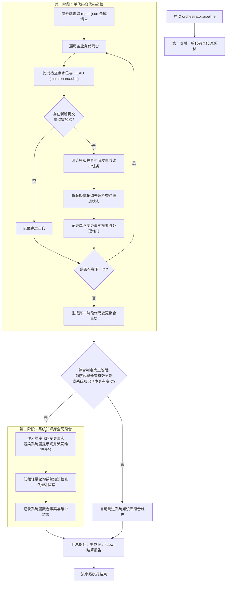

# 客户端多仓流水线调度指南

---

## 概述与编排定位

knowledge-dock 客户端平面聚焦于多代码仓的高效批量维护。在拥有数十甚至上百个微服务工程的复杂研发场景中，直接由单一长会话智能体串行处理所有仓库极易引发上下文打满、注意力分散、网络连接超时以及状态不一致等严重问题。

位于 `client/packages/knowledge-orchestrator` 的本地编排包，实现了两阶段拓扑调度引擎。它将宏观调度巡检与单兵微观作业彻底解耦，依托云端持久化检查点作为单一事实源，实现极低资源开销、无状态轻量调度与天然断点续传。

本文档面向调度编排工程师、自动化维护脚本开发者与系统运维人员，规范客户端编排包的使用方式、执行机物理边界、命令行调用语义、模板引擎占位符规范、后台守护进程运维与执行结算报告审计。

---

## 执行机边界与命令行语义

在 ActionDock 生态中，控制选项（如 `--profile`）用于指示 ActionDock CLI 将当前动作发送至远端服务端执行，而双短横线（`--`）之后的内容为动作的入参数据。

### 执行机物理边界铁律

- **本地动作属性**：流水线调度器（`orchestrator.pipeline`）是一个**纯本地动作**，必须在本地宿主机或本地客户端终端上执行，绝不打包进云端服务端镜像中。
- **命令行控制选项禁区**：在终端调用 `ad run orchestrator.pipeline` 时，**命令行绝对严禁附加** `--profile skm` **控制选项**！
- **原理与反模式说明**：若在命令中误加 `--profile skm` 控制选项（即错误写作 `ad run orchestrator.pipeline --profile skm`），ActionDock 客户端会错误地将调度器自身打包并上传至远端 443 服务端执行。云端服务既未安装客户端编排依赖，也无法在内部直接反向派发外部智能体，必然导致执行失败。
- **数据入参传递规范**：调度动作入参中的 `profile="skm"` 仅仅作为数据入参在双短横线（`--`）之后传入，供调度器内部在向云端服务端发起检查点查询时使用。由于其默认值即为 `skm`，在常规场景下甚至可以直接省略。

```bash
# 正确调用范例 (命令行无 --profile 控制选项，入参在 -- 之后)
ad run orchestrator.pipeline -- profile="skm" dispatchCmd='...'

# 绝对禁止的错误调用反例 (切勿在命令行添加 --profile 控制选项)
# ad run orchestrator.pipeline --profile skm -- dispatchCmd='...'  <-- 严禁这样写!
```

---

## 本地编排包链接与 Playbook 标准规程

### 本地编排包链接登记

在首次运行流水线调度之前，需将客户端编排包软链注册至本地 ActionDock 全局路由表中：

```bash
ad link client/packages/knowledge-orchestrator
```

注册完成后，可通过动作列表命令确认本地已挂载 `orchestrator.pipeline` 动作：

```bash
ad list
```

### Playbook 标准操作规程

编排包内置了经过严格工程验证的定期知识维护标准操作规程：`scheduled-maintenance`。

维护人员可通过命令行自省调阅该规程的完整定义：

```bash
ad playbook show orchestrator/scheduled-maintenance
```

该规程固化了从环境核验、预演检查、正式派发、日志流式跟踪到异常手动自愈的标准作业流程。

---

## 两阶段调度引擎运作机制

流水线调度器在执行时严格按照拓扑顺序分为两个阶段：



- **第一阶段（单代码仓代码巡检）**：
  - 调度器读取云端维护视图配置的仓库清单，依次对每个业务代码仓执行差异比对。
  - 若代码仓自上一次检查点以来有新提交，调度器渲染单仓维护提示词与派发命令并异步触发任务，随后以非阻塞轻量轮询探测云端检查点推进状态。
  - 每一个完成维护的代码仓，其变更提交、修改文件数与维护摘要均会被收集并沉淀为阶段事实。
- **第二阶段（系统知识库全局聚合）**：
  - 在所有业务代码仓处理完毕后，调度器评估全局状态。
  - 若前序代码仓中存在任何实质性变更，或系统知识仓自身存在新增提交，调度器将前序代码仓的更新摘要注入模板，唤醒系统知识库维护任务，驱动跨仓流程与全局架构更新。
  - 若所有代码仓均无变更且系统知识库基线已对齐，调度器自动跳过第二阶段，极大节约系统资源。

---

## 模板引擎 11 项占位符安全渲染规范

调度器内置轻量安全的字符串模板引擎。在配置派发命令模板 `dispatchCmd` 时，可自由嵌入占位符。调度器在派发前会自动完成上下文计算与安全引号转义，防止 Shell 命令注入。

### 核心占位符字典

- 基础仓库元数据占位符：
  - `{{repo}}`：当前代码仓目录名称（如 `order-service` 或 `system-knowledge`）。
  - `{{path}}`：当前仓库在云端服务工作区的绝对路径（如 `/srv/workspace/order-service`）。
  - `{{branch}}`：当前仓库的目标主干分支名（代码仓默认为 `release`，系统知识仓默认为 `master`）。
  - `{{repoType}}`：当前仓库的架构治理类型（`code` 或 `system_knowledge`）。
- 版本控制与差异占位符：
  - `{{from}}`：前置已核验检查点提交哈希（若该仓库首次接入建库则取值为 `initial`）。
  - `{{to}}`：当前云端分支最新目标提交哈希。
  - `{{commitCount}}`：待核验的新增提交总数量。
  - `{{changedFilesCount}}`：两次检查点之间变动的源代码与配置文件总数量。
  - `{{diffSummary}}`：增量变动统计摘要文本（由 `git diff --stat` 生成）。
  - `{{commitsSummary}}`：新增提交日志简短列表（包含提交哈希与单行提交信息）。
- 跨阶段事实与专业提示词占位符：
  - `{{codePhaseSummary}}`：第一阶段所有已完成巡检的代码仓摘要与变更事实清单。在第一阶段执行时该占位符为空字符串；在第二阶段系统知识库维护时自动注入前序全部变更事实，为跨仓端到端主流程聚合提供客观事实输入。
  - `{{prompt}}`：开箱即用的专业维护指导语模板。调度器会自动根据当前仓库类型（单代码仓或系统知识仓）以及是首次建库还是增量核验，动态装配最适宜的自闭环维护指导语。

### 模板安全转义说明

调度器在将变量值填充至占位符时，会对双引号、单引号及换行符等特殊字符进行转义处理，确保无论提交日志或变动文件名中包含何种特殊符号，均能安全拼装为合规的命令行或 JSON 载荷，杜绝命令注入风险。

---

## 调度动作参数完整定义

在终端执行 `ad run orchestrator.pipeline -- [参数列表]` 时，支持以下输入参数：

- `profile`（字符串，可选）：ActionDock 客户端远端维护配置标识，默认值为 `skm`。用于调度器内部向云端查询检查点。
- `dispatchCmd`（字符串，非预演模式必需）：外部智能体派发命令模板，内部使用占位符完成动态参数注入。
- `timeout`（数值，可选）：单仓维护最大等待超时时间（单位为分钟），默认值为 15。超时未完成将记录失败并继续处理下一仓库。
- `interval`（数值，可选）：向云端轮询探测检查点推进状态的轮询间隔时间（单位为秒），默认值为 10。
- `dryRun`（布尔值，可选）：预演演练模式，默认值为 `false`。开启后仅扫描远端变更、打印计算出的占位符并展示渲染后的派发命令，不实际触发任务与轮询。
- `only`（字符串，可选）：聚焦指定仓库。支持传入单个仓库名或以逗号分隔的仓库名列表（如 `only="order-service,system-knowledge"`），仅对指定仓库执行维护。
- `skipSystemKnowledge`（布尔值，可选）：跳过系统知识库第二阶段全局聚合维护，默认值为 `false`。
- `reportFile`（字符串，可选）：结算 Markdown 报告落盘路径，默认值为 `maintenance-report.md`。
- `logFile`（字符串，可选）：实时结构化日志追加路径，用于支持运维人员流式追溯。

---

## 本地后台守护进程与日志流式追溯

多仓批量巡检通常耗时数十分钟甚至数小时。为防止本地终端意外关闭导致流水线中断，推荐采用后台守护进程方式运行，并配合实时日志追溯。

### 四种日志观测与追溯范式

- **原生参数日志落盘与追踪**：
  - 调用动作时通过 `logFile` 参数指定日志落盘路径。调度器会将包含精准时间戳的生命周期事件（扫描基线、任务派发、检查点轮询探测、阶段切换、异常警告）实时追加写入目标文件。
  - 运维人员可在本地任一终端窗口中执行流式追踪命令：
    ```bash
    tail -f /var/log/knowledge-pipeline.log
    ```
- **本地后台守护进程执行与标准流重定向**：
  - 生产批处理任务推荐在本地终端通过 `nohup` 提交为后台守护进程，并将标准输出与标准错误流合并重定向至日志文件：
    ```bash
    nohup ad run orchestrator.pipeline -- \
      logFile="/var/log/knowledge-pipeline.log" \
      dispatchCmd='ad run my-agent.dispatch --profile skm -- repo="{{repo}}" prompt="{{prompt}}"' \
      > /var/log/pipeline-stdout.log 2>&1 &
    ```
  - 通过标准流实时追踪后台进程运行状态：
    ```bash
    tail -f /var/log/pipeline-stdout.log
    ```
- **前台控制台交互式流式直读**：
  - 在本地终端调试或临时验证时，直接在前台执行命令。框架默认将调度进展与事件日志实时流式输出到当前终端控制台，天然具备透明可见性。
- **异步长任务执行凭据状态回溯**：
  - 若在 ActionDock CLI 层面附加 `--async` 选项（如 `ad run orchestrator.pipeline --async -- dispatchCmd='...'`），命令将立即返回唯一的运行标识符。
  - 维护人员可随时通过运行查询命令调阅事件流与执行明细：
    ```bash
    ad runs show <runId>
    ```

---

## 实战调用范例

### 预演模式（核验变更与命令替换）

在正式执行前，使用预演模式查看待处理仓库清单及模板变量渲染结果：

```bash
ad run orchestrator.pipeline -- dryRun:=true
```

### 配合本地异步智能体派发与日志落盘

```bash
ad run orchestrator.pipeline -- \
  logFile="/var/log/knowledge-pipeline.log" \
  timeout:=20 \
  interval:=10 \
  dispatchCmd='ad run my-agent.dispatch --profile skm --async -- repo="{{repo}}" path="{{path}}" prompt="{{prompt}}"'
```

### 通过 HTTP 接口派发远程作业平台

```bash
ad run orchestrator.pipeline -- \
  dispatchCmd='curl -s -X POST https://agent-hub.internal/api/tasks -H "Content-Type: application/json" -d "{\"repo\": \"{{repo}}\", \"targetCommit\": \"{{to}}\"}"'
```

### 单仓限定定向维护

```bash
ad run orchestrator.pipeline -- \
  only="order-service" \
  dispatchCmd='ad run my-agent.dispatch --profile skm -- repo="{{repo}}" prompt="{{prompt}}"'
```

---

## 终端看板与结算报告审计

### 实时进度反馈

调度器在运行期间通过进度汇报接口向终端实时输出当前处理指标，直观展示已处理仓库数、总纳管仓库数以及当前处于活跃状态的代码仓名称，保持高度透明。

### Markdown 结算报告结构

流水线运行结束后，将在指定路径生成结算报告（默认 `maintenance-report.md`）。报告结构规范严谨，包含宏观统计总览与各仓库执行明细：

```markdown
# 知识库维护流水线结算报告

- 远端维护视图: skm
- 纳管仓库总数: 3
- 成功闭环数: 2
- 跳过未变动数: 1
- 执行失败数: 0
- 整体总耗时: 185s

## 仓库维护明细

| 仓库名称 | 治理类型 | 目标提交 | 执行状态 | 耗时 | 明细说明 |
|---|---|---|---|---|---|
| order-service | code | 8f3a12b | completed | 95s | 增量核验完成，文档已同步更新并推进检查点 |
| cron-service | code | 3c9d44e | skipped | 2s | 检查点与 HEAD 一致，无变动跳过 |
| system-knowledge | system_knowledge | 5e2a901 | completed | 88s | 系统知识库全局聚合完成，已同步跨仓主流程 |
```

维护人员可将该报告直接归档至企业协作系统或代码仓库中，作为工程知识体系自维护的审计依据。
