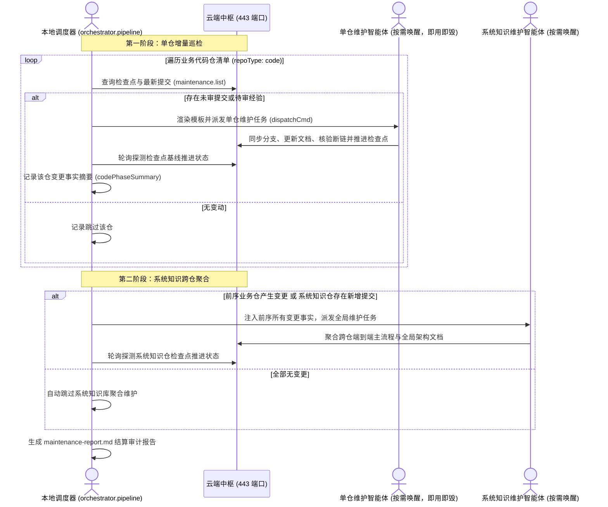

# 本地流水线编排实战指南

---

## 调度器的本质与边界铁律

在执行流水线编排调度前，必须在架构认知上厘清调度器的运行边界：

- 纯本地执行属性：流水线调度器（`orchestrator.pipeline`）属于客户端控制平面的纯本地动作，必须在本地终端或宿主执行机上执行，严禁且无需部署至云端容器内；
- 边界铁律：**命令行严禁附加控制选项** `--profile`；
- 底层失败机理深度剖析：在终端调用 ActionDock 时，若在双短横线（`--`）之前附加了控制选项 `--profile skm`（例如错误编写为 `ad run orchestrator.pipeline --profile skm -- ...`），ActionDock 命令行工具会将当前指定的 Action 动作连同其本地依赖打包，通过网络发往云端 443 服务端执行。云端容器既未安装调度器的执行依赖，亦无法在容器内部反向调度客户端宿主机上的外部智能体，最终导致调度失控与服务进程崩溃；
- 严格区分控制选项与数据入参：参数 `profile="skm"` 仅作为内部数据入参在双短横线（`--`）之后传入，指示调度器向远端哪个视图查询检查点基线。由于其默认值即为 `skm`，常规调用时直接缺省即可。

正确与错误调用范式对比：

```bash
# 正确调用范例 (命令行无 --profile 控制选项，入参在 -- 之后传递)
ad run orchestrator.pipeline -- dispatchCmd='ad run my-agent.dispatch --profile skm -- repo="{{repo}}" prompt="{{prompt}}"'

# 绝对禁止的错误调用反例 (切勿在双短横线之前添加 --profile 控制选项)
# ad run orchestrator.pipeline --profile skm -- dispatchCmd='...'  <-- 严禁添加控制选项
```

---

## 本地编排包链接与挂载

首次在客户端执行机运行流水线前，需将本地编排包软链注册至全局路由表：

```bash
ad link client/packages/knowledge-orchestrator
```

注册完成后，通过列表命令确认本地已成功挂载 `orchestrator.pipeline` 动作：

```bash
ad list
```

控制台输出中包含 `orchestrator.pipeline` 即表明本地控制平面就绪。

---

## 两阶段调度时序与模版引擎

针对企业多微服务架构，集中式的超长会话极易因上下文超限或单点阻塞导致整条流水线崩溃。调度器采用两阶段拓扑设计：



### 命令模板占位符速查表

在配置 `dispatchCmd` 命令模板时，可以使用占位符让调度器动态注入参数。调度器支持的占位符清单如下：

| 占位符名称 | 数据类型 | 核心作用说明 |
|---|---|---|
| `{{repo}}` | 字符串 | 当前代码仓目录名称（如 `order-service`） |
| `{{path}}` | 字符串 | 当前仓库在服务端工作区的绝对路径（如 `/srv/workspace/order-service`） |
| `{{branch}}` | 字符串 | 当前仓库的目标分支名（业务代码仓默认为 `release`，系统知识仓默认为 `master`） |
| `{{repoType}}` | 字符串 | 当前仓库治理类型（`code` 或 `system_knowledge`） |
| `{{from}}` | 字符串 | 上次检查点记录的代码提交哈希（冷启动建库时为 `initial`） |
| `{{to}}` | 字符串 | 当前服务端目标分支最新提交哈希 |
| `{{commitCount}}` | 数值 | 待核验的新增提交总数 |
| `{{changedFilesCount}}` | 数值 | 本次变动的源码文件总数 |
| `{{diffSummary}}` | 字符串 | 增量代码变动统计摘要文本（如 `12 files changed`） |
| `{{commitsSummary}}` | 字符串 | 提交日志列表摘要，包含短哈希与提交说明 |
| `{{codePhaseSummary}}` | 字符串 | 第一阶段所有已完成维护的代码仓变更事实汇总。第一阶段执行时该值为空；在第二阶段系统知识库维护时自动注入，为跨仓端到端主流程聚合提供客观事实输入 |
| `{{prompt}}` | 字符串 | 开箱即用的工程维护指导语，调度器依据代码仓类型与增量类型动态装配 |

### 双重安全引号转义机理

在向 Shell 派发命令时，若提交信息中包含双引号、反斜杠或美元符号，极易导致 Shell 语法中断甚至引发命令注入风险。

调度器模版引擎在底层内嵌了 `escapeQuotes` 双重安全转义机制：

```typescript
export function escapeQuotes(val: any): string {
  if (val === null || val === undefined) return "";
  return String(val)
    .replace(/\\/g, "\\\\")
    .replace(/"/g, '\\"')
    .replace(/\$/g, "\\$")
    .replace(/`/g, "\\`");
}
```

该机制在将变量插入命令模板的双引号字符串内部时，同时对反斜杠、双引号、`$` 与反引号执行转义，彻底阻断了子命令展开与语法逃逸，确保了 Shell 命令的安全渲染与确定性执行。

---

## 四种标准运维范式

根据不同执行阶段与应用场景，推荐以下四种标准运维范式：

- 本地单次前台执行：
  直接在本地终端前台运行，控制台输出实时看板与轮询状态，适用于日常开发调试与即时手动触发：
  ```bash
  ad run orchestrator.pipeline -- \
    dispatchCmd='ad run my-agent.dispatch --profile skm -- repo="{{repo}}" prompt="{{prompt}}"'
  ```

- 干跑预演模式：
  通过指定 `dryRun:=true` 启用预演模式。调度器仅连接远端扫描各仓提交状态、计算增量变量并打印完整渲染后的派发命令，不实际触发外部智能体调用与检查点推进，适用于修改模板后的语法验证：
  ```bash
  ad run orchestrator.pipeline -- dryRun:=true
  ```

- 后台守护进程挂起：
  针对多微服务全量批量维护，推荐使用 `nohup` 置于后台守护运行，配合输出重定向与日志持久化，防止终端网络连接中断导致维护任务中止：
  ```bash
  nohup ad run orchestrator.pipeline -- \
    logFile="/var/log/knowledge-pipeline.log" \
    dispatchCmd='ad run my-agent.dispatch --profile skm -- repo="{{repo}}" prompt="{{prompt}}"' \
    > /var/log/pipeline-stdout.log 2>&1 &
  ```

- 实时流式日志追踪：
  通过 `tail -f` 实时监控调度流水线的结构化运行日志，跟踪各阶段执行明细：
  ```bash
  tail -f /var/log/knowledge-pipeline.log
  ```

- 定时巡检自动化配置：
  可将调度命令配置至系统 crontab 定时任务中，实现无人值守的自动化定期巡检：
  ```bash
  0 2 * * * ad run orchestrator.pipeline -- logFile="/var/log/knowledge-pipeline.log" dispatchCmd='...'
  ```

---

## 参数配置字典速查表

在终端执行 `ad run orchestrator.pipeline -- [参数列表]` 时，支持以下配置参数：

| 参数名称 | 类型 | 默认值 | 作用说明 |
|---|---|---|---|
| `dispatchCmd` | 字符串 | 空 | 必填（预演模式除外）。向智能体派发维护任务的命令模板，支持使用占位符动态填充参数 |
| `profile` | 字符串 | `skm` | 服务端特权维护视图配置名称。供调度器向服务端查询检查点水位，默认值为 `skm`，常规调用可缺省 |
| `timeout` | 数值 | `15` | 单仓维护最长等待超时时间（单位为分钟）。超时未完成推进检查点将记录失败并继续处理后续仓库 |
| `interval` | 数值 | `10` | 轮询探测服务端检查点推进状态的时间间隔（单位为秒） |
| `dryRun` | 布尔值 | `false` | 预演模式开关。设为 `true` 时仅打印计算变量与渲染后的派发命令，不实际触发任务 |
| `only` | 字符串 | 空 | 限制仅维护指定的仓库。支持单个仓库名或逗号分隔的仓库列表，如 `only="order-service,payment-service"` |
| `skipSystemKnowledge` | 布尔值 | `false` | 是否跳过第二阶段的全局系统知识库聚合维护 |
| `reportFile` | 字符串 | `maintenance-report.md` | 结算审计报告输出路径，记录各仓库维护结果与耗时指标 |
| `logFile` | 字符串 | 空 | 结构化运行日志追加写入路径，便于使用 `tail -f` 流式追踪 |

---

## 控制台实时看板与结算报告

- 控制台实时进度看板：调度器在运行期间会在终端以动态进度条形式刷新当前处理进度，实时显示已处理仓库数、总仓库数以及当前正在活跃轮询的仓库名称：
  ```text
  [=========>          ] 50% (2/4) - 当前活跃仓: order-service
  ```

- 结算审计报告（默认保存在 `maintenance-report.md`）：流水线运行结束后在本地自动生成 Markdown 格式的审计报告，汇总运行指标与各仓库维护结果：

```markdown
# 知识库维护流水线结算报告

- 远端维护视图: skm
- 纳管仓库总数: 3
- 成功闭环数: 2
- 跳过未变动数: 1
- 执行失败数: 0
- 整体总耗时: 185s

## 仓库维护明细

| 仓库名称 | 治理类型 | 目标提交 | 执行状态 | 耗时 | 明细说明 |
|---|---|---|---|---|---|
| order-service | code | 8f3a12b | completed | 95s | 增量核验完成，文档已同步更新并推进检查点 |
| cron-service | code | 3c9d44e | skipped | 2s | 检查点与 HEAD 一致，无变动跳过 |
| system-knowledge | system_knowledge | 5e2a901 | completed | 88s | 系统知识库全局聚合完成，已同步跨仓主流程 |
```
