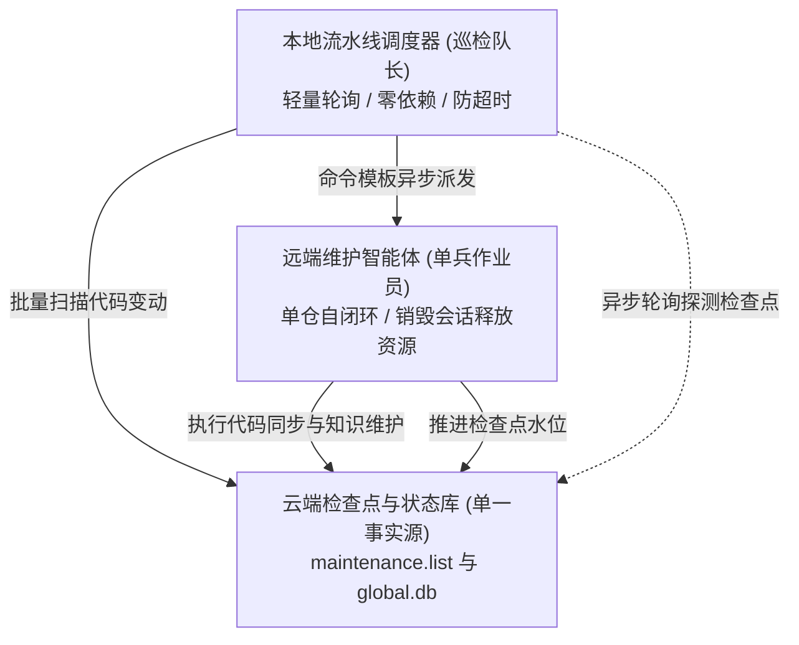

# 本地多仓流水线调度器使用手册

---

## 解决的问题

单仓维护可直接触发智能体完成；但当微服务仓库达到数十甚至上百个时，传统的长链路串行维护面临以下问题：

- 会话上下文溢出：多仓连续对话会导致智能体上下文窗口打满，推理精度显著下降。
- 长连接脆弱：批量巡检耗时较长，网络抖动或网关超时容易中断批处理。
- 状态维护脆弱：本地账本容易与远端真实代码产生状态漂移。

---

## 解耦模型：队长与作业员



- 本地调度器（巡检队长）：只负责按清单批量扫描、派发任务并轮询检查点是否推进，不跑大模型，零长会话开销。
- 两阶段调度架构：
  - 第一阶段（单仓代码巡检）：调度器按顺序巡检各个业务代码仓，驱动单仓分支同步、增量核验与知识维护，推进单仓检查点，并沉淀各仓变更摘要。
  - 第二阶段（系统知识库全局聚合）：若前序代码仓存在更新或系统知识仓本身存在变更，调度器自动唤醒系统知识库维护智能体，执行业务领域自动识别与目录初始化、跨仓端到端流程与全局数据库映射核验，推送到远端主干并推进检查点。若所有代码仓均无变更且系统知识库基线已对齐，自动跳过系统层维护。
- 维护智能体（单兵作业员）：被唤醒后只专注当前单一仓库或系统知识库，完成自闭环后销毁会话释放资源。
- 天然断点续传：以云端检查点为唯一事实源。中途随时退出或断网，再次运行自动跳过已完成仓库。

---

## 模板引擎占位符字典

在 `dispatchCmd` 模板中可使用以下占位符（执行时会自动进行安全引号转义）：

- `{{repo}}`：仓库名（例如 `order-service` 或 `system-knowledge`）。
- `{{path}}`：远端工作区绝对路径（例如 `/srv/workspace/order-service`）。
- `{{branch}}`：目标分支名（代码仓默认为 `release`，系统知识仓默认为 `master`）。
- `{{repoType}}`：仓库架构类型（`code` 或 `system_knowledge`）。
- `{{from}}`：前置检查点提交哈希（首次建库为 `initial`）。
- `{{to}}`：目标最新提交哈希。
- `{{commitCount}}`：待核验的新增提交总数。
- `{{changedFilesCount}}`：变动文件总数。
- `{{diffSummary}}`：变动统计摘要文本。
- `{{commitsSummary}}`：提交日志简短列表。
- `{{codePhaseSummary}}`：前序已完成巡检的代码仓摘要与变更清单（在系统知识库阶段自动注入）。
- `{{prompt}}`：开箱即用的专业维护指导语模板（自动根据仓库类型适配单代码仓或系统知识库聚合维护规程）。

---

## 命令行选项一览

- `profile`（字符串）：ActionDock 客户端远端配置标识，默认 `skm`。
- `dispatchCmd`（字符串）：自定义派发命令模板（预演模式可选，运行时必填）。
- `timeout`（数值）：单仓最大等待超时（分钟），默认 15。
- `interval`（数值）：远端检查点轮询探测间隔（秒），默认 10。
- `dryRun`（布尔）：预演模式，仅扫描远端变更并打印替换后的派发命令。
- `only`（字符串）：仅处理指定的仓库（逗号分隔，如 `order-service,system-knowledge`）。
- `skipSystemKnowledge`（布尔）：跳过系统知识库第二阶段全局聚合维护。
- `reportFile`（字符串）：结算报告输出路径，默认 `maintenance-report.md`。
- `logFile`（字符串）：实时日志追加路径，用于支持 `tail -f` 流式观察。

---

## 实战调用范例

**架构边界说明**：
`orchestrator.pipeline` 是本地 Action，在宿主机或本地智能体终端执行，**命令行绝对不带** `--profile skm` **控制选项**！
`profile="skm"` 仅仅作为数据入参在双短横线（`--`）后传给内部远程查询。

### ActionDock 异步动作派发与日志落盘

```bash
ad run orchestrator.pipeline -- profile="skm" \
  logFile="/var/log/knowledge-pipeline.log" \
  dispatchCmd='ad run my-agent.dispatch --profile skm --async -- repo="{{repo}}" path="{{path}}" prompt="{{prompt}}"'
```

### HTTP 接口派发远程智能体

```bash
ad run orchestrator.pipeline -- profile="skm" \
  dispatchCmd='curl -s -X POST https://agent.internal/api/dispatch -H "Content-Type: application/json" -d "{\"repo\": \"{{repo}}\", \"to\": \"{{to}}\"}"'
```

### 本地智能体命令行派发

```bash
ad run orchestrator.pipeline -- profile="skm" \
  timeout:=20 \
  interval:=15 \
  dispatchCmd='lobster run maintainer --repo="{{repo}}" --to="{{to}}" --prompt="{{prompt}}"'
```

### 预演模式（预览命令替换）

```bash
ad run orchestrator.pipeline -- profile="skm" dryRun:=true
```

### 定向维护指定仓库

```bash
ad run orchestrator.pipeline -- profile="skm" \
  only="order-service" \
  dispatchCmd='ad run my-agent.dispatch --profile skm --async -- repo="{{repo}}" prompt="{{prompt}}"'
```

---

## 执行观测与实时日志追溯

- 原生实时日志流：指定 `logFile` 参数后，流水线调度器将时序事件实时追加写入目标日志文件，运维人员可在任一终端执行 `tail -f /var/log/knowledge-pipeline.log` 持续跟踪。
- 控制台前台直读：前台直接执行时，框架默认将 `ctx.log` 与调度进展流式输出到控制台。
- 后台守护进程：在生产环境使用 `nohup ad run orchestrator.pipeline -- profile="skm" ... > /var/log/pipeline.log 2>&1 &` 运行，并通过 `tail -f /var/log/pipeline.log` 观察。
- 结算报告：运行结束后在当前目录生成 Markdown 结算报告（默认 `maintenance-report.md`），汇总各仓库处理结果与错误信息。
