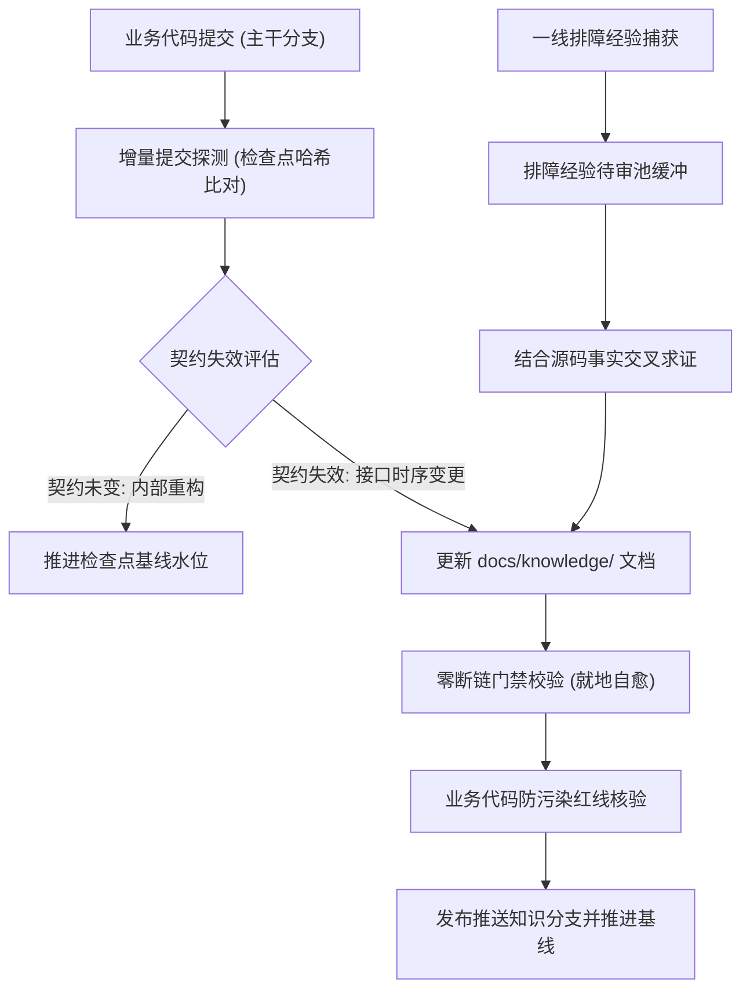

# 产品愿景与设计定位

> 工程知识中枢不是存储静态文档的集中式维基仓库，而是以代码提交为动力源、由智能体自治巡检与受控演进的工程事实中枢。

---

## 缺失自演进机制的系统性灾难

在企业级微服务研发与多智能体协同演进中，架构拓扑、时序契约与排障预案是系统稳定性的核心命脉。然而，若缺乏代码版本同构的自演进机制，工程知识体系必然陷入三类不可逆转的系统性灾难：

- **人工同步失效引发的刻舟求剑灾难**：业务代码在高频迭代中持续发版，文档维护在交付排期压力下被永久后置。脱离代码版本的静态文档迅速失真滞后，排障智能体或研发人员依据陈旧失效的时序与契约排查故障，必然导致诊断发生严重方向性误判；
- **缺乏缓冲直写引发的知识污染灾难**：若放开写入权限允许直接向知识库推送内容，线上排障的临时推论、未经源码求证的主观臆测以及破碎排版将瞬间涌入主干，击溃全局目录骨架，导致工程知识中枢丧失可信权威性；
- **缺乏增量基准引发的算力震荡灾难**：若无提交哈希作为推进水位基准，自动化检查系统无法标定已核验边界，后续维护将在全量比对与漏检停滞之间往复震荡，引发严重的算力浪费与状态死锁。

代码的变动速度永远超越人工打字的极限，脱离版本控制的文档在写入的那一刻起就已走向死亡。

---

## 知识模式架构升维对比

针对上述系统性灾难，[`knowledge-dock`](file:///root/code/knowledge-dock) 构建了基于代码版本同构的闭环演进体系：

| 治理维度 | 传统静态知识模式 | 知识中枢架构方案 |
|---|---|---|
| 事实源归属 | 外置独立文档数据库，与源码版本割裂脱节 | Git 作为唯一事实源，代码变更与知识演进原子绑定 |
| 变更驱动力 | 依赖人工自觉维护，高频发版下必然荒废 | 代码提交自动触发增量核验与契约失效分析 |
| 经验汇入通道 | 离散散落于即时通讯群组或无缓冲直写 | 设立排障经验待审池，经源码交叉求证后转正 |
| 权威性保障 | 存在不可感知的保鲜期，易诱发模型幻觉 | 与生产提交哈希严格对齐，零断链就地自愈 |
| 权限暴露面 | 粗粒度开放或依赖多端口反向代理网关 | 单端口虚拟视图权限隔离，只读与特权物理熔断 |

知识治理的终极价值不是记录曾经发生过什么，而是确保当前每一个排障与调用决策均基于真实代码事实。

---

## 方案横向矩阵：为什么不是传统 RAG

在大模型知识检索领域，检索增强生成被广泛应用，但在严肃工程技术与生产排障场景中，单纯依赖检索增强生成存在致命局限：

| 方案类型 | 核心运行机制 | 严肃工程中的致命瓶颈 |
|---|---|---|
| 传统检索增强生成 (RAG) | 对存量文本切片、向量化并基于相似度召回 | 假设底层文档永远正确，无法感知代码演进；代码变更后检索召回陈旧信息，直接放大模型幻觉 |
| 集中式企业维基 | 依赖人工手动编写与集中排版维护 | 完全脱离代码提交流水线，维护成本随工程规模线性爆炸，长尾文档极易全面荒废 |
| 静态代码符号检索 | 基于语法树或文本匹配代码定义与符号 | 仅能定位具体类名与函数实现，缺乏跨服务宏观业务契约、端到端时序与排障预案 |
| 知识中枢架构方案 (Knowledge Dock) | 代码版本同构驱动的自治巡检与受控审核闭环 | 专注于严肃工程架构与生产排障领域，知识随代码提交自愈演进并提供权威只读视界 |

传统检索增强生成解决「找到答案」，知识中枢架构方案解决「保证答案仍然正确」；没有版本同构约束的知识检索，本质是在高倍放大陈旧代码的危害。

---

## 支撑愿景实现的系统不变量

为了确保愿景在复杂工程实践中不发生漂移与衰减，系统确立了五条贯穿全局的系统不变量：

- **单一事实源不变量**：以 Git 仓库作为知识的唯一事实源，正式工程文档以 Markdown 纯文本随代码同源版本化，杜绝外置独立数据库带来的事实割裂；
- **双分支隔离不变量**：严格执行双分支隔离治理模型，主干业务分支与知识分支解耦，遇冲突安全中止并由智能体进行语义消解；
- **检查点推进不变量**：贯彻检查点基线推进机制（基于提交哈希的增量扫描基准）。无文档变更时推进检查点的技术必要性在于：无论代码变更是否触发文档改动，推进基线均为标记该批次提交已通过完整审计与评估的唯一凭据；若不推进检查点，后续维护将持续对已审计代码重复发起冗余比对与全量扫描，破坏增量闭环收敛性并带来不必要的计算开销；
- **待审池缓冲不变量**：建立排障经验待审池，候选文档是贡献单元而非正式知识存储单元，必须先缓冲入池，由维护智能体结合源码交叉求证后转正合入；
- **发布质量不变量**：上线发布强制实施零断链门禁（`links.verify` 就地自愈）与业务代码防污染红线（严格收敛在 [`docs/knowledge/`](file:///root/code/knowledge-dock/docs/knowledge/) 目录）。



增量驱动与生命周期状态转移极简逻辑：

```bash
# 增量驱动与生命周期状态转移逻辑
git diff "$last_checked"..."$latest_commit" || exit 0       # 探测代码增量差异
verify_contracts && patch_docs && verify_links          # 契约失效更新与零断链自愈
git commit -m "docs: sync" && advance_checkpoint        # 提交知识分支并推进基线水位
```

知识治理不是创作更多文字，而是通过系统不变量消除未经验证的猜测与滞后。

---

## 结语：架构全貌收敛法则

整个系统全貌遵循四句话收敛法则：

- 以 Git 仓库为单一事实源，让工程知识随生产代码提交实现确定性自收敛演进。
- 服务端单端口收敛双重视界，以最小特权物理隔绝越权访问与代码污染。
- 待审池与检查点筑牢确定性防线，彻底终结人工维护拖延与全量扫描震荡。
- 系统以硬性因果约束构筑自愈闭环，对外持续输出绝对可信的全局工程事实。

---

## 延伸阅读导航

- **核心概念与设计原则**：查阅系统不变量体系、单端口虚拟视图与双分支隔离模型权威定义，参见 [`concepts.md`](file:///root/code/knowledge-dock/docs/concepts.md)；
- **核心流程与生命周期**：掌握代码变更自维护、待审池流转闭环与流水线调度机制，参见 [`workflow.md`](file:///root/code/knowledge-dock/docs/workflow.md)；
- **全景架构设计指南**：了解服务端事实平面与客户端控制平面的系统拓扑设计，参见 [`architecture.md`](file:///root/code/knowledge-dock/docs/architecture.md)；
- **动作体系与底座工程解析**：深入理解 ActionDock 动作规范与原子操作设计，参见 [`action-design.md`](file:///root/code/knowledge-dock/docs/action-design.md)；
- **部署与交付实战指南**：获取多仓库配置、双令牌安全基线与容器部署指引，参见 [`deployment.md`](file:///root/code/knowledge-dock/docs/deployment.md)；
- **知识运维与质量门禁**：获取检查点基线运维、待审池流转操作与零断链门禁自愈手册，参见 [`operations.md`](file:///root/code/knowledge-dock/docs/operations.md)。
