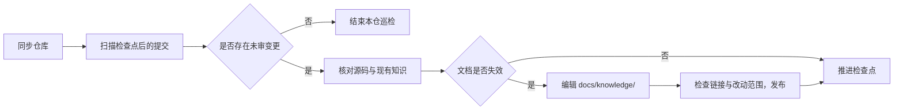

# 知识维护流程

维护流程有两类输入：代码提交和人工经验。两者最终都要经过源码核对，只有稳定、可验证的结论才进入正式知识；候选经验不会自动变成一篇同名文档。

## 代码变更

- `maintenance.sync` 更新代码镜像。业务仓将主干分支合入知识分支；冲突时返回 `conflict` 并中止合并，不能直接推进检查点。
- `maintenance.list` 比较目标分支提交与检查点。首次接入没有检查点时返回 `initial`，需要先盘点现有代码与知识。
- 维护智能体根据提交差异查找受影响的接口、状态、规则、数据语义和排障步骤。只改实际失效的文档。
- 有文档修改时，先运行 `links.verify`，审查 Git 改动范围，再调用 `maintenance.publish`。发布成功后调用 `maintenance.complete`。
- 无需改文档时，记录判断理由并直接调用 `maintenance.complete`。检查点是“已审查到哪里”的标记，不是“最后一次改文档”的标记。

`maintenance.complete` 接受仓库中存在的提交哈希。传入的目标提交应来自本轮 `maintenance.list` 的 `to`；不要把知识分支的新文档提交当作代码审查基线。

## 排障经验

`knowledge.collect` 只负责存储候选并补充编号、时间和状态，不判断内容是否真实。贡献助手负责投递前的查重与用户确认；维护智能体负责对照源码、配置和既有文档做最终审查。`knowledge.archive` 将候选移出待审池，并记录 `accepted`、`duplicate`、`rejected` 或 `insufficient_evidence` 决议。

候选格式和正式知识目录见[知识格式](knowledge-model.md)。记录不确定事项比填补未经验证的推断更有价值。

## 谁负责哪一步

| 参与者 | 主要工作 | 使用的视图 |
|---|---|---|
| 查询与排障助手 | 检索代码和知识，提供排障线索 | `sk` |
| 知识贡献助手 | 查重、整理候选、等待用户确认后投递 | `sk` |
| 单仓维护智能体 | 同步、分析、按需改文档、检查并推进检查点 | `skm` |
| 客户端控制平面 | 巡检仓库、派发智能体、探测结果和生成报告 | 本地动作，通过 `skm` 查询服务端 |

技能资产分别位于 [knowledge-contributor](../skills/knowledge-contributor/SKILL.md)、[project-knowledge-maintainer](../skills/project-knowledge-maintainer/SKILL.md) 和 [knowledge-maintenance-orchestrator](../skills/knowledge-maintenance-orchestrator/SKILL.md)。技能规定作业顺序；服务端 Action 提供底层能力。

## 多仓编排

客户端控制平面按顺序处理业务仓增量、系统知识聚合和待审池候选。系统知识仓用于整理跨仓流程；待审候选串行消费，避免多个任务同时编辑相同知识文件。调度器等待检查点或归档状态变化后再确认任务完成，超时或动作失败应进入报告，而不是当作已审查。

调度参数与命令模板见[编排指南](orchestration.md)，单仓发布检查见[运维手册](operations.md)。
