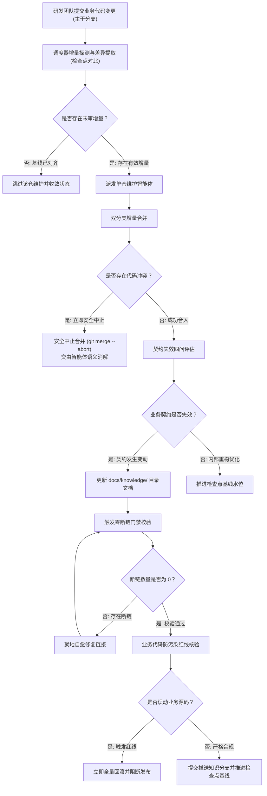
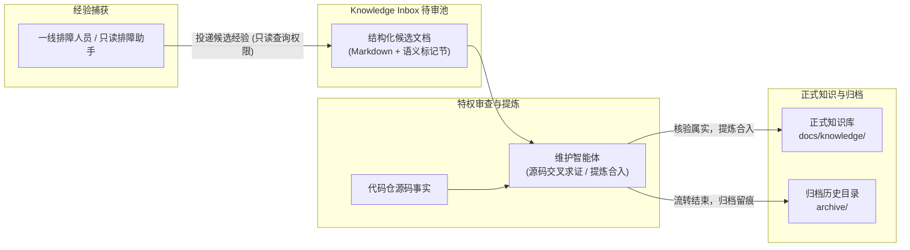
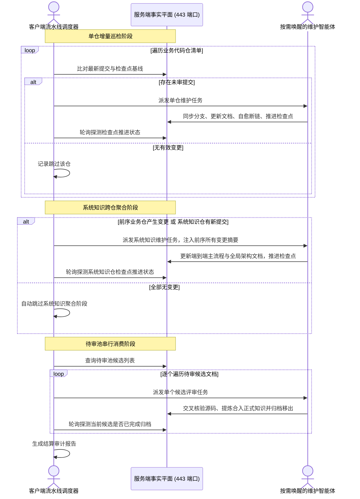

# 核心流程与生命周期流转

> 知识生命周期流转不是单向线性的静态文档落盘，而是由代码版本增量驱动、具备严格自愈与回滚特性的闭环状态机演进。

---

## 核心流程全景架构

[`knowledge-dock`](file:///root/code/knowledge-dock) 的运行生命周期围绕三条相互协同的确定性链路展开。服务端全链路依托单端口虚拟视图权限隔离（Virtual Views）在 443 端口提供受控动作能力，只读查询端与特权维护端物理隔离：

- **代码变更自动维护链路**：监听或定时巡检业务代码分支提交，按需驱动文档更新与检查点基线推进；
- **排障经验流转与待审池闭环**：收集一线排障中验证的事实与建议，经由待审池缓冲流转，由维护智能体交叉核验后转正；
- **客户端控制平面流水线调度**：主控调度器执行轻量批处理分阶段调度，协调单仓巡检、跨仓聚合与待审池消费。

---

## 代码变更自动维护链路

代码变更驱动的知识维护包含标准化的状态机转移与质量门禁节点：



### 双分支增量合并与冲突安全中止

- **双分支隔离治理模型**：主干业务分支与知识分支解耦，遇冲突安全中止并由智能体进行语义消解；
- **分支对齐与无破坏性保证**：系统将生产主干分支的最新提交合并入专属知识分支（`docs`），严禁执行任何强推（`push --force`）与硬重置破坏性指令；
- **冲突安全中止机制**：合并中若出现代码级冲突，自动化程序严禁私自裁决，立即安全退出，保留清晰的冲突现场供语义消解。

```bash
# 双分支安全合并状态机逻辑
git checkout docs && git merge --no-ff origin/main
if [ $? -ne 0 ]; then git merge --abort; exit 1; fi # 遇到代码级冲突立即安全中止，交由智能体语义消解
```

- **缺失机制的系统灾难**：若自动化程序在发生代码冲突时强行采用单侧覆盖或擅自提交，将导致生产主干中的关键业务逻辑被静默抹除，彻底破坏分支一致性并直接引发线上生产故障。

业务分支的纯粹性是生产安全的底线，知识分支的独立性是演进治理的前提。

### 契约失效评估机制

- **契约失效核心判定准则**：
  - 对外公开的 HTTP / RPC 接口契约是否改变？
  - 核心业务流程的时序图与状态机转移是否改变？
  - 核心业务校验规则与拦截条件是否改变？
  - 数据模型核心字段与领域实体定义是否改变？
- **精准按需更新**：若四问判定均未改变，表明变动仅为代码重构或单测补充，既有知识仍然有效，严禁修改文档；若判定改变，智能体仅更新受波及的对应分类文档。
- **缺失机制的系统灾难**：若跳过契约失效评估，日常代码的每一次格式化、注释调整或私有函数重构都将触发冗余的文档重写，导致文档版本历史充斥无意义的噪音抖动，破坏文档结构稳定性；反之，若未按契约要求评估，文档将与实际逻辑分道扬镳，诱发严重误判。

代码变更只是触发审查的必要信号，唯有业务契约失效才是更新文档的充分条件。

### 零断链门禁与业务代码防污染红线

- **零断链门禁**：统一规范表述为「零断链门禁」（`links.verify` 就地自愈），对知识目录中的所有 Markdown 文件执行超链接、相对路径与锚点校验。发现失效链接时智能体就地自愈修复，直到断链数为零；
- **业务代码防污染红线**：统一规范表述为「业务代码防污染红线」（严格收敛在 [`docs/knowledge/`](file:///root/code/knowledge-dock/docs/knowledge/) 目录），提交前严格核对暂存区状态，若发现变更超出知识文档目录范围，立即执行全量回滚并中断流程。

```bash
# 质量门禁校验状态机逻辑
broken_links=$(verify_links) && [ "$broken_links" -eq 0 ] || self_heal_links
check_diff_scope --strict "docs/knowledge/" || { git reset --hard; exit 1; }
```

- **缺失机制的系统灾难**：断链会导致智能体或排障人员在沿着上下文排查时遭遇信息悬崖；而若防污染红线失守，概率性智能体生成的临时分析文件或误触修改的代码一旦混入仓库，将直接污染代码库。

不可跳转的链接等同于断开的电路，越出边界的改动等同于对系统的恶意入侵。

### 检查点基线推进机制

- **检查点推进与增量收敛**：统一规范表述为「检查点基线推进机制」（基于提交哈希的增量扫描基准）。无文档变更时推进检查点的技术必要性在于：无论代码变更是否触发文档改动，推进基线均为标记该批次提交已通过完整审计与评估的唯一凭据；若不推进检查点，后续维护将持续对已审计代码重复发起冗余比对与全量扫描，破坏增量闭环收敛性并带来不必要的计算开销；
- **缺失机制的系统灾难**：若由于本次未产生文档更新而省略检查点推进，调度器在下一次巡检周期中将再度检出该批次代码提交，从而陷入对已审计代码反复触发全量扫描的比对死循环，导致计算资源持续耗尽。

无论文档是否改动，检查点推进都是增量闭环收敛的唯一物理印记。

---

## 排障经验流转与待审池闭环

统一规范表述为「排障经验待审池」，规范候选经验结构化采集、特权审查提炼与决议归档留痕闭环：



### 经验捕获与待审池投递

- 一线研发人员或只读排障助手在排障结束后，将事实与建议整理为符合规范的结构化候选文档；
- 通过调用投递接口写入排障经验待审池，该动作仅需只读查询令牌 `ACTIONDOCK_TOKEN` 鉴权即可完成，确保外部调用安全受控。

### 源码交叉求证与提炼转正

- **解耦核心原则**：候选文档是贡献单元而非正式知识存储单元，严禁机械地一对一新建正式文档；
- 维护智能体调取排障经验待审池中的候选文档，结合目标仓库源码事实进行深度交叉比对；
- 确认为普遍有效规则或高频故障预案后，将结论提炼并合入既有的标准知识骨架中。

```text
# 待审池流转状态机逻辑
inbox/candidate.md -> cross_verify_with_source() -> patch_into_docs_knowledge() -> archive/resolved/
```

### 决议归档与状态闭环

- 转正合入完成后，系统将候选文档移入归档目录留存排障历史证据；
- 待审池中该候选文档状态置为已处理并移出活跃池，确保待审池流转收敛；
- **缺失机制的系统灾难**：若缺少待审池机制而允许排障记录直写正式库，未经求证的偶发特例与主观臆断将迅速污染知识中枢；若只入池不归档，待审池将面临长尾无限堆积，引发智能体处理超时与重复评审死循环。

排障现场的结论是待求证的线索，唯有经过源码对齐的沉淀才是工程知识。

---

## 客户端控制平面流水线调度

统一规范表述为「客户端控制平面」（纯本地控制动作，命令行严禁附加 `--profile` 控制选项）。

流水线调度器（[`knowledge-orchestrator`](file:///root/code/knowledge-dock/client/packages/knowledge-orchestrator)）在当前执行机纯本地运行，按时序执行分阶段轻量批处理编排：



### 单仓增量巡检阶段

- 遍历配置清单中所有业务代码仓；
- 比对生产分支最新提交与检查点基线水位；
- 对存在有效未审提交的仓库，渲染安全命令模板并派发维护智能体进行单仓维护；
- 轮询探测检查点推进成功后，记录该仓的变更事实摘要。

### 系统知识跨仓聚合阶段

- 检查前序所有业务代码仓是否产生了有效知识变更，或系统知识仓本身是否存在新增提交；
- 若存在任一变更，派发系统知识维护智能体，将前序业务仓的变更事实摘要汇总注入，更新跨系统的端到端主流程与全局架构；
- 若全部无变动，自动跳过系统知识聚合阶段。

### 待审池串行消费阶段

- 查询排障经验待审池中处于待审状态的候选文档清单；
- 逐个串行派发评审任务，由智能体核对源码、提炼入库并归档移出待审池；
- 轮询探测当前候选文档归档成功后，继续流转下一个候选，杜绝长会话上下文超限与单点阻塞；
- 最终输出统一的结算审计报告。

### 流水线多阶段协同矩阵

| 流水线阶段 | 驱动判定条件 | 核心调度动作与状态收敛 |
|---|---|---|
| 单仓增量巡检阶段 | 业务仓生产分支最新提交哈希与检查点水位不一致 | 渲染安全命令模板并唤醒维护智能体，同步分支、按需更新文档、自愈断链并推进检查点基线 |
| 系统知识跨仓聚合阶段 | 前序业务仓产生了有效知识变更，或系统知识仓存在新增提交 | 汇总注入前序所有变更摘要事实，更新跨系统主业务时序与全局架构文档，推进系统知识仓基线 |
| 待审池串行消费阶段 | 排障经验待审池中存在处于待审状态的候选文档 | 逐个串行派发任务，维护智能体核对源码事实后合入骨架，探测归档移出成功后流转下一项 |

- **缺失串行消费机制的系统灾难**：若在待审池消费阶段采用并发派发，多个并发维护智能体会同时修改相同的知识骨架文件产生严重的 Git 提交冲突；此外，长会话上下文超限将导致智能体发生灾难性遗忘与逻辑混乱。通过串行原子消费与检查点轮询探测，系统确保了每次流转状态的确定性收敛。

流水线的吞吐量不取决于并发的规模，而取决于每个调度阶段状态收敛的确定性。

---

## 结语：架构全貌收敛法则

整个系统全貌遵循四句话收敛法则：

- 代码变更与经验输入经由受控管道转化为确定性的知识增量。
- 双分支安全合并与契约四问评估消除了无意义的文档震荡与逻辑冲突。
- 零断链门禁与防污染红线构筑了不可逾越的发布交付安全底线。
- 流水线分阶段调度保障了从单仓、跨仓到待审池消费的全链路增量收敛。

---

## 延伸阅读导航

- **产品愿景与设计定位**：深入了解知识中枢核心定位与方案横向对比，参见 [`vision.md`](file:///root/code/knowledge-dock/docs/vision.md)；
- **核心概念与设计原则**：查阅系统不变量体系、单端口虚拟视图与双分支隔离模型权威定义，参见 [`concepts.md`](file:///root/code/knowledge-dock/docs/concepts.md)；
- **全景架构设计指南**：了解服务端事实平面与客户端控制平面的系统拓扑设计，参见 [`architecture.md`](file:///root/code/knowledge-dock/docs/architecture.md)；
- **动作体系与底座工程解析**：深入理解 ActionDock 动作规范与原子操作设计，参见 [`action-design.md`](file:///root/code/knowledge-dock/docs/action-design.md)；
- **部署与交付实战指南**：获取多仓库配置、双令牌安全基线与容器部署指引，参见 [`deployment.md`](file:///root/code/knowledge-dock/docs/deployment.md)；
- **知识运维与质量门禁**：获取检查点基线运维、待审池流转操作与零断链门禁自愈手册，参见 [`operations.md`](file:///root/code/knowledge-dock/docs/operations.md)。
