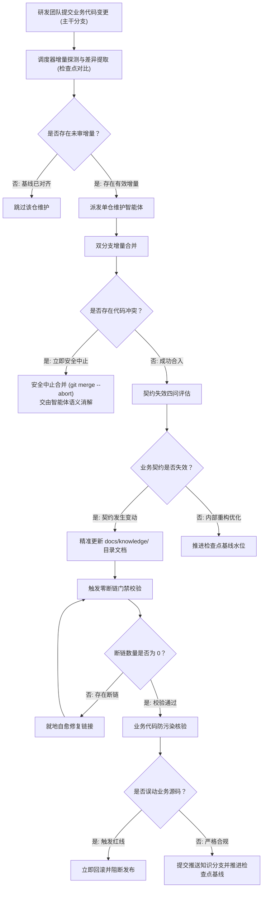
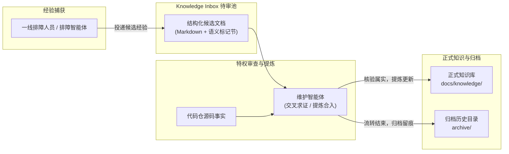

# 核心流程与生命周期流转

---

## 核心流程全景

knowledge-dock 的运行围绕三条相互协同的核心流程展开：

- **代码变更自动维护流程**：监听或定时巡检业务代码分支提交，按需驱动文档更新与检查点基线推进；
- **排障经验闭环流转流程**：收集一线排障中验证的事实与建议，经由待审池缓冲流转，由维护智能体交叉核验后转正；
- **客户端控制平面调度流程**：主控调度器执行轻量批处理三阶段调度，协调单仓巡检、跨仓聚合与待审池消费。

---

## 流程一：代码变更自动维护流程

代码变更驱动的知识维护包含六个标准化节点：

### 分支增量合并与冲突安全中止

- **双分支对齐**：系统将生产主干分支的最新提交合并入专属知识分支（`docs`）；
- **严禁强制推送与硬重置**：整个合并过程严禁执行破坏性 Git 指令；
- **冲突安全中止**：若合并过程中出现代码冲突，自动化脚本严禁私自裁决，立即执行 `git merge --abort` 退出，保留清晰的冲突文件清单，交由智能体基于业务语义进行消解。

### 契约失效评估与文档更新

- **契约失效四问判断机制**：
  - 对外公开的 HTTP / RPC 接口契约是否改变？
  - 核心业务流程的时序图与状态机转移是否改变？
  - 核心业务校验规则与拦截条件是否改变？
  - 数据模型核心字段与领域实体定义是否改变？
- **按需精准写入**：若四问判定均未改变，表明变动仅为代码重构或单测补充，既有知识仍然有效，严禁修改文档；若判定改变，智能体仅更新受波及的对应分类文档。

### 零断链门禁与防污染核验

- **零断链门禁**：对知识目录中的所有 Markdown 文件执行超链接、相对路径与锚点校验。发现失效链接时智能体就地自愈修复，直到断链数为零；
- **业务代码防污染红线**：提交前核验 Git 状态，若发现变更超出 `docs/knowledge/` 目录范围，立即执行全量回滚并中断流程。

### 检查点基线推进机制

- **增量收敛铁律**：无论本次巡检是否修改了知识文档，在维护流程确认完成后，均必须将该仓检查点推进至最新提交哈希；
- **推进基线的技术必要性**：推进检查点是系统标记「该段代码提交已通过完整审计与评估」的唯一凭据。若不推进检查点，下一次调度巡检仍会将已审计代码判定为未审增量，引发重复比对与死循环，破坏系统的增量收敛性。

---

## 流程二：排障经验流转与待审池闭环

排障经验遵循「缓冲入池、交叉核验、去重转正、归档留痕」四步流转闭环：

### 经验捕获与待审池投递

- 一线研发人员或只读排障助手在处理完线上故障后，将关键事实整理为标准候选文档；
- 调用投递接口将候选文档写入 Knowledge Inbox 待审池，该动作仅需只读查询权限即可执行。

### 源码交叉求证与提炼转正

- **解耦核心原则**：候选文档是贡献单元，不是正式知识存储单元，严禁机械地一对一新建正式文档；
- 维护智能体调取待审池候选文档，结合目标仓库源码进行事实交叉求证；
- 确认为普遍有效规则或高频故障预案后，将结论提炼并打补丁合入既有的标准知识骨架中。

### 决议归档与状态闭环

- 转正完成后，将候选文档移入归档目录留存排障历史证据；
- 待审池中该候选文档状态置为已处理，保证待审池流转收敛。

---

## 流程三：客户端控制平面三阶段流水线调度

客户端流水线调度器（`knowledge-orchestrator`）在当前执行机环境中运行，按顺序执行三阶段轻量批处理调度：

### 第一阶段：单代码仓增量巡检

- 遍历配置清单中所有业务代码仓；
- 比对生产分支最新提交与检查点基线水位；
- 对存在有效未审提交的仓库，渲染安全命令模板并派发维护智能体进行单仓维护；
- 轮询探测检查点推进成功后，记录该仓的变更事实摘要。

### 第二阶段：系统知识跨仓聚合

- 检查前序所有业务代码仓是否产生了有效知识变更，或系统知识仓本身是否存在新增提交；
- 若存在任一变更，派发系统知识维护智能体，将前序业务仓的变更事实摘要汇总注入，更新跨系统的端到端主流程与全局架构；
- 若全部无变动，自动跳过系统知识聚合阶段。

### 第三阶段：Knowledge Inbox 待审池串行消费

- 查询待审池中处于待审状态的候选文档清单；
- 逐个串行派发评审任务，由智能体核对源码、提炼入库并归档移出待审池；
- 轮询探测当前候选文档归档成功后，继续流转下一个候选，杜绝长会话上下文超限与单点阻塞；
- 最终输出统一的结算审计报告。
